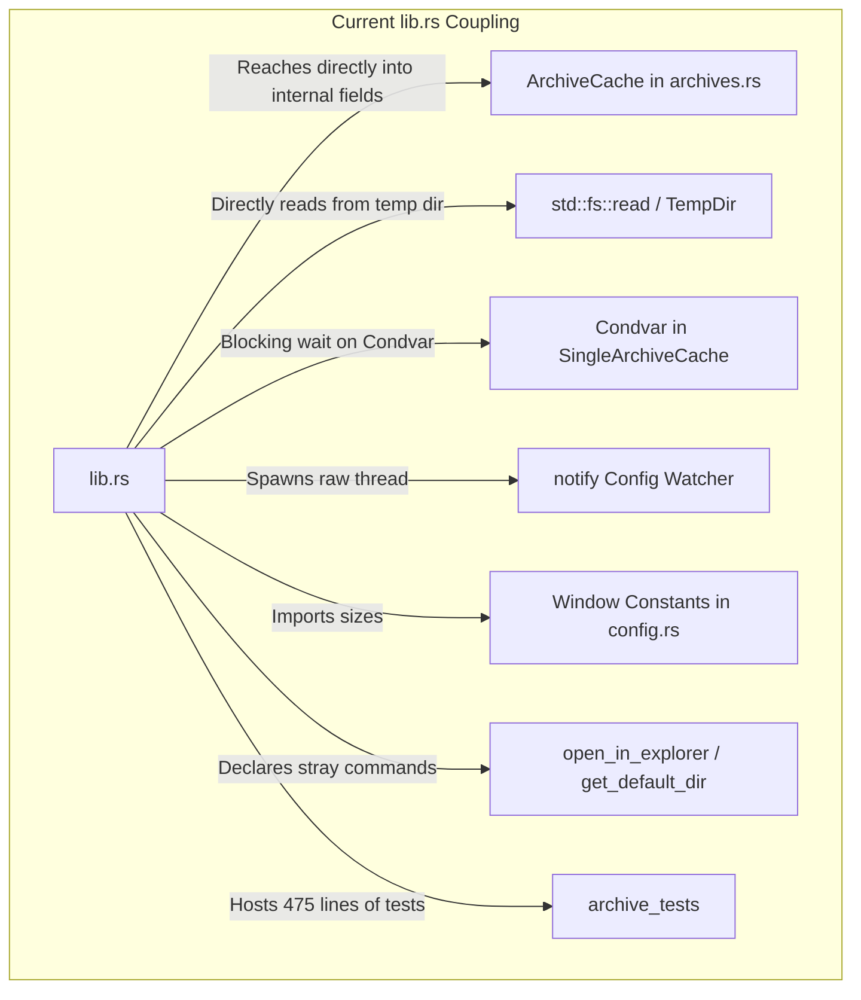
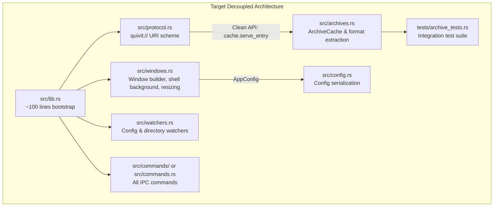

# Decoupling Analysis: `src-tauri/src/lib.rs`

**File Path:** [`src-tauri/src/lib.rs`](file:///E:/Projects/QuiviT/src-tauri/src/lib.rs)  
**Total Lines:** 970 lines  
**File Size:** 39,977 bytes (~39.0 KB)  
**Target Output Artifact:** [`01-lib.rs.md`](file:///E:/Projects/QuiviT/.agents/rust-decoupling-analysis/01-lib.rs.md)  
**Analysis Date:** 2026-08-16  

---

## 1. Executive Summary & File Overview

[`lib.rs`](file:///E:/Projects/QuiviT/src-tauri/src/lib.rs) is the root library crate entry point for the QuiviT Tauri backend. It defines the public application bootstrap function [`run()`](file:///E:/Projects/QuiviT/src-tauri/src/lib.rs#L62-L378), declares all backend child modules (`archives`, `commands`, `config`, `ico`, `models`, `utils`), and wires together Tauri plugins, state containers, command handlers, custom URI scheme handlers, and window lifecycle listeners.

However, `lib.rs` currently suffers from significant architectural bloat and severe cross-domain coupling:
1. **Bloat via Stranded Tests:** 475 lines (49.0% of the entire file, lines 494-969) consist of a test suite (`mod archive_tests`) that tests archive extraction, TAR/7z/RAR listing, path traversal safety, and cache eviction:functionality belonging entirely to [`archives.rs`](file:///E:/Projects/QuiviT/src-tauri/src/archives.rs).
2. **Leaky Protocol Handler:** The `quivit://` asynchronous protocol handler (lines 183-352) reaches directly into private and semi-private fields of [`ArchiveCache`](file:///E:/Projects/QuiviT/src-tauri/src/archives.rs#L19-L29) (`single.extract_temp_dir`, `single.extract_notify`, `single.zip_archive`), orchestrating Condvar synchronization, background wait timeouts, and multi-step cache fallbacks inside `lib.rs`.
3. **Reinvented Standard Utilities:** Lines 382-448 implement handwritten Base64 and percent-decoding algorithms from scratch, despite `Cargo.toml` already importing `base64 = "0.23.1"`.
4. **Scattered Window Management:** Window creation, configuration, sizing constants, and background color styling are fragmented across `lib.rs` and [`config.rs`](file:///E:/Projects/QuiviT/src-tauri/src/config.rs).
5. **Stray Command Implementations:** Commands like [`open_in_explorer`](file:///E:/Projects/QuiviT/src-tauri/src/lib.rs#L450-L460) and [`get_default_dir`](file:///E:/Projects/QuiviT/src-tauri/src/lib.rs#L462-L471) are implemented in `lib.rs` rather than in [`commands.rs`](file:///E:/Projects/QuiviT/src-tauri/src/commands.rs).
6. **Ad-Hoc Background File Watcher:** Spawns an unmanaged `notify` watcher thread inside the `.setup()` hook (lines 111-143) instead of utilizing a managed watcher service.

---

## 2. Itemized Inventory of Items in `lib.rs`

### 2.1. Module Declarations & Imports

| Line Range | Item | Visibility | Description |
| :--- | :--- | :--- | :--- |
| [L1](file:///E:/Projects/QuiviT/src-tauri/src/lib.rs#L1) | `pub mod archives;` | `pub` | Archive formats, extraction, caching (`ArchiveCache`) |
| [L2](file:///E:/Projects/QuiviT/src-tauri/src/lib.rs#L2) | `pub mod commands;` | `pub` | IPC directory traversal, navigation, watcher commands |
| [L3](file:///E:/Projects/QuiviT/src-tauri/src/lib.rs#L3) | `pub mod config;` | `pub` | Persistent app config, window sizing, config commands |
| [L4](file:///E:/Projects/QuiviT/src-tauri/src/lib.rs#L4) | `pub mod ico;` | `pub` | Native Windows icon extraction via Win32 Shell API |
| [L5](file:///E:/Projects/QuiviT/src-tauri/src/lib.rs#L5) | `pub mod models;` | `pub` | Data structures shared between Rust and TS/JS frontend |
| [L6](file:///E:/Projects/QuiviT/src-tauri/src/lib.rs#L6) | `pub mod utils;` | `pub` | File format definitions and Win32 file attribute flags |
| [L8-L18](file:///E:/Projects/QuiviT/src-tauri/src/lib.rs#L8-L18) | Top-level imports | `private` | Imports `std::fs`, `std::sync::Mutex`, `tauri::*`, and glob `archives::*`, `commands::*`, `config::*`, `ico::*` |

### 2.2. Public Functions & Exports

| Line Range | Signature | Description |
| :--- | :--- | :--- |
| [L62-L378](file:///E:/Projects/QuiviT/src-tauri/src/lib.rs#L62-L378) | `pub fn run()` | Main Tauri application entry point (`#[cfg_attr(mobile, tauri::mobile_entry_point)]`). Initializes plugins, state, commands, protocol, and starts event loop. |

### 2.3. Tauri Commands Registered in `lib.rs`

`lib.rs` registers 29 Tauri commands into `tauri::generate_handler![]` ([lines 150-182](file:///E:/Projects/QuiviT/src-tauri/src/lib.rs#L150-L182)). Two commands are implemented directly in `lib.rs`:

| Command Name | Source Line | Implementation Location | Category / Role |
| :--- | :--- | :--- | :--- |
| `read_directory` | [L151](file:///E:/Projects/QuiviT/src-tauri/src/lib.rs#L151) | [`commands.rs`](file:///E:/Projects/QuiviT/src-tauri/src/commands.rs#L78) | Directory listing & sorting |
| `list_archive` | [L152](file:///E:/Projects/QuiviT/src-tauri/src/lib.rs#L152) | [`commands.rs`](file:///E:/Projects/QuiviT/src-tauri/src/commands.rs#L249) | Archive internal directory read & cache setup |
| `prefetch_archive_entries` | [L153](file:///E:/Projects/QuiviT/src-tauri/src/lib.rs#L153) | [`commands.rs`](file:///E:/Projects/QuiviT/src-tauri/src/commands.rs#L349) | Background ZIP decompression |
| `open_parent` | [L154](file:///E:/Projects/QuiviT/src-tauri/src/lib.rs#L154) | [`commands.rs`](file:///E:/Projects/QuiviT/src-tauri/src/commands.rs#L400) | Navigate up container hierarchy |
| `open_sibling` | [L155](file:///E:/Projects/QuiviT/src-tauri/src/lib.rs#L155) | [`commands.rs`](file:///E:/Projects/QuiviT/src-tauri/src/commands.rs#L427) | Navigate to next/prev image sibling |
| `open_sibling_container` | [L156](file:///E:/Projects/QuiviT/src-tauri/src/lib.rs#L156) | [`commands.rs`](file:///E:/Projects/QuiviT/src-tauri/src/commands.rs#L476) | Navigate to next/prev folder/archive |
| `load_config` | [L157](file:///E:/Projects/QuiviT/src-tauri/src/lib.rs#L157) | [`config.rs`](file:///E:/Projects/QuiviT/src-tauri/src/config.rs#L170) | Read `config.json` |
| `get_config_dir` | [L158](file:///E:/Projects/QuiviT/src-tauri/src/lib.rs#L158) | [`config.rs`](file:///E:/Projects/QuiviT/src-tauri/src/config.rs#L187) | Return config folder path |
| `open_config_dir` | [L159](file:///E:/Projects/QuiviT/src-tauri/src/lib.rs#L159) | [`config.rs`](file:///E:/Projects/QuiviT/src-tauri/src/config.rs#L192) | Open config folder in Explorer |
| `get_local_data_dir` | [L160](file:///E:/Projects/QuiviT/src-tauri/src/lib.rs#L160) | [`config.rs`](file:///E:/Projects/QuiviT/src-tauri/src/config.rs#L198) | Return LocalAppData folder path |
| `open_local_data_dir` | [L161](file:///E:/Projects/QuiviT/src-tauri/src/lib.rs#L161) | [`config.rs`](file:///E:/Projects/QuiviT/src-tauri/src/config.rs#L203) | Open LocalAppData folder in Explorer |
| `save_config` | [L162](file:///E:/Projects/QuiviT/src-tauri/src/lib.rs#L162) | [`config.rs`](file:///E:/Projects/QuiviT/src-tauri/src/config.rs#L210) | Write `config.json` |
| `open_options` | [L163](file:///E:/Projects/QuiviT/src-tauri/src/lib.rs#L163) | [`config.rs`](file:///E:/Projects/QuiviT/src-tauri/src/config.rs#L273) | Open/focus Options window |
| `fit_options_window` | [L164](file:///E:/Projects/QuiviT/src-tauri/src/lib.rs#L164) | [`config.rs`](file:///E:/Projects/QuiviT/src-tauri/src/config.rs#L347) | Resize Options window to content |
| `open_metadata_window` | [L165](file:///E:/Projects/QuiviT/src-tauri/src/lib.rs#L165) | [`config.rs`](file:///E:/Projects/QuiviT/src-tauri/src/config.rs#L377) | Open/focus Metadata window |
| `fit_metadata_window` | [L166](file:///E:/Projects/QuiviT/src-tauri/src/lib.rs#L166) | [`config.rs`](file:///E:/Projects/QuiviT/src-tauri/src/config.rs#L442) | Resize Metadata window to content |
| `get_drives` | [L167](file:///E:/Projects/QuiviT/src-tauri/src/lib.rs#L167) | [`commands.rs`](file:///E:/Projects/QuiviT/src-tauri/src/commands.rs#L552) | Win32 logical drive letter enumeration |
| `watch_directory` | [L168](file:///E:/Projects/QuiviT/src-tauri/src/lib.rs#L168) | [`commands.rs`](file:///E:/Projects/QuiviT/src-tauri/src/commands.rs#L571) | Manage directory filesystem watcher |
| `open_in_explorer` | [L169](file:///E:/Projects/QuiviT/src-tauri/src/lib.rs#L169) | **`lib.rs:450-460`** | Launch Explorer process on path |
| `get_path_kind` | [L170](file:///E:/Projects/QuiviT/src-tauri/src/lib.rs#L170) | [`commands.rs`](file:///E:/Projects/QuiviT/src-tauri/src/commands.rs#L644) | Classify path as Directory, Archive, or File |
| `read_text_file` | [L171](file:///E:/Projects/QuiviT/src-tauri/src/lib.rs#L171) | [`commands.rs`](file:///E:/Projects/QuiviT/src-tauri/src/commands.rs#L663) | Read UTF-8 text file |
| `write_text_file` | [L172](file:///E:/Projects/QuiviT/src-tauri/src/lib.rs#L172) | [`commands.rs`](file:///E:/Projects/QuiviT/src-tauri/src/commands.rs#L669) | Write UTF-8 text file |
| `get_default_dir` | [L173](file:///E:/Projects/QuiviT/src-tauri/src/lib.rs#L173) | **`lib.rs:462-471`** | Read `%USERPROFILE%\Pictures` |
| `get_ico_frames` | [L174](file:///E:/Projects/QuiviT/src-tauri/src/lib.rs#L174) | [`ico.rs`](file:///E:/Projects/QuiviT/src-tauri/src/ico.rs#L77) | Parse `.ico` file sub-frames |
| `get_archive_ico_frames` | [L175](file:///E:/Projects/QuiviT/src-tauri/src/lib.rs#L175) | [`ico.rs`](file:///E:/Projects/QuiviT/src-tauri/src/ico.rs#L92) | Extract and parse `.ico` frame from archive |
| `get_native_icon` | [L176](file:///E:/Projects/QuiviT/src-tauri/src/lib.rs#L176) | [`ico.rs`](file:///E:/Projects/QuiviT/src-tauri/src/ico.rs#L162) | Win32 `SHGetFileInfoW` icon extraction |
| `get_format_status` | [L177](file:///E:/Projects/QuiviT/src-tauri/src/lib.rs#L177) | [`commands.rs`](file:///E:/Projects/QuiviT/src-tauri/src/commands.rs#L688) | Windows Registry file association status |
| `register_associations` | [L178](file:///E:/Projects/QuiviT/src-tauri/src/lib.rs#L178) | [`commands.rs`](file:///E:/Projects/QuiviT/src-tauri/src/commands.rs#L720) | Register file associations in Windows Registry |
| `unregister_associations` | [L179](file:///E:/Projects/QuiviT/src-tauri/src/lib.rs#L179) | [`commands.rs`](file:///E:/Projects/QuiviT/src-tauri/src/commands.rs#L790) | Clean up Windows Registry file associations |
| `get_initial_args` | [L180](file:///E:/Projects/QuiviT/src-tauri/src/lib.rs#L180) | [`commands.rs`](file:///E:/Projects/QuiviT/src-tauri/src/commands.rs#L836) | Return CLI arguments passed to process |
| `show_window` | [L181](file:///E:/Projects/QuiviT/src-tauri/src/lib.rs#L181) | [`config.rs`](file:///E:/Projects/QuiviT/src-tauri/src/config.rs#L476) | Show window after fit calculations |

### 2.4. Private Helpers & Internal Functions

| Function / Helper | Line Range | Purpose |
| :--- | :--- | :--- |
| [`apply_shell_background`](file:///E:/Projects/QuiviT/src-tauri/src/lib.rs#L36-L60) | [L36-L60](file:///E:/Projects/QuiviT/src-tauri/src/lib.rs#L36-L60) | Queries config theme and sets native window background before first paint |
| [`base64_decode`](file:///E:/Projects/QuiviT/src-tauri/src/lib.rs#L382-L386) | [L382-L386](file:///E:/Projects/QuiviT/src-tauri/src/lib.rs#L382-L386) | Decodes base64 string to UTF-8 String |
| [`base64_decode_bytes`](file:///E:/Projects/QuiviT/src-tauri/src/lib.rs#L388-L429) | [L388-L429](file:///E:/Projects/QuiviT/src-tauri/src/lib.rs#L388-L429) | Low-level custom ASCII lookup table base64 byte decoder |
| [`urlencoding_decode`](file:///E:/Projects/QuiviT/src-tauri/src/lib.rs#L431-L448) | [L431-L448](file:///E:/Projects/QuiviT/src-tauri/src/lib.rs#L431-L448) | Percent-decoding parser (`%XX` hex byte translation) |
| [`guess_mime`](file:///E:/Projects/QuiviT/src-tauri/src/lib.rs#L473-L492) | [L473-L492](file:///E:/Projects/QuiviT/src-tauri/src/lib.rs#L473-L492) | Static extension-to-MIME string matcher |

---

## 3. Responsibility Clusters & Line Range Analysis

```
┌────────────────────────────────────────────────────────────────────────┐
│                        lib.rs (970 total lines)                       │
├───────────────────────────────┬────────────────────────────────────────┤
│ Module Declarations & Imports │ Lines 1 - 18     (18 lines)            │
│ Window Styling Helper         │ Lines 19 - 60    (42 lines)            │
│ App Bootstrap & Lifecycle     │ Lines 62 - 182   (121 lines)           │
│ quivit:// URI Scheme Protocol │ Lines 183 - 352  (170 lines)           │
│ Window Lifecycle Event Hooks  │ Lines 353 - 378  (26 lines)            │
│ Handwritten Utility Functions │ Lines 380 - 448  (69 lines)            │
│ Stray Tauri Commands          │ Lines 450 - 471  (22 lines)            │
│ Protocol MIME Lookup          │ Lines 473 - 492  (20 lines)            │
│ Stranded archive_tests Suite  │ Lines 494 - 969  (476 lines, 49.1%)    │
└───────────────────────────────┴────────────────────────────────────────┘
```

### Cluster 1: App Bootstrap, Plugins & Lifecycle ([L62-L90](file:///E:/Projects/QuiviT/src-tauri/src/lib.rs#L62-L90), [L353-L378](file:///E:/Projects/QuiviT/src-tauri/src/lib.rs#L353-L378))
- **Responsibilities:**
  - Loads configuration early via [`crate::config::load_config_early()`](file:///E:/Projects/QuiviT/src-tauri/src/config.rs#L64) to determine single-instance activation and cache capacity.
  - Initializes `tauri_plugin_single_instance`: captures subsequent CLI invocations, focuses the `main` window, and emits `single-instance-open`.
  - Initializes `tauri_plugin_opener` and `tauri_plugin_dialog`.
  - Manages global state: `Mutex<ArchiveCache>` and `Mutex<WatcherState>`.
  - Implements `on_window_event` listener: when `main` window receives `CloseRequested`, automatically closes child windows (`options`, `metadata`) to prevent orphaned headless processes.
  - Implements `RunEvent::Exit` hook: triggers [`crate::config::apply_pending_config_to_disk()`](file:///E:/Projects/QuiviT/src-tauri/src/config.rs#L149).

### Cluster 2: Window Construction & Native Shell Styling ([L21-L60](file:///E:/Projects/QuiviT/src-tauri/src/lib.rs#L21-L60), [L92-L110](file:///E:/Projects/QuiviT/src-tauri/src/lib.rs#L92-L110))
- **Responsibilities:**
  - Builds the `main` window programmatically in the `.setup()` hook (`WebviewWindowBuilder::new(app, "main", ...)`).
  - Configures initial dimensions (`MAIN_INITIAL_W`, `MAIN_INITIAL_H`, `MAIN_MIN_W`, `MAIN_MIN_H` imported from `config.rs`).
  - [`apply_shell_background`](file:///E:/Projects/QuiviT/src-tauri/src/lib.rs#L36-L60): Evaluates user theme ("dark", "light", or OS system theme) and applies Win32 webview surface background color (`#252526` or `#ffffff`) before first paint to eliminate launch flicker.
- **Architectural Smell:** Window creation is split between `lib.rs` (`main` window) and `config.rs` (`options` and `metadata` windows). Window dimension constants are declared in `config.rs` but consumed in `lib.rs`.

### Cluster 3: Embedded Config File Watcher ([L111-L145](file:///E:/Projects/QuiviT/src-tauri/src/lib.rs#L111-L145))
- **Responsibilities:**
  - Spawns a dedicated OS thread (`std::thread::spawn`) in `.setup()` using `notify::recommended_watcher`.
  - Watches parent directory of `config.json`.
  - Debounces `EventKind::Modify` events (500ms cooldown) and emits `config-changed` to the frontend webview.
- **Architectural Smell:** Unmanaged thread creation directly inside `lib.rs`. Duplicate usage of `notify` crate (the directory watcher is in `commands.rs`, while the config watcher is embedded in `lib.rs`).

### Cluster 4: Custom `quivit://` Asset Scheme Protocol Handler ([L183-L352](file:///E:/Projects/QuiviT/src-tauri/src/lib.rs#L183-L352), [L473-L492](file:///E:/Projects/QuiviT/src-tauri/src/lib.rs#L473-L492))
- **Responsibilities:**
  - Registers the custom asynchronous URI scheme protocol `"quivit"`.
  - Parses incoming request URIs (`quivit://archive/<base64_archive_path>/<entry_name>`).
  - Decodes base64 archive paths and percent-encoded entry names.
  - Spawns an OS worker thread per asset request to extract or serve bytes from cache / disk.
  - Implements synchronization: For 7z/RAR solid archives, waits up to 30s on a `Condvar` for background extraction threads to finish unpacking requested files.
  - Formats HTTP `Response` with headers (`Content-Type`, `Content-Length`, `Access-Control-Allow-Origin: *`).
- **Architectural Smell:** Heavily reaches into [`ArchiveCache`](file:///E:/Projects/QuiviT/src-tauri/src/archives.rs#L19-L29) internals, managing Mutexes and Condvars directly. It bypasses any clean service layer in `archives.rs`.

### Cluster 5: Handwritten Utilities & Stray Tauri Commands ([L380-L471](file:///E:/Projects/QuiviT/src-tauri/src/lib.rs#L380-L471))
- **Responsibilities:**
  - [`base64_decode`](file:///E:/Projects/QuiviT/src-tauri/src/lib.rs#L382-L386) & [`base64_decode_bytes`](file:///E:/Projects/QuiviT/src-tauri/src/lib.rs#L388-L429): Custom base64 decoder.
  - [`urlencoding_decode`](file:///E:/Projects/QuiviT/src-tauri/src/lib.rs#L431-L448): Custom percent decoder.
  - [`open_in_explorer`](file:///E:/Projects/QuiviT/src-tauri/src/lib.rs#L450-L460): Spawns Windows Explorer process.
  - [`get_default_dir`](file:///E:/Projects/QuiviT/src-tauri/src/lib.rs#L462-L471): Returns `%USERPROFILE%\Pictures`.
  - [`guess_mime`](file:///E:/Projects/QuiviT/src-tauri/src/lib.rs#L473-L492): File extension to MIME mapper.
- **Architectural Smell:** Reinventing wheel for base64/urlencoding; placing random Tauri IPC commands inside `lib.rs`.

### Cluster 6: Archive & Cache Unit/Integration Test Suite ([L494-L969](file:///E:/Projects/QuiviT/src-tauri/src/lib.rs#L494-L969))
- **Responsibilities:**
  - 13 test functions + 2 test helper functions testing archive extraction, CBT creation, solid 7z listing, RAR5 listing, path traversal safety, and cache eviction.
- **Architectural Smell:** Makes up 49% of `lib.rs` source code. Belongs in `archives.rs` or `tests/archive_tests.rs`.

---

## 4. In-Depth Architectural & Coupling Analysis



### 4.1. Leaky Abstraction: Protocol Handler Reaching Into `ArchiveCache` Internals

In [`lib.rs:230-332`](file:///E:/Projects/QuiviT/src-tauri/src/lib.rs#L230-L332), the protocol handler performs deep multi-step manipulation of `ArchiveCache` internal fields:
```rust
// lib.rs:243-254 - Directly inspecting inner struct fields
if let Some(single) = cache.archives.get(&archive_path) {
    if let Some(temp_dir) = &single.extract_temp_dir {
        if let Some(file_path) = crate::archives::archive_entry_temp_path(temp_dir, &entry_name) {
            if let Ok(bytes) = fs::read(&file_path) {
                data = Some(bytes);
            }
        }
    }
}
```
And on cache miss ([lines 297-330](file:///E:/Projects/QuiviT/src-tauri/src/lib.rs#L297-L330)):
```rust
// lib.rs extracts raw extract_notify Arc<(Mutex<HashSet<String>>, Condvar)> from cache
// and executes a blocking wait_timeout_while in lib.rs!
let (lock, cvar) = &*notify;
let set = lock.lock().unwrap();
let timeout = std::time::Duration::from_secs(30);
let _ = cvar.wait_timeout_while(set, timeout, |pending| {
    !pending.contains(&entry_name)
}).unwrap();
```
**Why this is problematic:**
- Any change to the storage format or caching strategy in `archives.rs` breaks `lib.rs`.
- `lib.rs` is responsible for handling high-level Tauri lifecycle, yet it acts as an archive extraction orchestrator.
- Encapsulation is completely broken: `SingleArchiveCache` fields (`extract_temp_dir`, `extract_notify`, `zip_archive`) must remain `pub` solely because `lib.rs` reaches into them.

### 4.2. Unmanaged Concurrency & Thread Contention in `quivit://` Protocol

- For every image request made by the webview (``), `lib.rs:226` calls `std::thread::spawn(move || { ... })`.
- During fast thumbnail rendering or rapid scrolling, 20-50 OS threads can be spawned concurrently.
- Each thread acquires `state.lock().unwrap()` on the global `Mutex<ArchiveCache>` up to 3 separate times (initial check, extraction lookup, cache insert).
- Threads waiting for solid 7z extraction block for up to 30 seconds on a Condvar.

### 4.3. Duplicated / Handwritten Utility Logic

- **Base64 Decoding ([L382-L429](file:///E:/Projects/QuiviT/src-tauri/src/lib.rs#L382-L429)):**
  `lib.rs` defines a custom 45-line base64 decoder using raw ASCII table lookups.
  However, `Cargo.toml` already declares:
  ```toml
  base64 = "0.23.1"
  ```
  Handwritten base64 parsers introduce unnecessary maintenance and lack standard security/fuzzing assurances.
- **Percent Decoding ([L431-L448](file:///E:/Projects/QuiviT/src-tauri/src/lib.rs#L431-L448)):**
  Handwritten `%XX` loop instead of standard URL decoding helpers.

### 4.4. Fragmented Window Management

- `lib.rs` creates the `main` window and sets its background color ([L95-L108](file:///E:/Projects/QuiviT/src-tauri/src/lib.rs#L95-L108)).
- `config.rs` creates the `options` and `metadata` windows ([`config.rs:273`](file:///E:/Projects/QuiviT/src-tauri/src/config.rs#L273), [`config.rs:377`](file:///E:/Projects/QuiviT/src-tauri/src/config.rs#L377)).
- Window dimension constants (`MAIN_INITIAL_W`, `MAIN_INITIAL_H`, `MAIN_MIN_W`, `MAIN_MIN_H`, `OPTIONS_INITIAL_W`, `META_INITIAL_W`, etc.) are declared in `config.rs` (lines 12-39), making `config.rs` responsible for both JSON serialization and Win32 UI geometry.
- `lib.rs` handles the child window close cascading logic ([L353-L370](file:///E:/Projects/QuiviT/src-tauri/src/lib.rs#L353-L370)).

### 4.5. Half of `lib.rs` is Stranded Tests

- Lines 494-969 (475 lines) are unit and integration tests for `archives.rs`.
- These tests do not test `lib.rs` functionality.
- They inflate compilation and navigation overhead in `lib.rs`.

---

## 5. Test Suite Analysis (`mod archive_tests`)

The `archive_tests` module ([lines 494-969](file:///E:/Projects/QuiviT/src-tauri/src/lib.rs#L494-L969)) contains 13 test functions and 2 private test helper functions:

| Test / Helper Name | Line Range | Target Functionality Tested | Test Type |
| :--- | :--- | :--- | :--- |
| `test_file` (helper) | [L501-L508](file:///E:/Projects/QuiviT/src-tauri/src/lib.rs#L501-L508) | Resolves path to `../test-files/archives/<name>` | Test Fixture Helper |
| `ensure_cbt` (helper) | [L513-L566](file:///E:/Projects/QuiviT/src-tauri/src/lib.rs#L513-L566) | Self-provisions `cbt.cbt` by repacking images from `7z.7z` | Test Fixture Builder |
| `lists_solid_7z_with_nested_folders` | [L568-L584](file:///E:/Projects/QuiviT/src-tauri/src/lib.rs#L568-L584) | [`archives::list_7z_entries`](file:///E:/Projects/QuiviT/src-tauri/src/archives.rs) natural sorting and path preservation | Unit / Integration |
| `extracts_solid_7z_to_temp` | [L586-L611](file:///E:/Projects/QuiviT/src-tauri/src/lib.rs#L586-L611) | [`archives::extract_7z_to_temp`](file:///E:/Projects/QuiviT/src-tauri/src/archives.rs) unpacking & nested file integrity | Integration |
| `lists_and_reads_tar` | [L613-L643](file:///E:/Projects/QuiviT/src-tauri/src/lib.rs#L613-L643) | [`archives::list_tar_entries`](file:///E:/Projects/QuiviT/src-tauri/src/archives.rs) and [`extract_tar_entry`](file:///E:/Projects/QuiviT/src-tauri/src/archives.rs) byte match against 7z | Integration |
| `extracts_tar_to_temp` | [L645-L666](file:///E:/Projects/QuiviT/src-tauri/src/lib.rs#L645-L666) | [`archives::extract_tar_to_temp`](file:///E:/Projects/QuiviT/src-tauri/src/archives.rs) temp directory extraction | Integration |
| `archive_entry_temp_path_rejects_escape_paths` | [L668-L678](file:///E:/Projects/QuiviT/src-tauri/src/lib.rs#L668-L678) | [`archives::archive_entry_temp_path`](file:///E:/Projects/QuiviT/src-tauri/src/archives.rs) traversal rejection (`..`, `/absolute`) | Security / Unit |
| `tar_temp_extraction_includes_metadata` | [L680-L718](file:///E:/Projects/QuiviT/src-tauri/src/lib.rs#L680-L718) | Extraction of `ComicInfo.xml` alongside images | Integration |
| `supported_archives_include_new_formats` | [L720-L725](file:///E:/Projects/QuiviT/src-tauri/src/lib.rs#L720-L725) | [`utils::is_archive_ext`](file:///E:/Projects/QuiviT/src-tauri/src/utils.rs#L113) format verification (`7z`, `cb7`, `cbt`, `tar`) | Unit |
| `lists_rar5_cbr` | [L727-L737](file:///E:/Projects/QuiviT/src-tauri/src/lib.rs#L727-L737) | [`archives::list_rar_entries`](file:///E:/Projects/QuiviT/src-tauri/src/archives.rs) RAR5 unicode file entry reading | Integration |
| `lists_cb7_like_7z` | [L739-L751](file:///E:/Projects/QuiviT/src-tauri/src/lib.rs#L739-L751) | `.cb7` extension handling via 7z pipeline | Integration |
| `url_decode_roundtrips_utf8_entry_names` | [L753-L766](file:///E:/Projects/QuiviT/src-tauri/src/lib.rs#L753-L766) | [`urlencoding_decode`](file:///E:/Projects/QuiviT/src-tauri/src/lib.rs#L431) with Japanese multi-byte UTF-8 | Unit |
| `protocol_serve_timing_simulation` | [L768-L868](file:///E:/Projects/QuiviT/src-tauri/src/lib.rs#L768-L868) | Simulates async protocol response timing and background 7z/CBT extraction | Integration / Benchmark |
| `archive_cache_byte_budget_evicts_globally` | [L870-L937](file:///E:/Projects/QuiviT/src-tauri/src/lib.rs#L870-L937) | [`ArchiveCache`](file:///E:/Projects/QuiviT/src-tauri/src/archives.rs#L19) LRU eviction, byte budget capping, oversize handling | Unit |
| `archive_cache_bounds_open_archive_state` | [L939-L968](file:///E:/Projects/QuiviT/src-tauri/src/lib.rs#L939-L968) | [`ArchiveCache::max_open_archives`](file:///E:/Projects/QuiviT/src-tauri/src/archives.rs#L28) LRU archive state bounding | Unit |

**Test Migration Destination:**
- The pure unit tests (`archive_cache_byte_budget_evicts_globally`, `archive_cache_bounds_open_archive_state`, `archive_entry_temp_path_rejects_escape_paths`) belong directly in [`src-tauri/src/archives.rs`](file:///E:/Projects/QuiviT/src-tauri/src/archives.rs) as an inline `#[cfg(test)] mod tests`.
- The fixture-based archive format integration tests (`lists_solid_7z_with_nested_folders`, `extracts_solid_7z_to_temp`, `lists_and_reads_tar`, `extracts_tar_to_temp`, `tar_temp_extraction_includes_metadata`, `lists_rar5_cbr`, `lists_cb7_like_7z`, `protocol_serve_timing_simulation`) belong in a dedicated integration test file: `src-tauri/tests/archive_tests.rs`.

---

## 6. Target Decoupled Architecture



### 6.1. Proposed New / Extracted Modules

1. **`src/protocol.rs` (Custom URI Scheme Handler):**
   - Encapsulates `register_quivit_protocol(builder: tauri::Builder<R>) -> tauri::Builder<R>`.
   - Uses `base64::prelude::BASE64_STANDARD` or `URL_SAFE` to decode paths cleanly.
   - Delegates entry retrieval to a clean public method on `ArchiveCache` (e.g., `cache.get_or_extract_entry(...)`).
   - Contains [`guess_mime`](file:///E:/Projects/QuiviT/src-tauri/src/lib.rs#L473-L492).

2. **`src/windows.rs` (Centralized Window Management):**
   - Centralizes window construction:
     - `create_main_window(app: &tauri::App) -> tauri::Result<tauri::WebviewWindow>`
     - `open_options_window(app: &tauri::AppHandle)` (moved from `config.rs`)
     - `open_metadata_window(app: &tauri::AppHandle)` (moved from `config.rs`)
   - Window size constants: `MAIN_INITIAL_W`, `MAIN_MIN_W`, `OPTIONS_INITIAL_W`, `META_INITIAL_W`, etc. (moved out of `config.rs`).
   - Window styling & commands:
     - [`apply_shell_background`](file:///E:/Projects/QuiviT/src-tauri/src/lib.rs#L36-L60)
     - `fit_options_window`, `fit_metadata_window`, `show_window`.
     - Window event cascading (`close_secondary_windows_on_main_exit`).

3. **`src/watchers.rs` (Managed File System Watchers):**
   - Encapsulates both the Directory Watcher (`WatcherState`) and the Config File Watcher.
   - Provides a clean function `start_config_watcher(app_handle: tauri::AppHandle, config_path: PathBuf)`.

4. **`src/commands.rs` (Consolidated Command Registry):**
   - Move [`open_in_explorer`](file:///E:/Projects/QuiviT/src-tauri/src/lib.rs#L450-L460) and [`get_default_dir`](file:///E:/Projects/QuiviT/src-tauri/src/lib.rs#L462-L471) from `lib.rs` into `commands.rs`.

5. **`tests/archive_tests.rs` (Integration Tests):**
   - Move fixture-dependent tests and `ensure_cbt` helper to `src-tauri/tests/archive_tests.rs`.

---

## 7. Migration & Decoupling Step-by-Step Plan

| Step | Action | Source Location | Target Location | Rationale |
| :--- | :--- | :--- | :--- | :--- |
| **1** | Extract archive tests to integration suite | `lib.rs:494-969` | `tests/archive_tests.rs` & `archives.rs` | Eliminates 475 lines of stranded code from `lib.rs`. |
| **2** | Move stray commands to `commands.rs` | `lib.rs:450-471` (`open_in_explorer`, `get_default_dir`) | `commands.rs` | Keeps all Tauri command implementations together. |
| **3** | Create `src/protocol.rs` and encapsulate scheme handler | `lib.rs:183-352`, `lib.rs:382-448`, `lib.rs:473-492` | `src/protocol.rs` | Decouples scheme parsing and MIME guessing; replaces handwritten base64 with `base64` crate. |
| **4** | Add clean retrieval method to `ArchiveCache` | `lib.rs:230-332` | `archives.rs: ArchiveCache::get_or_wait_entry(...)` | Eliminates leaky direct field manipulation and Condvar waits in protocol handler. |
| **5** | Create `src/windows.rs` and consolidate window logic | `lib.rs:21-60`, `lib.rs:95-109`, `lib.rs:353-370`, `config.rs:12-39`, `config.rs:273-485` | `src/windows.rs` | Unifies window constants, creation, fitting, styling, and lifecycle in one module. |
| **6** | Extract config watcher into `src/watchers.rs` | `lib.rs:111-145` | `src/watchers.rs` | Clean separation of background watcher threads. |
| **7** | Streamline `lib.rs` | `lib.rs` | `src/lib.rs` (~90-120 lines) | `lib.rs` becomes a clean, readable orchestrator. |

---

## 8. Target `lib.rs` Reference Implementation (Post-Decoupling)

Once decoupled, `lib.rs` will be reduced from 970 lines to ~95 lines:

```rust
pub mod archives;
pub mod commands;
pub mod config;
pub mod ico;
pub mod models;
pub mod protocol;
pub mod utils;
pub mod watchers;
pub mod windows;

use std::sync::Mutex;
use archives::ArchiveCache;
use watchers::WatcherState;

#[cfg_attr(mobile, tauri::mobile_entry_point)]
pub fn run() {
    let config = config::load_config_early();
    let single_instance = config
        .frontend_data
        .get("single_instance")
        .and_then(|v| v.as_bool())
        .unwrap_or(true);
    let cache_mb = config.archive_cache_mb.unwrap_or(512);

    let mut builder = tauri::Builder::default();

    if single_instance {
        builder = windows::init_single_instance(builder);
    }

    builder = builder
        .plugin(tauri_plugin_opener::init())
        .plugin(tauri_plugin_dialog::init())
        .setup(move |app| {
            let main_window = windows::create_main_window(app)?;
            windows::apply_shell_background(&main_window, &config);
            watchers::start_config_watcher(app.handle().clone());
            Ok(())
        });

    builder
        .manage(Mutex::new(ArchiveCache::new(cache_mb)))
        .manage(Mutex::new(WatcherState::new()))
        .invoke_handler(commands::generate_handler())
        .register_asynchronous_uri_scheme_protocol("quivit", protocol::handle_quivit_request)
        .on_window_event(windows::handle_window_event)
        .build(tauri::generate_context!())
        .expect("error while building tauri application")
        .run(|_app_handle, event| {
            if let tauri::RunEvent::Exit = event {
                config::apply_pending_config_to_disk();
            }
        });
}
```
