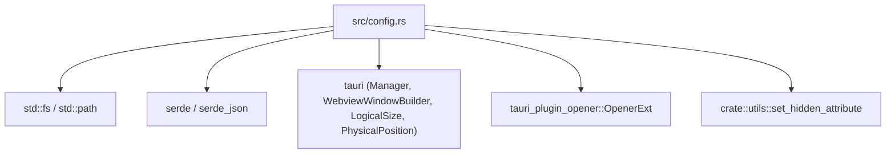
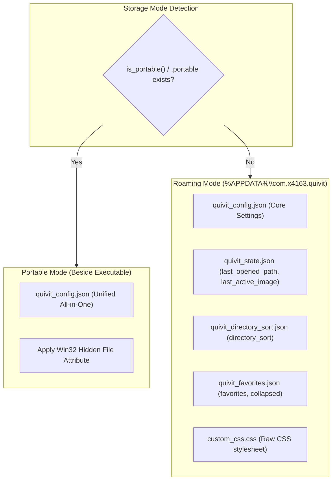
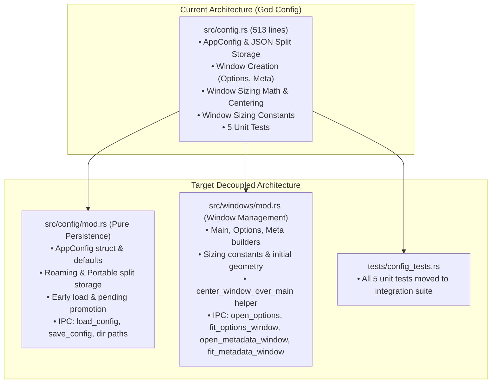

# Decoupling Analysis: `src-tauri/src/config.rs`

**File Path:** [`src-tauri/src/config.rs`](file:///E:/Projects/QuiviT/src-tauri/src/config.rs)  
**Total Lines:** 513 lines  
**File Size:** 20,101 bytes (~19.6 KB)  
**Target Output Artifact:** [`04-config.rs.md`](file:///E:/Projects/QuiviT/.agents/rust-decoupling-analysis/04-config.rs.md)  
**Analysis Date:** 2026-08-16  

---

## 1. Executive Summary & File Overview

[`config.rs`](file:///E:/Projects/QuiviT/src-tauri/src/config.rs) is the persistent configuration and state management module for QuiviT. Its core mission is to handle user preferences, multi-file JSON decomposition and aggregation, roaming vs. portable storage modes, startup staged configuration promotion, and configuration directory opening.

However, `config.rs` has accumulated severe architectural coupling by acting as a secondary window management module. In addition to pure configuration persistence, it contains:
1. **Window Construction & Lifecycle Logic:** Direct calls to Tauri's [`WebviewWindowBuilder`](file:///E:/Projects/QuiviT/src-tauri/src/config.rs#L323-L342) to construct, focus, and configure the `"options"` and `"metadata"` webviews.
2. **Dynamic Window Fitting & Centering Math:** Tauri IPC commands computing DPI physical/logical coordinates and center-offset geometry over the `"main"` window.
3. **Hardcoded Window Sizing Constants:** Window initial, minimum, and auto-fit dimension constants for the entire application (including the main window, which is constructed in [`lib.rs`](file:///E:/Projects/QuiviT/src-tauri/src/lib.rs#L92-L110)).
4. **Dead / Mirrored Constants:** Constants marked `#[allow(dead_code)]` that mirror JavaScript layout clamps.
5. **In-Tree Unit Tests:** 67 lines (13.1% of the file) containing unit test cases for serialization resiliency and staged single-instance promotion.

### Key Metrics Summary

| Metric | Value |
| :--- | :--- |
| **Total Lines** | 513 lines |
| **Code Lines** | ~400 lines (excluding blanks and comments) |
| **Test Suite Lines** | 67 lines (Lines 446-512) |
| **Primary Domain Responsibilities** | Config persistence, portable/roaming detection, multi-file partitioning |
| **Secondary (Leaked) Responsibilities** | Window instantiation, DPI scale calculations, window centering, sizing constants |
| **Tauri Commands Exported** | 10 commands (6 config/path commands, 4 window management commands) |
| **Coupling Level** | High (tight coupling with Tauri windowing, OS environment, filesystem, and UI lifecycle) |

---

## 2. Itemized Inventory of Items in `config.rs`

### 2.1. Window Sizing Constants

| Symbol | Visibility | Lines | Type / Value | Usage & Description |
| :--- | :--- | :--- | :--- | :--- |
| [`MAIN_INITIAL_W`](file:///E:/Projects/QuiviT/src-tauri/src/config.rs#L12) | `pub const` | 12 | `f64 = 1280.0` | Initial width for Main window, consumed in [`lib.rs:101`](file:///E:/Projects/QuiviT/src-tauri/src/lib.rs#L101). |
| [`MAIN_INITIAL_H`](file:///E:/Projects/QuiviT/src-tauri/src/config.rs#L13) | `pub const` | 13 | `f64 = 720.0` | Initial height for Main window, consumed in [`lib.rs:101`](file:///E:/Projects/QuiviT/src-tauri/src/lib.rs#L101). |
| [`MAIN_MIN_W`](file:///E:/Projects/QuiviT/src-tauri/src/config.rs#L14) | `pub const` | 14 | `f64 = 640.0` | Minimum width for Main window, consumed in [`lib.rs:102`](file:///E:/Projects/QuiviT/src-tauri/src/lib.rs#L102). |
| [`MAIN_MIN_H`](file:///E:/Projects/QuiviT/src-tauri/src/config.rs#L15) | `pub const` | 15 | `f64 = 400.0` | Minimum height for Main window, consumed in [`lib.rs:102`](file:///E:/Projects/QuiviT/src-tauri/src/lib.rs#L102). |
| [`AUTO_FIT_INITIAL_W`](file:///E:/Projects/QuiviT/src-tauri/src/config.rs#L19) | `const` (private) | 19 | `f64 = 560.0` | Placeholder width for auto-fit secondary windows. |
| [`AUTO_FIT_INITIAL_H`](file:///E:/Projects/QuiviT/src-tauri/src/config.rs#L20) | `const` (private) | 20 | `f64 = 600.0` | Placeholder height for auto-fit secondary windows. |
| [`OPTIONS_INITIAL_W`](file:///E:/Projects/QuiviT/src-tauri/src/config.rs#L23) | `const` (private) | 23 | `f64 = AUTO_FIT_INITIAL_W` | Initial width placeholder for Options window. |
| [`OPTIONS_INITIAL_H`](file:///E:/Projects/QuiviT/src-tauri/src/config.rs#L24) | `const` (private) | 24 | `f64 = 620.0` | Fixed height for Options window. |
| [`OPTIONS_MIN_W`](file:///E:/Projects/QuiviT/src-tauri/src/config.rs#L25) | `const` (private) | 25 | `f64 = 400.0` | Minimum width clamp for Options window. |
| [`OPTIONS_MIN_H`](file:///E:/Projects/QuiviT/src-tauri/src/config.rs#L26) | `const` (private) | 26 | `f64 = 360.0` | Minimum height clamp for Options window. |
| [`OPTIONS_MAX_W`](file:///E:/Projects/QuiviT/src-tauri/src/config.rs#L29) | `const` (private, `#[allow(dead_code)]`) | 29 | `f64 = 560.0` | Dead code in Rust; mirrors JS clamp in `windowFit.js`. |
| [`META_INITIAL_W`](file:///E:/Projects/QuiviT/src-tauri/src/config.rs#L33) | `const` (private) | 33 | `f64 = 400.0` | Fixed initial width for Metadata window. |
| [`META_INITIAL_H`](file:///E:/Projects/QuiviT/src-tauri/src/config.rs#L34) | `const` (private) | 34 | `f64 = AUTO_FIT_INITIAL_H` | Initial height placeholder for Metadata window. |
| [`META_MIN_W`](file:///E:/Projects/QuiviT/src-tauri/src/config.rs#L35) | `const` (private) | 35 | `f64 = 320.0` | Minimum width clamp for Metadata window. |
| [`META_MIN_H`](file:///E:/Projects/QuiviT/src-tauri/src/config.rs#L36) | `const` (private) | 36 | `f64 = 280.0` | Minimum height clamp for Metadata window. |
| [`META_MAX_H`](file:///E:/Projects/QuiviT/src-tauri/src/config.rs#L39) | `const` (private, `#[allow(dead_code)]`) | 39 | `f64 = 600.0` | Dead code in Rust; mirrors JS clamp in `windowFit.js`. |

### 2.2. Configuration Data Structures & Constants

| Symbol | Visibility | Lines | Description |
| :--- | :--- | :--- | :--- |
| [`AppConfig`](file:///E:/Projects/QuiviT/src-tauri/src/config.rs#L43-L50) | `pub struct` | 43-50 | Root configuration model (`portable_mode`, `hidden`, `archive_cache_mb`, `frontend_data`). Derives `Serialize, Deserialize, Clone`. |
| [`AppConfig::default()`](file:///E:/Projects/QuiviT/src-tauri/src/config.rs#L52-L61) | `impl Default` | 52-61 | Default initialization for `AppConfig`. |
| [`ROAMING_FILES`](file:///E:/Projects/QuiviT/src-tauri/src/config.rs#L86-L92) | `pub const` | 86-92 | Array of 5 file names stored under the roaming profile directory. |
| [`STATE_KEYS`](file:///E:/Projects/QuiviT/src-tauri/src/config.rs#L159) | `pub const` | 159 | Array of key names extracted into `quivit_state.json`. |
| [`SORT_KEYS`](file:///E:/Projects/QuiviT/src-tauri/src/config.rs#L160) | `pub const` | 160 | Array of key names extracted into `quivit_directory_sort.json`. |
| [`FAVORITES_KEYS`](file:///E:/Projects/QuiviT/src-tauri/src/config.rs#L161) | `pub const` | 161 | Array of key names extracted into `quivit_favorites.json`. |

### 2.3. Path Resolution & Persistence Functions

| Symbol | Visibility | Lines | Signature | Description |
| :--- | :--- | :--- | :--- | :--- |
| [`get_exe_dir`](file:///E:/Projects/QuiviT/src-tauri/src/config.rs#L63-L69) | `pub fn` | 63-69 | `() -> PathBuf` | Resolves directory containing current running executable. |
| [`is_portable`](file:///E:/Projects/QuiviT/src-tauri/src/config.rs#L71-L74) | `pub fn` | 71-74 | `() -> bool` | Checks if `quivit_config.json` exists in the executable directory. |
| [`roaming_dir_path`](file:///E:/Projects/QuiviT/src-tauri/src/config.rs#L76-L78) | `pub fn` | 76-78 | `(&tauri::AppHandle) -> PathBuf` | Queries Tauri `app_config_dir` path. |
| [`roaming_dir`](file:///E:/Projects/QuiviT/src-tauri/src/config.rs#L80-L84) | `pub fn` | 80-84 | `(&tauri::AppHandle) -> PathBuf` | Resolves roaming path and creates directory if missing. |
| [`remove_roaming_files`](file:///E:/Projects/QuiviT/src-tauri/src/config.rs#L94-L98) | `pub fn` | 94-98 | `(&Path)` | Deletes the 5 roaming files when switching to portable mode. |
| [`get_config_path`](file:///E:/Projects/QuiviT/src-tauri/src/config.rs#L100-L113) | `pub fn` | 100-113 | `() -> PathBuf` | Computes active config file path without `AppHandle` (checking `.portable` / `quivit_config.json` or `%APPDATA%`). |
| [`load_config_early`](file:///E:/Projects/QuiviT/src-tauri/src/config.rs#L115-L123) | `pub fn` | 115-123 | `() -> AppConfig` | Synchronous config loader used during early application startup. |
| [`apply_pending_to_config`](file:///E:/Projects/QuiviT/src-tauri/src/config.rs#L131-L140) | `pub fn` | 131-140 | `(&mut AppConfig)` | In-memory promotion of `pending_single_instance` to `single_instance`. |
| [`apply_pending_config_to_disk`](file:///E:/Projects/QuiviT/src-tauri/src/config.rs#L142-L151) | `pub fn` | 142-151 | `()` | Promotes staged startup settings and writes back to disk. |
| [`extract_keys`](file:///E:/Projects/QuiviT/src-tauri/src/config.rs#L163-L173) | `pub fn` | 163-173 | `(&mut JsonValue, &[&str]) -> JsonValue` | Removes specified keys from a JSON object and returns them. |
| [`merge_keys`](file:///E:/Projects/QuiviT/src-tauri/src/config.rs#L175-L181) | `pub fn` | 175-181 | `(&mut JsonValue, JsonValue)` | Merges key-value pairs from source JSON object into target. |
| [`read_json_file`](file:///E:/Projects/QuiviT/src-tauri/src/config.rs#L183-L186) | `pub fn` | 183-186 | `<T: DeserializeOwned>(&Path) -> Option<T>` | Generic JSON deserialization from disk path. |
| [`merge_file_into`](file:///E:/Projects/QuiviT/src-tauri/src/config.rs#L188-L192) | `pub fn` | 188-192 | `(&Path, &mut JsonValue)` | Reads JSON file and merges keys into `frontend_data`. |

### 2.4. Tauri IPC Commands

| Command Name | Kind / Attribute | Lines | Signature | Domain Role |
| :--- | :--- | :--- | :--- | :--- |
| [`load_config`](file:///E:/Projects/QuiviT/src-tauri/src/config.rs#L194-L215) | `#[tauri::command]` | 194-215 | `(AppHandle) -> AppConfig` | Aggregates multi-file split JSON in roaming mode or loads portable JSON. |
| [`get_config_dir`](file:///E:/Projects/QuiviT/src-tauri/src/config.rs#L222-L225) | `#[tauri::command]` | 222-225 | `(AppHandle) -> String` | Returns roaming config folder path as string. |
| [`open_config_dir`](file:///E:/Projects/QuiviT/src-tauri/src/config.rs#L227-L235) | `#[tauri::command]` | 227-235 | `(AppHandle) -> Result<(), String>` | Opens roaming config folder in Windows Explorer via `opener`. |
| [`get_local_data_dir`](file:///E:/Projects/QuiviT/src-tauri/src/config.rs#L237-L240) | `#[tauri::command]` | 237-240 | `() -> String` | Returns executable folder path as string. |
| [`open_local_data_dir`](file:///E:/Projects/QuiviT/src-tauri/src/config.rs#L242-L249) | `#[tauri::command]` | 242-249 | `(AppHandle) -> Result<(), String>` | Opens executable folder in Windows Explorer via `opener`. |
| [`save_config`](file:///E:/Projects/QuiviT/src-tauri/src/config.rs#L251-L308) | `#[tauri::command]` | 251-308 | `(AppHandle, AppConfig) -> Result<(), String>` | Persists config; handles portable hidden attributes and roaming file splitting. |
| [`open_options`](file:///E:/Projects/QuiviT/src-tauri/src/config.rs#L310-L345) | `#[tauri::command] pub async` | 310-345 | `(AppHandle) -> Result<(), String>` | Creates or focuses `"options"` webview window (hidden initially). |
| [`fit_options_window`](file:///E:/Projects/QuiviT/src-tauri/src/config.rs#L350-L376) | `#[tauri::command] pub async` | 350-376 | `(AppHandle, f64) -> Result<(), String>` | Sizes `"options"` window to content width and centers over `"main"`. |
| [`open_metadata_window`](file:///E:/Projects/QuiviT/src-tauri/src/config.rs#L378-L414) | `#[tauri::command] pub async` | 378-414 | `(AppHandle) -> Result<(), String>` | Creates or focuses `"metadata"` webview window (hidden initially). |
| [`fit_metadata_window`](file:///E:/Projects/QuiviT/src-tauri/src/config.rs#L418-L444) | `#[tauri::command] pub async` | 418-444 | `(AppHandle, f64) -> Result<(), String>` | Sizes `"metadata"` window to content height and centers over `"main"`. |

---

## 3. Dependencies & Imports Analysis



### Dependency Audit
1. **Serialization (`serde`, `serde_json`)**: Extensively used for generic dynamic JSON parsing (`JsonValue`), structural mapping, and deserialization resiliency.
2. **Tauri Core Windowing APIs (`tauri::Manager`, `tauri::WebviewWindowBuilder`)**: Directly utilized to build, inspect, position, and focus webview windows.
3. **Internal Module Reach-In (`crate::utils::set_hidden_attribute`)**: [`save_config`](file:///E:/Projects/QuiviT/src-tauri/src/config.rs#L263) directly invokes Win32 hidden file attribute setter from `utils.rs`.
4. **Platform Shell Opener (`tauri_plugin_opener`)**: Invoked by [`open_config_dir`](file:///E:/Projects/QuiviT/src-tauri/src/config.rs#L232-L234) and [`open_local_data_dir`](file:///E:/Projects/QuiviT/src-tauri/src/config.rs#L246-L248) to reveal directories in Windows Explorer.
5. **Operating System Environment (`std::env`)**: Relies on `std::env::current_exe()` and `std::env::var("APPDATA")` for path discovery.

---

## 4. Responsibility Clusters with Exact Line Ranges

```
config.rs (513 lines)
│
├── Cluster 1: Window Dimension & Clamping Constants (L8-40)
│   ├── MAIN_INITIAL_W, MAIN_INITIAL_H, MAIN_MIN_W, MAIN_MIN_H (L12-15)
│   ├── AUTO_FIT_INITIAL_W, AUTO_FIT_INITIAL_H (L19-20)
│   ├── OPTIONS_INITIAL_W, OPTIONS_INITIAL_H, OPTIONS_MIN_W, OPTIONS_MIN_H, OPTIONS_MAX_W (L23-29)
│   └── META_INITIAL_W, META_INITIAL_H, META_MIN_W, META_MIN_H, META_MAX_H (L33-39)
│
├── Cluster 2: Data Models & Default Invariants (L43-61)
│   ├── AppConfig struct definition (L43-50)
│   └── AppConfig::default implementation (L52-61)
│
├── Cluster 3: Filesystem Path Discovery & Portability Resolution (L63-113)
│   ├── get_exe_dir (L63-69)
│   ├── is_portable (L71-74)
│   ├── roaming_dir_path (L76-78)
│   ├── roaming_dir (L80-84)
│   ├── ROAMING_FILES constant (L86-92)
│   ├── remove_roaming_files (L94-98)
│   └── get_config_path (L100-113)
│
├── Cluster 4: Startup Bootstrapping & Pending Settings Promotion (L115-151)
│   ├── load_config_early (L115-123)
│   ├── apply_pending_to_config (L131-140)
│   └── apply_pending_config_to_disk (L142-151)
│
├── Cluster 5: Multi-File JSON Partitioning & Merging Engine (L153-192)
│   ├── STATE_KEYS, SORT_KEYS, FAVORITES_KEYS constants (L159-161)
│   ├── extract_keys (L163-173)
│   ├── merge_keys (L175-181)
│   ├── read_json_file (L183-186)
│   └── merge_file_into (L188-192)
│
├── Cluster 6: Config IPC Commands & Persistence Routing (L194-308)
│   ├── load_config command (L194-215)
│   ├── get_config_dir command (L222-225)
│   ├── open_config_dir command (L227-235)
│   ├── get_local_data_dir command (L237-240)
│   ├── open_local_data_dir command (L242-249)
│   └── save_config command (L251-308)
│
├── Cluster 7: Secondary Window Lifecycle, Sizing & Centering (L310-444)
│   ├── open_options command (L310-345)
│   ├── fit_options_window command (L350-376)
│   ├── open_metadata_window command (L378-414)
│   └── fit_metadata_window command (L418-444)
│
└── Cluster 8: In-Tree Unit Test Suite (L446-512)
    ├── test_appconfig_resiliency (L450-470)
    ├── test_apply_pending_config_disable_promotion (L471-481)
    ├── test_apply_pending_config_enable_promotion (L482-492)
    ├── test_apply_pending_config_noop_without_pending (L493-501)
    └── test_apply_pending_config_non_bool_dropped (L502-512)
```

---

## 5. Detailed Analysis of Subsystems

### 5.1. Dual Persistence Architecture (Roaming vs. Portable)

QuiviT implements a dual-mode persistence architecture:



1. **Portable Mode:**
   - Single file: [`exe_dir/quivit_config.json`](file:///E:/Projects/QuiviT/src-tauri/src/config.rs#L105).
   - Contains all configuration, UI state, favorites, and CSS in a single JSON document.
   - Automatically applies or clears the Windows `FILE_ATTRIBUTE_HIDDEN` flag based on `config.hidden` via [`crate::utils::set_hidden_attribute`](file:///E:/Projects/QuiviT/src-tauri/src/config.rs#L263).
   - Deletes any lingering roaming files ([`remove_roaming_files`](file:///E:/Projects/QuiviT/src-tauri/src/config.rs#L265)) so that only one source of truth remains active.

2. **Roaming Mode:**
   - Multi-file split layout placed in `%APPDATA%\com.x4163.quivit`.
   - Splits dynamic/frequently modified runtime state into isolated JSON files:
     - `quivit_config.json`: Core application preferences.
     - `quivit_state.json`: Last opened file paths and zoom states.
     - `quivit_directory_sort.json`: Per-folder natural sorting preferences.
     - `quivit_favorites.json`: Bookmark collections.
     - `custom_css.css`: User-defined CSS styles.
   - Backward Compatibility: [`load_config`](file:///E:/Projects/QuiviT/src-tauri/src/config.rs#L201-L206) reads `quivit_config.json` first, then transparently merges keys from the auxiliary files if they exist. Legacy single-file configs in roaming mode load without data loss.

### 5.2. Startup Staged Setting Promotion (`pending_single_instance`)

Certain runtime settings (such as single-instance enforcement via `tauri_plugin_single_instance`) must be active before the Tauri application setup hook runs and cannot be toggled at runtime without a restart.

- The frontend Options UI writes changes to `frontend_data["pending_single_instance"]`.
- On startup, [`load_config_early()`](file:///E:/Projects/QuiviT/src-tauri/src/config.rs#L115-L123) is called in [`lib.rs:64`](file:///E:/Projects/QuiviT/src-tauri/src/lib.rs#L64) before plugin initialization.
- [`apply_pending_to_config()`](file:///E:/Projects/QuiviT/src-tauri/src/config.rs#L131-L140) promotes boolean values from `pending_single_instance` into `single_instance` and deletes the pending key.
- On exit, [`apply_pending_config_to_disk()`](file:///E:/Projects/QuiviT/src-tauri/src/config.rs#L142-L151) persists this promoted state back to disk.

---

## 6. Coupling, Duplication & Code Smells

### 6.1. Violation of Single Responsibility Principle (SRP): Window Lifecycle in Config

[`config.rs`](file:///E:/Projects/QuiviT/src-tauri/src/config.rs) contains 135 lines (Lines 310-444) dedicated entirely to window management:
- [`open_options`](file:///E:/Projects/QuiviT/src-tauri/src/config.rs#L310-L345) and [`open_metadata_window`](file:///E:/Projects/QuiviT/src-tauri/src/config.rs#L378-L414) build and show webview windows.
- [`fit_options_window`](file:///E:/Projects/QuiviT/src-tauri/src/config.rs#L350-L376) and [`fit_metadata_window`](file:///E:/Projects/QuiviT/src-tauri/src/config.rs#L418-L444) query window scale factors, calculate physical monitor coordinates, and reposition windows.

*Architectural Impact:* Window creation is fragmented across [`lib.rs`](file:///E:/Projects/QuiviT/src-tauri/src/lib.rs#L92-L110) (`main` window) and [`config.rs`](file:///E:/Projects/QuiviT/src-tauri/src/config.rs#L310-L414) (`options` and `metadata` windows). Config module should have zero dependencies on `tauri::WebviewWindowBuilder`, `LogicalSize`, or `PhysicalPosition`.

### 6.2. Duplicate Window Centering & Physical Coordinate Math

The coordinate centering calculation is duplicated almost verbatim across `fit_options_window` and `fit_metadata_window`:

**Lines 359-367 (`fit_options_window`):**
```rust
let position: Option<tauri::PhysicalPosition<i32>> = (|| {
    let main = app.get_webview_window("main")?;
    let pos  = main.outer_position().ok()?;
    let size = main.outer_size().ok()?;
    let scale = main.scale_factor().ok()?;
    let x = pos.x + (size.width  as i32 - (width * scale) as i32) / 2;
    let y = pos.y + (size.height as i32 - (OPTIONS_INITIAL_H * scale) as i32) / 2;
    Some(tauri::PhysicalPosition::new(x, y))
})();
```

**Lines 427-435 (`fit_metadata_window`):**
```rust
let position: Option<tauri::PhysicalPosition<i32>> = (|| {
    let main = app.get_webview_window("main")?;
    let pos  = main.outer_position().ok()?;
    let size = main.outer_size().ok()?;
    let scale = main.scale_factor().ok()?;
    let x = pos.x + (size.width  as i32 - (META_INITIAL_W * scale) as i32) / 2;
    let y = pos.y + (size.height as i32 - (height * scale) as i32) / 2;
    Some(tauri::PhysicalPosition::new(x, y))
})();
```

*Architectural Impact:* Any bug fix in monitor scale handling or multi-monitor boundary clamping must be applied in duplicate.

### 6.3. Portable Detection Inconsistency

There is a subtle divergence between [`is_portable()`](file:///E:/Projects/QuiviT/src-tauri/src/config.rs#L71-L74) and [`get_config_path()`](file:///E:/Projects/QuiviT/src-tauri/src/config.rs#L100-L113):

```rust
// Lines 71-74:
pub fn is_portable() -> bool {
    let exe_dir = get_exe_dir();
    exe_dir.join("quivit_config.json").exists()
}

// Lines 100-104:
pub fn get_config_path() -> PathBuf {
    let exe_dir = get_exe_dir();
    let is_port = exe_dir.join(".portable").exists() || exe_dir.join("quivit_config.json").exists();
    ...
}
```

*Bug Risk:* If a user places a `.portable` trigger flag file next to the binary before first launch, `is_portable()` will return `false` while `get_config_path()` will return the portable path. `is_portable()` must check `.portable` as well.

### 6.4. Divergent Roaming Path Resolution

- [`roaming_dir_path()`](file:///E:/Projects/QuiviT/src-tauri/src/config.rs#L76-L78) uses Tauri's official API: `app_handle.path().app_config_dir()`.
- [`get_config_path()`](file:///E:/Projects/QuiviT/src-tauri/src/config.rs#L107-L109) manually resolves `%APPDATA%` via `std::env::var("APPDATA")` and hardcodes `"com.x4163.quivit"`.

*Smell:* If Tauri's bundle identifier or configuration folder conventions change, early config loading will look in a different directory than runtime config loading.

### 6.5. Non-Atomic Multi-File Writes

In [`save_config()`](file:///E:/Projects/QuiviT/src-tauri/src/config.rs#L284-L303), in roaming mode, 5 separate files are written sequentially via `fs::write`:
```rust
fs::write(dir.join("quivit_config.json"), data)?;
fs::write(dir.join("quivit_state.json"), ...)?;
fs::write(dir.join("quivit_directory_sort.json"), ...)?;
fs::write(dir.join("quivit_favorites.json"), ...)?;
fs::write(dir.join("custom_css.css"), custom_css)?;
```
If an OS crash, power loss, or write error occurs on file 3, files 1 and 2 are updated while files 3, 4, and 5 remain outdated or corrupted.

### 6.6. Dead / Mirrored Clamping Constants

Lines 28-29 and 38-39 declare constants marked `#[allow(dead_code)]`:
```rust
#[allow(dead_code)] // Single source of truth for the cap; enforced in JS.
const OPTIONS_MAX_W: f64 = 560.0;

#[allow(dead_code)] // Single source of truth for the cap; enforced in JS.
const META_MAX_H: f64 = 600.0;
```
Claiming Rust is the "single source of truth" for constants that are never referenced by any Rust code creates false security. If the frontend JavaScript clamps change, these dead constants will silently go out of sync.

---

## 7. In-Tree Unit Test Suite Inventory

The bottom of [`config.rs`](file:///E:/Projects/QuiviT/src-tauri/src/config.rs#L446-L512) contains 5 unit tests (67 lines) under `mod tests`:

| Test Function | Lines | Coverage Target | Assertions / Verification |
| :--- | :--- | :--- | :--- |
| [`test_appconfig_resiliency`](file:///E:/Projects/QuiviT/src-tauri/src/config.rs#L451-L470) | 451-470 | `AppConfig` deserialization | Tests that missing `portable_mode` defaults to `false`, missing `frontend_data` defaults to empty object `{}`. |
| [`test_apply_pending_config_disable_promotion`](file:///E:/Projects/QuiviT/src-tauri/src/config.rs#L472-L481) | 472-481 | `apply_pending_to_config` | Verifies `pending_single_instance: false` overrides effective `single_instance: true` and is removed. |
| [`test_apply_pending_config_enable_promotion`](file:///E:/Projects/QuiviT/src-tauri/src/config.rs#L483-L492) | 483-492 | `apply_pending_to_config` | Verifies `pending_single_instance: true` overrides effective `single_instance: false` and is removed. |
| [`test_apply_pending_config_noop_without_pending`](file:///E:/Projects/QuiviT/src-tauri/src/config.rs#L494-L501) | 494-501 | `apply_pending_to_config` | Verifies configuration is untouched when `pending_single_instance` key is absent. |
| [`test_apply_pending_config_non_bool_dropped`](file:///E:/Projects/QuiviT/src-tauri/src/config.rs#L503-L512) | 503-512 | `apply_pending_to_config` | Verifies invalid non-boolean types (e.g. `"yes"`) are stripped without mutating `single_instance`. |

*Decoupling Target:* These tests exercise pure data structure deserialization and transformation with zero private state dependencies. They can be moved cleanly to an external test file `tests/config_tests.rs`.

---

## 8. Decoupling Recommendations & Target Architecture

To achieve clean separation of concerns and eliminate window management leaks from configuration persistence, the following refactoring plan is recommended:



### 8.1. Target Directory & Module Structure

```
src-tauri/
├── src/
│   ├── config/
│   │   ├── mod.rs             # Pure AppConfig, persistence, split JSON, config commands
│   │   └── paths.rs           # Exe dir, roaming dir, portable flag resolution
│   ├── windows/
│   │   ├── mod.rs             # Re-exports window commands and initialization
│   │   ├── constants.rs       # MAIN_*, OPTIONS_*, META_* sizing constants
│   │   ├── positioning.rs     # Reusable center_window_over_main() calculation
│   │   └── commands.rs        # open_options, fit_options_window, open_metadata_window, fit_metadata_window
│   ├── commands/              # Commands dispatch submodules
│   ├── lib.rs                 # Clean Tauri bootstrap
│   └── utils.rs
└── tests/
    └── config_tests.rs        # External integration test suite
```

### 8.2. Actionable Extraction Steps

1. **Extract `windows` Subsystem (`src/windows/` or `src/windows.rs`):**
   - Move all window dimension constants (`MAIN_INITIAL_W`, `MAIN_INITIAL_H`, `MAIN_MIN_W`, `MAIN_MIN_H`, `OPTIONS_*`, `META_*`) from `config.rs` into `windows/constants.rs`.
   - Move `open_options`, `fit_options_window`, `open_metadata_window`, and `fit_metadata_window` into `windows/commands.rs`.
   - Also move `apply_shell_background` from [`lib.rs:36-60`](file:///E:/Projects/QuiviT/src-tauri/src/lib.rs#L36-L60) and `show_window` from [`commands.rs:854-857`](file:///E:/Projects/QuiviT/src-tauri/src/commands.rs#L854-L857) into `windows/` to unify all window lifecycle handling.
   - Extract a shared centering function:
     ```rust
     pub fn center_window_over_main(
         app: &tauri::AppHandle,
         window: &tauri::WebviewWindow,
         target_width: f64,
         target_height: f64,
     ) -> Result<(), String> {
         let main = app.get_webview_window("main")
             .ok_or_else(|| "main window not found".to_string())?;
         let pos = main.outer_position().map_err(|e| e.to_string())?;
         let size = main.outer_size().map_err(|e| e.to_string())?;
         let scale = main.scale_factor().map_err(|e| e.to_string())?;
         
         let x = pos.x + (size.width as i32 - (target_width * scale) as i32) / 2;
         let y = pos.y + (size.height as i32 - (target_height * scale) as i32) / 2;
         
         window.set_size(tauri::LogicalSize::new(target_width, target_height))
             .map_err(|e| e.to_string())?;
         window.set_position(tauri::PhysicalPosition::new(x, y))
             .map_err(|e| e.to_string())?;
         Ok(())
     }
     ```

2. **Unify Portability Check:**
   - Update [`is_portable()`](file:///E:/Projects/QuiviT/src-tauri/src/config.rs#L71-L74) so it checks `.portable` as well:
     ```rust
     pub fn is_portable() -> bool {
         let exe_dir = get_exe_dir();
         exe_dir.join(".portable").exists() || exe_dir.join("quivit_config.json").exists()
     }
     ```

3. **Purify `config.rs`:**
   - Retain only `AppConfig`, `load_config_early`, `apply_pending_to_config`, `apply_pending_config_to_disk`, split-file keys (`STATE_KEYS`, `SORT_KEYS`, `FAVORITES_KEYS`), and the 6 config IPC commands (`load_config`, `save_config`, `get_config_dir`, `open_config_dir`, `get_local_data_dir`, `open_local_data_dir`).
   - Remove `tauri::Manager` and windowing imports.

4. **Relocate Test Suite to `tests/config_tests.rs`:**
   - Move `test_appconfig_resiliency` and all 4 `test_apply_pending_config_*` tests into `tests/config_tests.rs`.
   - Expose `apply_pending_to_config` as `pub` (or `pub(crate)`) for test visibility.

---

## 9. Migration & Symbol Re-Export Matrix

| Symbol / Item | Current Location in `config.rs` | Recommended Target Location | Target Visibility |
| :--- | :--- | :--- | :--- |
| `MAIN_INITIAL_W` / `H`, `MAIN_MIN_W` / `H` | Lines 12-15 | `src-tauri/src/windows/constants.rs` | `pub const` |
| `OPTIONS_*` & `META_*` constants | Lines 19-39 | `src-tauri/src/windows/constants.rs` | `pub(crate) const` |
| `AppConfig` | Lines 43-61 | `src-tauri/src/config/mod.rs` | `pub struct` |
| `get_exe_dir`, `is_portable` | Lines 63-74 | `src-tauri/src/config/paths.rs` | `pub fn` |
| `roaming_dir_path`, `roaming_dir` | Lines 76-84 | `src-tauri/src/config/paths.rs` | `pub fn` |
| `ROAMING_FILES`, `remove_roaming_files` | Lines 86-98 | `src-tauri/src/config/paths.rs` | `pub(crate)` |
| `get_config_path`, `load_config_early` | Lines 100-123 | `src-tauri/src/config/mod.rs` | `pub fn` |
| `apply_pending_to_config`, `apply_pending_config_to_disk` | Lines 131-151 | `src-tauri/src/config/mod.rs` | `pub fn` |
| `STATE_KEYS`, `SORT_KEYS`, `FAVORITES_KEYS` | Lines 159-161 | `src-tauri/src/config/mod.rs` | `pub const` |
| `extract_keys`, `merge_keys`, `read_json_file`, `merge_file_into` | Lines 163-192 | `src-tauri/src/config/mod.rs` | `pub(crate) fn` |
| `load_config`, `save_config` | Lines 194-215, 251-308 | `src-tauri/src/config/mod.rs` | `#[tauri::command] pub` |
| `get_config_dir`, `open_config_dir`, `get_local_data_dir`, `open_local_data_dir` | Lines 222-249 | `src-tauri/src/config/mod.rs` | `#[tauri::command] pub` |
| `open_options`, `fit_options_window` | Lines 310-376 | `src-tauri/src/windows/commands.rs` | `#[tauri::command] pub` |
| `open_metadata_window`, `fit_metadata_window` | Lines 378-444 | `src-tauri/src/windows/commands.rs` | `#[tauri::command] pub` |
| `mod tests` (5 tests) | Lines 446-512 | `src-tauri/tests/config_tests.rs` | Integration tests |
