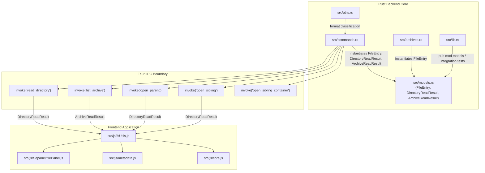
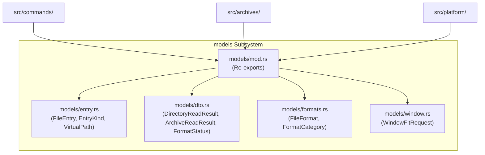

# Rust Backend Decoupling Analysis: `src-tauri/src/models.rs`

## 1. Executive Summary & File Role

| Property | Value |
| :--- | :--- |
| **Path** | `E:/Projects/QuiviT/src-tauri/src/models.rs` |
| **Size** | 776 bytes |
| **Line Count** | 29 lines |
| **Primary Role** | IPC Data Transfer Objects (DTOs) for Directory navigation & Archive inspection |
| **Subsystem Responsibilities** | 3 core data structures (`FileEntry`, `DirectoryReadResult`, `ArchiveReadResult`) |
| **Coupling Index** | High downstream reach (core serialization contract consumed by `commands.rs`, `archives.rs`, `lib.rs`, and frontend JavaScript services) |
| **Test Coverage** | 0% direct unit tests in `models.rs` (indirectly exercised through archive tests in `lib.rs`) |

[`models.rs`](file:///E:/Projects/QuiviT/src-tauri/src/models.rs) is the primary data transfer definition module in the QuiviT backend. In its current implementation (29 lines), it provides three basic serialization structs that form the communication backbone between Rust backend operations and the webview JavaScript UI:
1. [`FileEntry`](file:///E:/Projects/QuiviT/src-tauri/src/models.rs#L5-L13): Represents a single file, directory, or compressed archive member in the viewport or navigation list.
2. [`DirectoryReadResult`](file:///E:/Projects/QuiviT/src-tauri/src/models.rs#L15-L22): Represents the payload returned when navigating or scanning a physical filesystem folder.
3. [`ArchiveReadResult`](file:///E:/Projects/QuiviT/src-tauri/src/models.rs#L24-L28): Represents the payload returned when opening and inspecting a compressed archive (`.zip`, `.cbz`, `.rar`, `.cbr`, `.7z`, `.cb7`, `.tar`, `.cbt`).

Despite its central role as the application's data contract, the module suffers from severe **model starvation**, missing standard trait derives (`Debug`, `PartialEq`, `Eq`, `Deserialize`, `Default`), **stringly-typed attributes**, a lack of domain vs. DTO separation, and missing domain models / IPC request DTOs that are currently passed as raw primitive arguments across commands (`width`, `height`, `current_dir`, etc.) or scattered in other modules (`FormatStatus` in `commands.rs`, `FileFormat` in `utils.rs`, `AppConfig` in `config.rs`).

---

## 2. Public API & Item Inventory

### 2.1 Struct Definitions

| Symbol | Visibility | Lines | Derives | Purpose / Description |
| :--- | :--- | :--- | :--- | :--- |
| [`FileEntry`](file:///E:/Projects/QuiviT/src-tauri/src/models.rs#L5-L13) | `pub` | 5-13 | `Serialize, Clone` | Universal item descriptor representing a physical filesystem entry or a virtual archive member. |
| [`DirectoryReadResult`](file:///E:/Projects/QuiviT/src-tauri/src/models.rs#L15-L22) | `pub` | 15-22 | `Serialize` | Tauri IPC response payload for filesystem directory queries and navigation commands. |
| [`ArchiveReadResult`](file:///E:/Projects/QuiviT/src-tauri/src/models.rs#L24-L28) | `pub` | 24-28 | `Serialize` | Tauri IPC response payload for archive entry listings. |

### 2.2 Deep-Dive Field Analysis

```rust
// src-tauri/src/models.rs:5-13
#[derive(Serialize, Clone)]
pub struct FileEntry {
    pub name: String,
    pub path: String,
    pub ext: String,
    pub date: String,
    pub is_dir: bool,
    pub is_hidden: bool,
}
```

- **`name: String`**: In filesystem mode, contains the file or folder name (e.g. `"cover.jpg"`). In archive mode, contains the internal relative path / entry name within the archive (e.g. `"chapter1/01.webp"`).
- **`path: String`**: In filesystem mode, contains the absolute OS path (e.g. `"C:\\Comics\\Volume 01\\cover.jpg"`). In archive mode, contains a synthetic pipe-delimited composite URI (e.g. `"C:\\Comics\\Volume 01.cbz|chapter1/01.webp"`).
- **`ext: String`**: Contains the uppercase file extension (e.g. `"JPG"`, `"PNG"`, `"CBZ"`).
- **`date: String`**: Formatted Unix timestamp in milliseconds as a string (e.g. `"1712345678901"`), or an empty string `""` when unavailable or within archive listings.
- **`is_dir: bool`**: `true` if the item is a physical directory; always `false` for archive entries.
- **`is_hidden: bool`**: `true` if the file has the Windows `FILE_ATTRIBUTE_HIDDEN` flag or starts with `.` on Unix; always `false` for archive entries.

```rust
// src-tauri/src/models.rs:15-22
#[derive(Serialize)]
pub struct DirectoryReadResult {
    pub files: Vec<FileEntry>,
    pub initial_index: usize,
    pub target_filename: String,
    pub directory: String,
    pub parent_directory: Option<String>,
}
```

- **`files: Vec<FileEntry>`**: Filtered, naturally-sorted list of entries in the scanned directory.
- **`initial_index: usize`**: 0-based index of the active or target file for immediate UI selection.
- **`target_filename: String`**: The filename targeted for initial focus.
- **`directory: String`**: Canonicalized absolute path of the directory.
- **`parent_directory: Option<String>`**: Canonicalized absolute path of the parent directory (`None` if root/drives).

```rust
// src-tauri/src/models.rs:24-28
#[derive(Serialize)]
pub struct ArchiveReadResult {
    pub files: Vec<FileEntry>,
    pub archive_path: String,
}
```

- **`files: Vec<FileEntry>`**: List of image and metadata entries extracted or enumerated from the archive.
- **`archive_path: String`**: Canonicalized absolute path to the archive container file.

---

## 3. Dependency & Consumer Ecosystem



### 3.1 Downstream Consumer Audit (Rust Backend)

1. **[`src/archives.rs`](file:///E:/Projects/QuiviT/src-tauri/src/archives.rs#L6)**:
   - Imports [`FileEntry`](file:///E:/Projects/QuiviT/src-tauri/src/models.rs#L5-L13).
   - Constructed across all archive enumeration formats:
     - [`list_zip_entries`](file:///E:/Projects/QuiviT/src-tauri/src/archives.rs#L231) (lines 256-263, 270-277)
     - [`list_rar_entries`](file:///E:/Projects/QuiviT/src-tauri/src/archives.rs#L342) (lines 357-364)
     - [`list_7z_entries`](file:///E:/Projects/QuiviT/src-tauri/src/archives.rs#L424) (lines 440-447)
     - [`list_tar_entries`](file:///E:/Projects/QuiviT/src-tauri/src/archives.rs#L491) (lines 514-521)
2. **[`src/commands.rs`](file:///E:/Projects/QuiviT/src-tauri/src/commands.rs#L14)**:
   - Glob imports `use crate::models::*;`.
   - Populates [`FileEntry`](file:///E:/Projects/QuiviT/src-tauri/src/models.rs#L5-L13) during directory traversal in [`read_directory_impl`](file:///E:/Projects/QuiviT/src-tauri/src/commands.rs#L128-L135).
   - Constructs and returns [`DirectoryReadResult`](file:///E:/Projects/QuiviT/src-tauri/src/models.rs#L15-L22) in:
     - [`read_directory_impl`](file:///E:/Projects/QuiviT/src-tauri/src/commands.rs#L162-L168)
     - [`read_directory`](file:///E:/Projects/QuiviT/src-tauri/src/commands.rs#L176)
     - [`open_parent`](file:///E:/Projects/QuiviT/src-tauri/src/commands.rs#L385)
     - [`open_sibling`](file:///E:/Projects/QuiviT/src-tauri/src/commands.rs#L405)
     - [`open_sibling_container`](file:///E:/Projects/QuiviT/src-tauri/src/commands.rs#L446)
   - Constructs and returns [`ArchiveReadResult`](file:///E:/Projects/QuiviT/src-tauri/src/models.rs#L24-L28) in [`list_archive`](file:///E:/Projects/QuiviT/src-tauri/src/commands.rs#L184,L241-L244).
3. **[`src/lib.rs`](file:///E:/Projects/QuiviT/src-tauri/src/lib.rs#L5)**:
   - Declares `pub mod models;`.
   - Archive tests directly inspect `FileEntry` fields ([`lib.rs:570-584`](file:///E:/Projects/QuiviT/src-tauri/src/lib.rs#L570-L584), [`lib.rs:616-627`](file:///E:/Projects/QuiviT/src-tauri/src/lib.rs#L616-L627)).

### 3.2 Downstream Consumer Audit (Frontend JavaScript)

1. **[`src/js/fsUtils.js`](file:///E:/Projects/QuiviT/src/js/fsUtils.js)**:
   - Consumes `DirectoryReadResult` (`result.files`, `result.initial_index`, `result.target_filename`, `result.directory`, `result.parent_directory`) in `loadFile`, `openParent`, `openSibling`, `openSiblingContainer`.
   - Consumes `ArchiveReadResult` (`result.files`, `result.archive_path`) in `loadArchive`.
   - Processes `FileEntry` fields: `f.path`, `f.name`, `f.ext`, `f.date`, `f.is_dir`, `f.is_hidden`.
2. **[`src/js/metadata.js`](file:///E:/Projects/QuiviT/src/js/metadata.js#L40)**:
   - Filters `result.files` for embedded metadata files (`.xml`, `.opf`).
3. **[`src/js/filepanel/filePanel.js`](file:///E:/Projects/QuiviT/src/js/filepanel/filePanel.js)**:
   - Directly renders `FileEntry` list elements into the UI sidebar.

---

## 4. Architectural Smells, Anti-patterns & Vulnerabilities

### 4.1 Missing Standard Trait Derives (Derive Deficit)

Currently, the structs define only the bare minimum derives:
- `FileEntry`: `#[derive(Serialize, Clone)]`
- `DirectoryReadResult`: `#[derive(Serialize)]`
- `ArchiveReadResult`: `#[derive(Serialize)]`

#### Consequences:
- **Missing `Debug`**: Makes structured tracing, logging, and error reporting via `tracing::debug!("{:?}", result)` or `eprintln!("{:?}", entry)` impossible without manual formatting.
- **Missing `PartialEq, Eq`**: Unit test assertions cannot compare structs directly (`assert_eq!(result, expected)`). Instead, tests must painfully compare individual field slices (e.g. in [`lib.rs:580-584`](file:///E:/Projects/QuiviT/src-tauri/src/lib.rs#L580-L584)).
- **Missing `Deserialize`**: Prevents bidirectional IPC testing, mock fixture loading from JSON files, and reusing `FileEntry` as a request payload (e.g., when the frontend sends back an active entry).
- **Missing `Default`**: Prevents placeholder initialization or default struct building patterns.

### 4.2 Stringly-Typed & Overloaded Domain Semantics

The fields in `FileEntry` suffer from type overloading and stringly-typed anti-patterns:

```rust
pub struct FileEntry {
    pub name: String,
    pub path: String,       // Overloaded: OS Path OR "Archive.zip|entry.png"
    pub ext: String,        // Redundant String allocation (can be derived from name)
    pub date: String,       // Stringified millisecond timestamp or empty string
    pub is_dir: bool,       // Phantom field in archives (always false)
    pub is_hidden: bool,    // Phantom field in archives (always false)
}
```

1. **Synthetic Composite Paths (`path: String`)**:
   - For filesystem entries, `path` is an OS filesystem path (`"C:\Images\01.jpg"`).
   - For archive entries, `path` is a synthesized string concatenation (`"C:\Comics\vol1.cbz|01.jpg"`).
   - There is no distinct `VirtualPath` or `PathLocator` type to prevent accidental standard `std::fs` operations on virtual paths. Code across `commands.rs` and `lib.rs` constantly performs ad-hoc string splits on `'|'`.
2. **Stringified Unix Timestamps (`date: String`)**:
   - In `commands.rs:117`, modification times are converted to milliseconds strings (`duration.as_millis().to_string()`), or `""`.
   - In `archives.rs`, all 4 archive listing functions allocate empty strings: `date: "".to_string()`.
   - Storing timestamps as `Option<u64>` or `Option<i64>` (or using an explicit serde serializer) avoids thousands of heap-allocated empty `String` objects during large directory/archive traversals.
3. **Redundant Extension Allocations (`ext: String`)**:
   - `ext` is stored as an uppercase `String` on every single entry.
   - For an archive with 10,000 files, this creates 10,000 redundant heap allocations for `"JPG"`, `"PNG"`, etc., when extension extraction can be a zero-allocation borrow or enum reference.

### 4.3 Overloaded Model for Heterogeneous Domains (Filesystem vs Virtual Archive)

`FileEntry` is forced to act as both a **Physical Filesystem Model** and a **Virtual Compressed Stream Model**:

| Field | Physical Filesystem Meaning | Virtual Archive Entry Meaning |
| :--- | :--- | :--- |
| `name` | File or directory name | Relative entry path inside archive |
| `path` | Valid OS absolute path | Synthetic compound locator (`archive|entry`) |
| `ext` | File extension | Member extension |
| `date` | Actual OS modification timestamp | Unused / Phantom (`""`) |
| `is_dir` | True for subfolders | Unused / Phantom (`false`) |
| `is_hidden` | Win32 / POSIX hidden attribute | Unused / Phantom (`false`) |

Because QuiviT flattens archive contents into a flat list of images and metadata, the `is_dir`, `is_hidden`, and `date` fields are dead weight for archive entries, but must still be explicitly populated in all archive handlers.

### 4.4 Boilerplate Instantiation & Missing Factory Constructors

Because `FileEntry` lacks constructor helpers or factory methods, identical construction boilerplate is duplicated across 6 different locations:

```rust
// Duplicated in archives.rs:256, 270, 357, 440, 514
files.push(FileEntry {
    name: decoded_name.clone(),
    path: format!("{}|{}", archive_path, decoded_name),
    ext: ext.to_uppercase(),
    date: "".to_string(),
    is_dir: false,
    is_hidden: false,
});
```

### 4.5 Model Fragmentation: Stray DTOs Across Other Files

Several core DTOs and state models that logically belong in `models` or a `models/` subsystem are scattered across the codebase:

1. **[`FormatStatus`](file:///E:/Projects/QuiviT/src-tauri/src/commands.rs#L605-L611)**:
   - Defined inside `commands.rs` (lines 605-611) instead of `models.rs`.
   - Used as the response DTO for `get_format_status` Tauri IPC.
2. **[`FileFormat`](file:///E:/Projects/QuiviT/src-tauri/src/utils.rs#L61-L67)**:
   - Defined inside `utils.rs` (lines 61-67).
   - Core domain model for file extension registry and format classification.
3. **Stray Window Fit IPC Parameters**:
   - `fit_options_window` ([`config.rs:351`](file:///E:/Projects/QuiviT/src-tauri/src/config.rs#L351)) takes `width: f64`.
   - `fit_metadata_window` ([`config.rs:419`](file:///E:/Projects/QuiviT/src-tauri/src/config.rs#L419)) takes `height: f64`.
   - Both commands lack typed request DTOs (e.g. `WindowFitPayload`).
4. **Missing Archive Entry Details Model**:
   - Archive entries lack rich metadata (uncompressed size, compressed size, compression method, CRC32, encrypted flag).

---

## 5. Decoupling Recommendations & Target Architecture

To transition QuiviT to a clean, decoupled architecture, `models.rs` should evolve into a modular `models/` directory or a consolidated, well-structured domain & DTO module hierarchy.

```
src-tauri/src/
├── models/
│   ├── mod.rs             # Unified public exports & re-exports
│   ├── dto.rs             # IPC Request/Response DTOs (wire-compatible with frontend)
│   ├── entry.rs           # FileEntry, VirtualPath, EntryKind, constructors
│   ├── formats.rs         # FileFormat, FormatCategory, FormatStatus
│   └── window.rs          # WindowFitRequest, WindowPlacement DTOs
```



---

## 6. Proposed Code Architecture

### 6.1 Enhanced `FileEntry` with Rich Derives & Constructors (`models/entry.rs`)

```rust
use serde::{Deserialize, Serialize};

#[derive(Debug, Clone, PartialEq, Eq, Serialize, Deserialize)]
pub struct FileEntry {
    pub name: String,
    pub path: String,
    pub ext: String,
    pub date: String,
    pub is_dir: bool,
    pub is_hidden: bool,
}

impl FileEntry {
    /// Factory for physical filesystem entries.
    pub fn new_filesystem_entry(
        name: String,
        path: String,
        ext: String,
        date_millis: Option<u64>,
        is_dir: bool,
        is_hidden: bool,
    ) -> Self {
        Self {
            name,
            path,
            ext: ext.to_uppercase(),
            date: date_millis.map(|m| m.to_string()).unwrap_or_default(),
            is_dir,
            is_hidden,
        }
    }

    /// Factory for virtual archive entries (sets date="", is_dir=false, is_hidden=false).
    pub fn new_archive_entry(archive_path: &str, entry_name: &str, ext: &str) -> Self {
        Self {
            name: entry_name.to_string(),
            path: format!("{}|{}", archive_path, entry_name),
            ext: ext.to_uppercase(),
            date: String::new(),
            is_dir: false,
            is_hidden: false,
        }
    }

    /// Helper to test if this is a virtual archive path.
    #[inline]
    pub fn is_archive_item(&self) -> bool {
        self.path.contains('|')
    }

    /// Parses virtual archive components (archive_path, entry_name) if applicable.
    pub fn split_archive_path(&self) -> Option<(&str, &str)> {
        let mut parts = self.path.splitn(2, '|');
        let archive = parts.next()?;
        let entry = parts.next()?;
        Some((archive, entry))
    }
}
```

### 6.2 Typed DTOs (`models/dto.rs`)

```rust
use serde::{Deserialize, Serialize};
use super::entry::FileEntry;

#[derive(Debug, Clone, PartialEq, Eq, Serialize, Deserialize)]
pub struct DirectoryReadResult {
    pub files: Vec<FileEntry>,
    pub initial_index: usize,
    pub target_filename: String,
    pub directory: String,
    pub parent_directory: Option<String>,
}

#[derive(Debug, Clone, PartialEq, Eq, Serialize, Deserialize)]
pub struct ArchiveReadResult {
    pub files: Vec<FileEntry>,
    pub archive_path: String,
}

/// Migrated from commands.rs:605
#[derive(Debug, Clone, PartialEq, Eq, Serialize, Deserialize)]
pub struct FormatStatus {
    pub ext: String,
    pub name: String,
    pub icon: String,
    pub category: String,
    pub is_associated: bool,
}

/// Typed DTO for window dimension adjustments
#[derive(Debug, Clone, Copy, PartialEq, Serialize, Deserialize)]
pub struct WindowFitRequest {
    pub width: Option<f64>,
    pub height: Option<f64>,
}
```

### 6.3 Formats & Categories (`models/formats.rs`)

```rust
use serde::{Deserialize, Serialize};

#[derive(Debug, Clone, Copy, PartialEq, Eq, Serialize, Deserialize)]
pub enum FormatCategory {
    Image,
    Archive,
}

impl FormatCategory {
    pub fn as_str(&self) -> &'static str {
        match self {
            Self::Image => "Image",
            Self::Archive => "Archive",
        }
    }
}

/// Migrated from utils.rs:61
#[derive(Debug, Clone, Copy, PartialEq, Eq, Serialize, Deserialize)]
pub struct FileFormat {
    pub ext: &'static str,
    pub name: &'static str,
    pub icon: &'static str,
    pub category: FormatCategory,
}
```

---

## 7. Action Items & Step-by-Step Implementation Roadmap

| Priority | Step | Description | Target Files |
| :---: | :--- | :--- | :--- |
| **P1** | **Add Essential Derives** | Add `Debug`, `PartialEq`, `Eq`, `Deserialize`, `Clone` to all structs in `models.rs`. | `src/models.rs` |
| **P1** | **Add Constructors** | Introduce `FileEntry::new_filesystem_entry` and `FileEntry::new_archive_entry` to eliminate repeated boilerplate. | `src/models.rs`, `src/archives.rs`, `src/commands.rs` |
| **P2** | **Relocate Stranded DTOs** | Move `FormatStatus` out of `commands.rs` and into `models.rs` (or `models/dto.rs`). | `src/commands.rs`, `src/models.rs` |
| **P2** | **Integrate `FileFormat`** | Unify `FileFormat` and `FormatCategory` under `models/formats.rs` or re-export via `models`. | `src/utils.rs`, `src/models.rs` |
| **P3** | **Decompose `models/` Directory** | Split `models.rs` into `entry.rs`, `dto.rs`, `formats.rs`, `window.rs`, re-exported cleanly via `models/mod.rs`. | `src/models/` |
| **P3** | **Implement Unit Tests** | Add unit tests for `FileEntry` construction, archive path splitting, and JSON serialization/deserialization round-trips. | `src/models.rs` / `src/models/entry.rs` |
