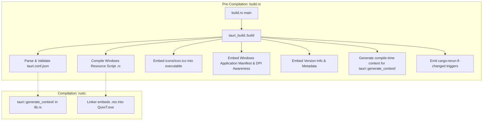
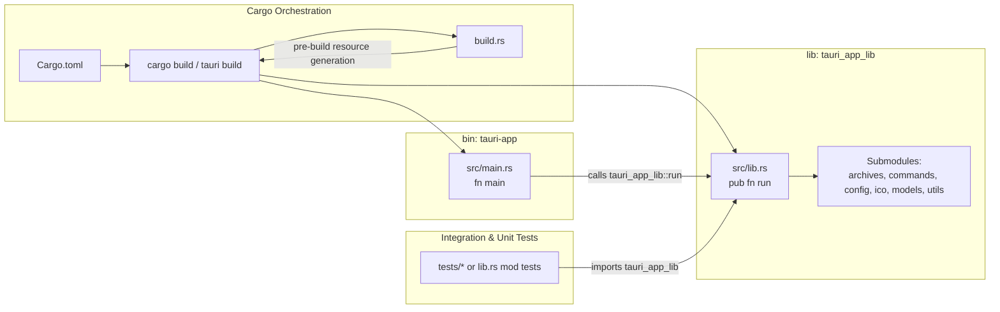

# Rust Backend Decoupling Analysis: `src-tauri/src/main.rs` & `src-tauri/build.rs`

**Target Source Files:**
- [`src-tauri/src/main.rs`](file:///E:/Projects/QuiviT/src-tauri/src/main.rs) (7 lines, 190 bytes)
- [`src-tauri/build.rs`](file:///E:/Projects/QuiviT/src-tauri/build.rs) (4 lines, 42 bytes)
- [`src-tauri/Cargo.toml`](file:///E:/Projects/QuiviT/src-tauri/Cargo.toml) (40 lines, 1,239 bytes)

**Target Output Artifact:** [`08-main.rs.md`](file:///E:/Projects/QuiviT/.agents/rust-decoupling-analysis/08-main.rs.md)  
**Analysis Date:** 2026-08-16  

---

## 1. Executive Summary & File Roles

| Metric / Property | `src-tauri/src/main.rs` | `src-tauri/build.rs` |
| :--- | :--- | :--- |
| **Path** | [`E:/Projects/QuiviT/src-tauri/src/main.rs`](file:///E:/Projects/QuiviT/src-tauri/src/main.rs) | [`E:/Projects/QuiviT/src-tauri/build.rs`](file:///E:/Projects/QuiviT/src-tauri/build.rs) |
| **Size** | 190 bytes | 42 bytes |
| **Line Count** | 7 lines | 4 lines |
| **Primary Role** | Binary entry-point trampoline (`tauri-app` executable) | Compile-time build script (`tauri-build` code generator) |
| **Target Kind** | Cargo `[[bin]]` target | Cargo build script (`build.rs`) |
| **Downstream Dependencies** | [`tauri_app_lib::run`](file:///E:/Projects/QuiviT/src-tauri/src/lib.rs#L62) | `tauri_build::build` |
| **Coupling Level** | Minimal (strictly calls library entry point) | Minimal (strictly delegates to `tauri-build` crate) |
| **Logic Leakage Risk** | Zero currently (must remain strictly 0 lines of business logic) | Zero currently (must remain strictly standard build hook) |

In modern Tauri 2 architecture, the backend is strictly decoupled into a **thin binary trampoline** ([`main.rs`](file:///E:/Projects/QuiviT/src-tauri/src/main.rs)), a **root library crate** ([`lib.rs`](file:///E:/Projects/QuiviT/src-tauri/src/lib.rs)), and a **pre-compile build orchestrator** ([`build.rs`](file:///E:/Projects/QuiviT/src-tauri/build.rs)).

This document provides a comprehensive architectural and decoupling analysis of the executable boundary, build configuration, Windows subsystem linker attributes, Cargo target naming constraints, and build pipeline invariants.

---

## 2. Deep Dive: `src-tauri/src/main.rs`

### 2.1 Complete Source Code Inventory

```rust
// src-tauri/src/main.rs:1-7
// Prevents additional console window on Windows in release, DO NOT REMOVE!!
#![cfg_attr(not(debug_assertions), windows_subsystem = "windows")]

fn main() {
    tauri_app_lib::run()
}
```

### 2.2 Detailed Item Analysis

| Line Range | Syntax / Symbol | Category | Description & Purpose |
| :--- | :--- | :--- | :--- |
| [L1](file:///E:/Projects/QuiviT/src-tauri/src/main.rs#L1) | `// Prevents additional console window...` | Comment | Developer warning explaining the necessity of the Windows subsystem attribute. |
| [L2](file:///E:/Projects/QuiviT/src-tauri/src/main.rs#L2) | `#![cfg_attr(not(debug_assertions), windows_subsystem = "windows")]` | Inner Attribute / Linker Flag | Conditional compilation attribute instructing MSVC/GNU linkers to target the GUI subsystem in release builds while preserving the console subsystem in debug builds. |
| [L4-L6](file:///E:/Projects/QuiviT/src-tauri/src/main.rs#L4-L6) | `fn main() { tauri_app_lib::run() }` | Function Entry Point | Process entry point function invoking the Tauri application runner in `tauri_app_lib`. |

### 2.3 Windows Subsystem Linker Attribute Mechanics

On Windows platforms (both MSVC and MinGW/GNU toolchains), Rust executables default to the `console` subsystem (`/SUBSYSTEM:CONSOLE` in `link.exe` / `--subsystem,console` in `ld`). When a user executes a console subsystem application from Windows Explorer, Start Menu, or a desktop shortcut:
1. Windows kernel (`ntoskrnl.exe`) and subsystem loader detect `IMAGE_SUBSYSTEM_WINDOWS_CUI`.
2. The operating system automatically allocates a new console window (`conhost.exe` or `WindowsTerminal.exe`) before executing the binary's entry point.
3. For a dedicated desktop image viewer like QuiviT, an orphaned black command prompt window popping up behind the graphical webview window degrades user experience.

The attribute `#![cfg_attr(not(debug_assertions), windows_subsystem = "windows")]` controls this behavior conditionally:
- **Debug Mode (`cargo build` / `cargo tauri dev`)**: `debug_assertions` is active. The `windows_subsystem = "windows"` attribute is **not** applied. The binary uses the `console` subsystem. All standard `println!`, `eprintln!`, `dbg!`, panic hook messages, and logging outputs stream directly to the terminal stdout/stderr for immediate developer debugging.
- **Release Mode (`cargo build --release` / `cargo tauri build`)**: `debug_assertions` is inactive (`not(debug_assertions)` evaluates to `true`). The compiler passes `/SUBSYSTEM:WINDOWS` (`IMAGE_SUBSYSTEM_WINDOWS_GUI`) to the linker. Windows suppresses console window allocation upon process startup, launching the GUI directly without terminal flicker.

---

## 3. Deep Dive: `src-tauri/build.rs`

### 3.1 Complete Source Code Inventory

```rust
// src-tauri/build.rs:1-4
fn main() {
    tauri_build::build()
}
```

### 3.2 Detailed Item Analysis

| Line Range | Syntax / Symbol | Category | Description & Purpose |
| :--- | :--- | :--- | :--- |
| [L1-L3](file:///E:/Projects/QuiviT/src-tauri/build.rs#L1-L3) | `fn main() { tauri_build::build() }` | Build Script Entry Point | Cargo pre-build hook executing `tauri_build::build()` to compile platform resources, validate `tauri.conf.json`, and generate compile-time code. |

### 3.3 Build-Time Orchestration Performed by `tauri_build::build()`

The call to `tauri_build::build()` in [`build.rs`](file:///E:/Projects/QuiviT/src-tauri/build.rs) executes before any Rust source code is compiled. It automates several essential platform and packaging tasks:



1. **`tauri.conf.json` Validation & Parsing:** Reads [`src-tauri/tauri.conf.json`](file:///E:/Projects/QuiviT/src-tauri/tauri.conf.json) at build time, verifying security policies (e.g. CSP, asset protocol permissions), window definitions, bundle targets, and version numbers.
2. **Windows Resource Compilation (`.rc` / `.res`):**
   - Invokes `windres` or `rc.exe` to compile native Win32 resource headers.
   - Embeds application icon files ([`icons/icon.ico`](file:///E:/Projects/QuiviT/src-tauri/icons/icon.ico)) directly into the binary's resource section, ensuring Windows Explorer displays the high-resolution QuiviT icon for the `.exe` file and taskbar item.
   - Embeds Win32 Version Information (`FILEVERSION`, `PRODUCTVERSION`, `CompanyName`, `FileDescription`, `LegalCopyright`).
   - Embeds the Windows Application Manifest (`tauri.exe.manifest`) declaring Per-Monitor V2 DPI awareness, Windows 10/11 common controls compatibility, and standard non-elevated user privilege execution.
3. **Macro Context Generation:** Emits code consumed downstream by the [`tauri::generate_context!()`](file:///E:/Projects/QuiviT/src-tauri/src/lib.rs#L376) macro in `lib.rs`.
4. **Cargo Incremental Build Triggers:** Emits directives to stdout (`cargo:rerun-if-changed=tauri.conf.json`, `cargo:rerun-if-changed=icons/`, `cargo:rerun-if-env-changed=...`), ensuring that cargo does not unnecessarily re-run build scripts when unrelated frontend files change, while immediately rebuilding when configuration or icons change.

---

## 4. Deep Dive: `src-tauri/Cargo.toml` Architecture

### 4.1 Target & Dependency Matrix

```toml
# src-tauri/Cargo.toml:1-19
[package]
name = "tauri-app"
version = "1.0.0"
description = "A Tauri App"
authors = ["you"]
edition = "2021"

[lib]
# The `_lib` suffix may seem redundant but it is necessary
# to make the lib name unique and wouldn't conflict with the bin name.
# This seems to be only an issue on Windows, see https://github.com/rust-lang/cargo/issues/8519
name = "tauri_app_lib"
crate-type = ["staticlib", "cdylib", "rlib"]

[build-dependencies]
tauri-build = { version = "2", features = [] }
```

### 4.2 Target Collision Mitigation (Cargo Issue #8519)

In [`Cargo.toml`](file:///E:/Projects/QuiviT/src-tauri/Cargo.toml#L10-L15), the `[lib]` target is explicitly given a distinct name:
```toml
[lib]
name = "tauri_app_lib"
crate-type = ["staticlib", "cdylib", "rlib"]
```

**Why this is necessary on Windows:**
- When a Cargo package produces both a library artifact and a binary executable with the same name (e.g. `tauri-app.exe` and `tauri-app.lib`), the MSVC linker creates `tauri-app.lib` (import library) and `tauri-app.pdb` (program debug database) in the same output directory (`target/debug/` or `target/release/`).
- The binary build step and the library build step overwrite each other's `.lib` and `.pdb` files, leading to linker collision errors or missing debug symbols (documented in [Rust/Cargo Issue #8519](https://github.com/rust-lang/cargo/issues/8519)).
- Disambiguating the library target as `name = "tauri_app_lib"` completely eliminates file collisions while allowing [`main.rs`](file:///E:/Projects/QuiviT/src-tauri/src/main.rs#L5) to cleanly link against `tauri_app_lib::run()`.

### 4.3 `crate-type` Multi-Target Strategy

The configuration `crate-type = ["staticlib", "cdylib", "rlib"]` enables seamless cross-platform targeting:

| Crate Type | Output Artifact | Primary Consumer / Use Case |
| :--- | :--- | :--- |
| **`rlib`** (Rust Library) | `libtauri_app_lib.rlib` | Consumed directly by [`main.rs`](file:///E:/Projects/QuiviT/src-tauri/src/main.rs) for desktop executable generation (`tauri-app.exe`). Also consumed by unit and integration tests (`tests/*.rs`). |
| **`cdylib`** (C Dynamic Library) | `tauri_app_lib.dll` / `.so` | Required for mobile Android builds (embedded into APK/AAB as JNI native library loaded by Android Activity). |
| **`staticlib`** (C Static Library) | `tauri_app_lib.lib` / `.a` | Required for mobile iOS builds (linked directly into Xcode iOS application bundle). |

---

## 5. System Interconnection & Coupling Topology



### 5.1 Analysis of Cross-Module Coupling

1. **`main.rs` to `lib.rs` Coupling**:
   - Coupling is minimal and ideal: `main.rs` contains only 1 functional line calling `tauri_app_lib::run()`.
   - `main.rs` does not access internal submodules, structs, state mutexes, or Tauri plugin configurations.
   - `main.rs` acts purely as an operating system entry trampoline.

2. **`build.rs` to Backend Coupling**:
   - `build.rs` does not import or depend on internal code in `src/`.
   - It interfaces strictly with `tauri.conf.json` and the `tauri-build` crate.
   - No build-time code generation reach-in exists, keeping compile times clean and deterministic.

3. **Binary/Library Decoupling Benefits**:
   - **Integration Testing:** Because `lib.rs` is compiled as an `rlib`, external integration test suites (e.g. in `src-tauri/tests/`) can import `tauri_app_lib::*` directly without invoking the GUI event loop.
   - **Benchmarking:** Microbenchmarks (e.g. archive decompression or natural string sorting benchmarks) can link against `tauri_app_lib` without spawning Windows GUI threads.
   - **Alternative Frontends / CLIs:** A potential future headless CLI (e.g. `quivit-cli.exe` for batch archive indexing or format inspection) can be added as a second `[[bin]]` target in `Cargo.toml` without refactoring any core backend code.

---

## 6. Code Smells, Safety & Invariants Analysis

### 6.1 Assessment of Current Implementation

| Inspection Criterion | `main.rs` Status | `build.rs` Status | Remarks |
| :--- | :--- | :--- | :--- |
| **Business Logic Leakage** | 🟢 None | 🟢 None | Pure trampolines with zero domain logic. |
| **Error Handling / Panics** | 🟢 Standard | 🟢 Standard | Unhandled panics in `build.rs` halt cargo compilation cleanly. Panics in `main.rs` propagate through Tauri's runtime logger. |
| **Unsafe Code** | 🟢 Zero `unsafe` | 🟢 Zero `unsafe` | No raw pointers or manual FFI calls. |
| **Memory / Allocations** | 🟢 Zero overhead | 🟢 Zero overhead | No heap allocations in `main.rs` prior to `tauri_app_lib::run()`. |
| **Thread Safety** | 🟢 Compliant | 🟢 Compliant | Process initialization is single-threaded until Tauri runtime spawns worker threads. |
| **Cross-Platform Portability** | 🟢 Guarded | 🟢 Guarded | Windows subsystem attribute is properly guarded by `#[cfg_attr(..., windows_subsystem = ...)]`. Mobile entry points are guarded by `#[cfg_attr(mobile, ...)]` in `lib.rs`. |

### 6.2 Architectural Invariants to Enforce

1. **Invariant 1: Zero Business Logic in `main.rs`**
   - Under no circumstances should CLI argument parsing, state initialization, file I/O, or custom logger registration be placed in [`main.rs`](file:///E:/Projects/QuiviT/src-tauri/src/main.rs).
   - If early process initialization (e.g., custom crash reporting, Win32 DPI scaling tweaks, or environment variable setup) is required, it must be implemented as a dedicated setup function inside `tauri_app_lib` (e.g. `tauri_app_lib::init()` or within `tauri_app_lib::run()`).

2. **Invariant 2: Declarative Build Pipeline in `build.rs`**
   - [`build.rs`](file:///E:/Projects/QuiviT/src-tauri/build.rs) must strictly remain a build orchestrator.
   - Heavy custom compilation steps (such as compiling C libraries or running shell commands) should avoid modifying workspace source files directly; all generated code must be written to `std::env::var("OUT_DIR")`.

3. **Invariant 3: Preserving Linker Subsystem Isolation**
   - The attribute `#![cfg_attr(not(debug_assertions), windows_subsystem = "windows")]` must never be moved into `lib.rs` (where it has no effect on binary targets) and must never be deleted from `main.rs`.

---

## 7. Decoupling & Modernization Recommendations

### 7.1 Recommendation 1: Maintain Trampoline Purity in `main.rs`

[`main.rs`](file:///E:/Projects/QuiviT/src-tauri/src/main.rs) is currently 7 lines and perfectly adheres to the Single Responsibility Principle. No changes are required.

```rust
// Proposed / Maintained src-tauri/src/main.rs
// Prevents additional console window on Windows in release, DO NOT REMOVE!!
#![cfg_attr(not(debug_assertions), windows_subsystem = "windows")]

fn main() {
    tauri_app_lib::run()
}
```

### 7.2 Recommendation 2: Optional Build Script Hardening (Future-Proofing)

If future requirements demand embedding build metadata (such as Git commit hashes, build timestamps, or target platform details) into the frontend/backend for display in an "About QuiviT" dialog, `build.rs` can be extended cleanly without breaking existing invariants:

```rust
// Example hardened src-tauri/build.rs (if build-time metadata is needed)
fn main() {
    // Re-run build script only when tauri configuration or icons change
    println!("cargo:rerun-if-changed=tauri.conf.json");
    println!("cargo:rerun-if-changed=icons");
    
    tauri_build::build()
}
```

### 7.3 Recommendation 3: Cargo Manifest Hygiene (`Cargo.toml`)

In [`Cargo.toml`](file:///E:/Projects/QuiviT/src-tauri/Cargo.toml), update package metadata to reflect the actual project identity:

```diff
 [package]
-name = "tauri-app"
+name = "quivit"
 version = "1.0.0"
-description = "A Tauri App"
-authors = ["you"]
+description = "QuiviT - Modern Lightweight Comic & Image Viewer"
+authors = ["QuiviT Contributors"]
 edition = "2021"

 [lib]
-# The `_lib` suffix may seem redundant but it is necessary
-# to make the lib name unique and wouldn't conflict with the bin name.
-# This seems to be only an issue on Windows, see https://github.com/rust-lang/cargo/issues/8519
 name = "tauri_app_lib"
 crate-type = ["staticlib", "cdylib", "rlib"]
```

*(Note: Keeping `name = "tauri_app_lib"` in `[lib]` avoids rename churn across `main.rs` and imports, while updating `package.name = "quivit"` ensures the resulting desktop binary is cleanly produced as `quivit.exe` if desired).*

---

## 8. Summary Matrix & Verification Checklist

| Aspect | Current Status | Architectural Recommendation | Priority |
| :--- | :--- | :--- | :--- |
| **`main.rs` Trampoline** | 7 lines, clean delegation | Keep as-is. Preserve 0-logic invariant. | Low (Already Optimal) |
| **Windows Subsystem** | Correctly configured with `cfg_attr` | Keep as-is. Preserve release console suppression. | Low (Already Optimal) |
| **`build.rs` Hook** | 4 lines, `tauri_build::build()` | Keep as-is. Route any future codegen to `OUT_DIR`. | Low (Already Optimal) |
| **Target Collision Fix** | Uses `tauri_app_lib` separation | Keep as-is. Prevents MSVC `.lib`/`.pdb` collision. | Low (Already Optimal) |
| **Cross-Platform Target** | `["staticlib", "cdylib", "rlib"]` | Keep as-is. Supports desktop, mobile, and integration tests. | Low (Already Optimal) |
| **`Cargo.toml` Metadata** | Generic placeholder strings | Update package name, description, and author metadata. | Minor Cleanup |

---
*Report compiled autonomously as part of the QuiviT Rust Backend Decoupling Analysis.*
