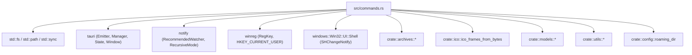

# Rust Backend Decoupling Analysis: `src-tauri/src/commands.rs`

## 1. Executive Summary & File Role

| Property | Value |
| :--- | :--- |
| **Path** | `E:/Projects/QuiviT/src-tauri/src/commands.rs` |
| **Size** | 31,631 bytes |
| **Line Count** | 858 lines |
| **Primary Role** | Central Tauri command dispatcher & heterogeneous system logic |
| **Subsystem Responsibilities** | 7 distinct domains (Filesystem browsing/sorting, Archive traversal/prefetching, Directory change watching, Windows Registry associations, Embedded icon assets, Text I/O, Window/App controls) |
| **Coupling Index** | High (tight coupling with `archives.rs`, `lib.rs`, `utils.rs`, `models.rs`, `config.rs`, and Windows Win32 APIs) |
| **Test Coverage** | 0% (0 unit tests present) |

`commands.rs` serves as a classic **"God Module"** for Tauri command handlers. Rather than acting strictly as a thin IPC bridge / translation layer between Tauri's frontend and the backend domain engines, it accumulates low-level business logic, Win32 registry mutations, filesystem traversal algorithms, thread synchronization condvars, and embedded binary icons.

---

## 2. Public API & Item Inventory

### 2.1 Structs & Enums

| Symbol | Visibility | Lines | Description |
| :--- | :--- | :--- | :--- |
| [`WatcherState`](file:///E:/Projects/QuiviT/src-tauri/src/commands.rs#L19-L31) | `pub` | 19–31 | Holds optional `RecommendedWatcher` instances for active directory and parent directory. |
| [`FormatStatus`](file:///E:/Projects/QuiviT/src-tauri/src/commands.rs#L604-L611) | `pub` | 604–611 | DTO for frontend association settings (`ext`, `name`, `icon`, `category`, `registered`). |

### 2.2 Functions & Tauri Commands

| Symbol | Kind / Attribute | Lines | Return Type | Purpose |
| :--- | :--- | :--- | :--- | :--- |
| [`is_hidden_path`](file:///E:/Projects/QuiviT/src-tauri/src/commands.rs#L35-L49) | `pub fn` | 35–49 | `bool` | Checks Unix dot prefix and Windows `FILE_ATTRIBUTE_HIDDEN` flag. |
| [`read_directory_impl`](file:///E:/Projects/QuiviT/src-tauri/src/commands.rs#L51-L169) | `pub fn` | 51–169 | `Result<DirectoryReadResult, String>` | Scans folder, filters extensions/hidden files, sorts with natural order, computes parent/target. |
| [`read_directory`](file:///E:/Projects/QuiviT/src-tauri/src/commands.rs#L171-L178) | `#[tauri::command(async)] pub fn` | 171–178 | `Result<DirectoryReadResult, String>` | Tauri command wrapper for `read_directory_impl`. |
| [`list_archive`](file:///E:/Projects/QuiviT/src-tauri/src/commands.rs#L180-L245) | `#[tauri::command(async)] pub fn` | 180–245 | `Result<ArchiveReadResult, String>` | Registers archive in cache, initiates background extraction if non-ZIP, lists entries. |
| [`prefetch_archive_entries`](file:///E:/Projects/QuiviT/src-tauri/src/commands.rs#L247-L295) | `#[tauri::command(async)] pub fn` | 247–295 | `Result<(), String>` | Pre-extracts and loads ZIP entries into memory cache. |
| [`get_archive_ico_frames`](file:///E:/Projects/QuiviT/src-tauri/src/commands.rs#L297-L379) | `#[tauri::command(async)] pub fn` | 297–379 | `Result<String, String>` | Extracts ICO file from ZIP or temp disk archive and returns multi-frame JSON. |
| [`open_parent`](file:///E:/Projects/QuiviT/src-tauri/src/commands.rs#L381-L398) | `#[tauri::command] pub fn` | 381–398 | `Result<DirectoryReadResult, String>` | Navigates to parent directory, setting current folder as target item. |
| [`open_sibling`](file:///E:/Projects/QuiviT/src-tauri/src/commands.rs#L400-L443) | `#[tauri::command] pub fn` | 400–443 | `Result<DirectoryReadResult, String>` | Navigates to next/previous directory sibling with modulo wrap. |
| [`open_sibling_container`](file:///E:/Projects/QuiviT/src-tauri/src/commands.rs#L445-L520) | `#[tauri::command] pub fn` | 445–520 | `Result<String, String>` | Navigates across sibling folders and archive files, or hops across drive roots. |
| [`get_drives`](file:///E:/Projects/QuiviT/src-tauri/src/commands.rs#L522-L532) | `#[tauri::command] pub fn` | 522–532 | `Vec<String>` | Enumerates Windows drive letters `A:\` through `Z:\`. |
| [`get_path_kind`](file:///E:/Projects/QuiviT/src-tauri/src/commands.rs#L534-L544) | `#[tauri::command] pub fn` | 534–544 | `String` | Classifies path as `"directory"`, `"file"`, or `"missing"`. |
| [`watch_directory`](file:///E:/Projects/QuiviT/src-tauri/src/commands.rs#L546-L589) | `#[tauri::command] pub fn` | 546–589 | `Result<(), String>` | Attaches notify watchers for directory contents and parent deletion tracking. |
| [`read_text_file`](file:///E:/Projects/QuiviT/src-tauri/src/commands.rs#L591-L594) | `#[tauri::command] pub fn` | 591–594 | `Result<String, String>` | UTF-8 string file reader. |
| [`write_text_file`](file:///E:/Projects/QuiviT/src-tauri/src/commands.rs#L596-L599) | `#[tauri::command] pub fn` | 596–599 | `Result<(), String>` | UTF-8 string file writer. |
| [`get_format_status`](file:///E:/Projects/QuiviT/src-tauri/src/commands.rs#L613-L664) | `#[tauri::command] pub fn` | 613–664 | `Vec<FormatStatus>` | Queries HKCU `UserChoice` and `Classes` to check file association status. |
| [`dump_icons`](file:///E:/Projects/QuiviT/src-tauri/src/commands.rs#L675-L691) | `pub fn` | 675–691 | `Result<PathBuf, String>` | Writes embedded `.ico` resources to AppData roaming icons folder. |
| [`register_associations`](file:///E:/Projects/QuiviT/src-tauri/src/commands.rs#L693-L783) | `#[tauri::command] pub fn` | 693–783 | `Result<(), String>` | Configures Windows HKCU ProgID, DefaultIcon, open command, and Capabilities. |
| [`unregister_associations`](file:///E:/Projects/QuiviT/src-tauri/src/commands.rs#L785-L847) | `#[tauri::command] pub fn` | 785–847 | `Result<(), String>` | Removes ProgID entries and cleans up QuiviT registry subkeys. |
| [`get_initial_args`](file:///E:/Projects/QuiviT/src-tauri/src/commands.rs#L849-L852) | `#[tauri::command] pub fn` | 849–852 | `Vec<String>` | Returns command line arguments. |
| [`show_window`](file:///E:/Projects/QuiviT/src-tauri/src/commands.rs#L854-L857) | `#[tauri::command] pub fn` | 854–857 | `()` | Reveals the Tauri window. |

---

## 3. Internal / Private Items & Embedded Assets

### 3.1 Embedded Icon Assets (Lines 667–673)
```rust
const ICON_APNG: &[u8] = include_bytes!("../../icons/apng.ico");
const ICON_CBR: &[u8] = include_bytes!("../../icons/cbr.ico");
const ICON_CBZ: &[u8] = include_bytes!("../../icons/cbz.ico");
const ICON_GIF: &[u8] = include_bytes!("../../icons/gif.ico");
const ICON_SVG: &[u8] = include_bytes!("../../icons/svg.ico");
const ICON_WEBP: &[u8] = include_bytes!("../../icons/webp.ico");
const ICON_MOE: &[u8] = include_bytes!("../../icons/quivi-t_moe-icon.ico");
```
*Architectural Issue:* Embedding application binary assets directly in the middle of a command dispatcher file mixes resource packaging concerns with IPC handling.

---

## 4. Dependencies & Imports Analysis



### Dependency Audit
1. **Windows Platform Crates (`winreg`, `windows::Win32`)**: Used directly inside command functions without an abstraction boundary or OS-agnostic service interface.
2. **Third-Party File Watcher (`notify`)**: Manages watcher lifecycle directly via Tauri AppHandle state inside command handlers.
3. **Internal Module Reach-In**:
   - Reaches into `crate::archives` internals (`SingleArchiveCache`, `extract_rar_to_temp`, `read_zip_entry_by_decoded_name`, etc.).
   - Reaches into `crate::config::roaming_dir` for file dumping.
   - Reaches into `crate::ico` for ICO decoding.

---

## 5. Responsibility Clusters with Exact Line Ranges

```
commands.rs (858 lines)
│
├── Cluster 1: Directory Watcher State Definition (L19–32)
│   └── WatcherState struct and WatcherState::new
│
├── Cluster 2: Directory Browsing, Scanning & Navigation (L35–179, L381–443)
│   ├── is_hidden_path (L35–49)
│   ├── read_directory_impl (L51–169)
│   ├── read_directory (L171–179)
│   ├── open_parent (L381–398)
│   └── open_sibling (L401–443)
│
├── Cluster 3: Archive Operations & Prefetching (L180–380)
│   ├── list_archive (L181–245)
│   ├── prefetch_archive_entries (L247–295)
│   └── get_archive_ico_frames (L297–379)
│
├── Cluster 4: Container & Path Navigation / System Discovery (L445–545)
│   ├── open_sibling_container (L446–520)
│   ├── get_drives (L523–532)
│   └── get_path_kind (L534–544)
│
├── Cluster 5: Filesystem Watching Command (L546–589)
│   └── watch_directory (L547–589)
│
├── Cluster 6: Text File I/O Commands (L591–599)
│   ├── read_text_file (L592–594)
│   └── write_text_file (L596–598)
│
├── Cluster 7: Windows Registry, File Associations & Icon Assets (L601–847)
│   ├── FormatStatus struct (L604–611)
│   ├── get_format_status (L613–665)
│   ├── Embedded icon constants (L667–673)
│   ├── dump_icons (L675–691)
│   ├── register_associations (L693–783)
│   └── unregister_associations (L785–847)
│
└── Cluster 8: Shell & Window Management Commands (L849–858)
    ├── get_initial_args (L850–852)
    └── show_window (L855–857)
```

---

## 6. Coupling, Duplication & Code Smells

### 6.1 Split of Command Definitions Across `commands.rs` and `lib.rs`
There is no coherent architectural boundary dictating what belongs in `commands.rs` vs `lib.rs`:
- `lib.rs` defines: `open_in_explorer`, `get_default_dir`, `get_ico_frames`, `get_native_icon`, `load_config`, `save_config`, `open_options`, `fit_options_window`, `open_metadata_window`, `fit_metadata_window`.
- `commands.rs` defines: `read_directory`, `list_archive`, `watch_directory`, `get_format_status`, `register_associations`, `get_initial_args`, `show_window`.

### 6.2 Deep Coupling with Archive Extraction Internals
In `commands.rs` (Lines 203–225, 340–374), command handlers directly:
- Calculate MD5 hashes of paths (`md5::compute`).
- Manage temporary directories under `%TEMP%/QuiviT/<hash>`.
- Spawn worker threads with condition variables (`Condvar`) and mutex sets.
- Execute low-level format extractions (`extract_rar_to_temp`, `extract_7z_to_temp`, `extract_tar_to_temp`).
- Lock and manipulate `zip::ZipArchive` instances directly.

*Smell:* All of this is extraction engine internals, not command routing. If archive caching or extraction logic changes, `commands.rs` breaks.

### 6.3 Watcher State Fragmentation
- `WatcherState` is declared in `commands.rs` (L19–31), managed in `lib.rs` (L149), and mutated in `watch_directory` (L547–589).
- Separately, `lib.rs` implements a *second*, completely unrelated notify watcher thread for `config.json` changes (L110–144).

### 6.4 Lock Thrashing in `prefetch_archive_entries` (Lines 258–294)
In `prefetch_archive_entries`:
```rust
for entry_name in entries {
    {
        let mut cache = state.lock().unwrap(); // Lock 1
        if cache.get_zip_entry(&archive_path, &entry_name).is_some() { continue; }
    }
    let extracted = {
        let mut cache = state.lock().unwrap(); // Lock 2
        ...
    };
    ...
    let mut cache = state.lock().unwrap();     // Lock 3
    cache.insert_zip_entry(&archive_path, &entry_name, data);
}
```
For a list of $N$ entries, this acquires and releases the global `ArchiveCache` lock up to $3N$ times sequentially within a tight loop.

### 6.5 Duplication in Navigation Logic
`open_sibling` (L401–443) and `open_sibling_container` (L446–520) duplicate directory iteration, hidden file filtering (`is_hidden_path`), natural sorting (`natord::compare`), and Euclidean modulo wrapping (`rem_euclid`).

### 6.6 Hidden File Check Placement
`is_hidden_path` (L35–49) is a core filesystem utility function with Win32 `FILE_ATTRIBUTE_HIDDEN` bitmask checking, yet it is declared inside `commands.rs` rather than `src/utils.rs` or a dedicated `src/fs/` module.

---

## 7. Decoupling Recommendations & Target Architecture

To transition QuiviT to a clean, decoupled architecture adhering to the project guidelines, `commands.rs` should be dissolved and refactored into domain-focused submodules under `src-tauri/src/commands/` (or dedicated top-level modules):

```
src-tauri/src/
├── commands/
│   ├── mod.rs               # Re-exports all command functions for tauri::generate_handler!
│   ├── directory.rs         # Directory browsing, hidden path checks, sibling navigation, drives
│   ├── archives.rs          # Thin IPC handlers delegating directly to ArchiveManager / ArchiveCache
│   ├── watcher.rs           # WatcherState and watch_directory command
│   ├── registry.rs          # FormatStatus, association registration/unregistration, icon dumping
│   ├── text_file.rs         # read_text_file and write_text_file
│   └── window.rs            # show_window, get_initial_args, open_in_explorer (migrated from lib.rs)
├── services/ (or engine modules)
│   ├── registry_service.rs  # Encapsulated Win32 registry and association logic
│   └── watcher_service.rs   # Encapsulated file watching logic
```

### Detailed Extraction Plan

| Target Module | Source Items to Move | Visibility | Rationale |
| :--- | :--- | :--- | :--- |
| `commands/directory.rs` | `read_directory`, `read_directory_impl`, `open_parent`, `open_sibling`, `open_sibling_container`, `get_drives`, `get_path_kind`, `is_hidden_path` | `pub(crate)` | Keeps all folder and container traversal algorithms together; can share sibling index math. |
| `commands/archives.rs` | `list_archive`, `prefetch_archive_entries`, `get_archive_ico_frames` | `pub(crate)` | Strips low-level extraction and threading logic out into `archives.rs` service methods, keeping commands purely as request/response adapters. |
| `commands/watcher.rs` | `WatcherState`, `watch_directory` | `pub(crate)` | Consolidates notify watcher state management. |
| `commands/registry.rs` | `FormatStatus`, `get_format_status`, `register_associations`, `unregister_associations`, `dump_icons`, `ICON_*` constants | `pub(crate)` | Isolates Windows-specific registry manipulation and embedded icon resources. |
| `commands/text_file.rs` | `read_text_file`, `write_text_file` | `pub(crate)` | Isolates lightweight file I/O. |
| `commands/window.rs` | `get_initial_args`, `show_window` (+ `open_in_explorer` from `lib.rs`) | `pub(crate)` | Unifies window and OS shell command handlers. |
| `commands/mod.rs` | Unified registration export | `pub` | Clean interface to `tauri::generate_handler!`. |

---

## 8. Summary of Action Items

1. **Modularize Commands:** Break `commands.rs` (858 lines) into 6 cohesive modules under `src/commands/`.
2. **Encapsulate Archive Logic:** Move background extraction spawning, temp directory creation, and condition variable waits from `commands.rs` into `ArchiveCache` / `archives.rs` methods (`cache.ensure_extracted(path)`).
3. **Consolidate IPC Commands from `lib.rs`:** Move `open_in_explorer`, `get_default_dir`, `get_ico_frames`, `get_native_icon`, and window fit commands from `lib.rs` into appropriate command submodules.
4. **Optimize Lock Contention:** Refactor `prefetch_archive_entries` to perform batch reads and single-lock insertions.
5. **Add Unit Tests:** Add unit tests for `is_hidden_path`, sibling index calculations (`rem_euclid`), and path classification.
