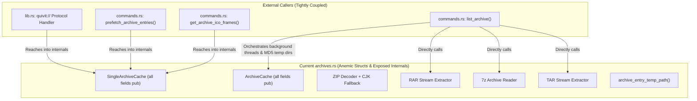
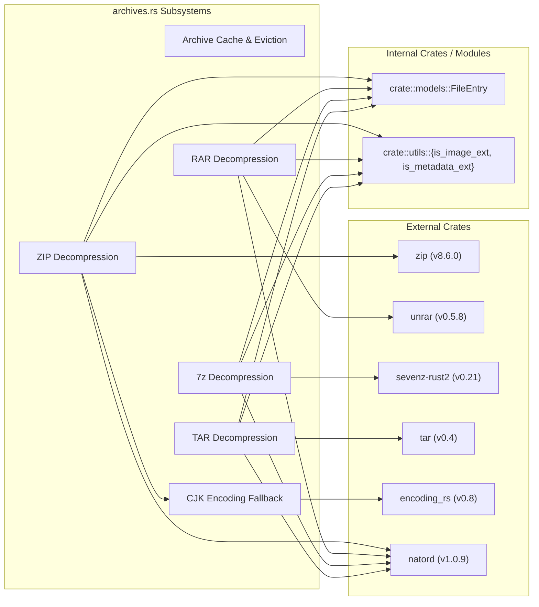

# Decoupling Analysis: `src-tauri/src/archives.rs`

**File Path:** [`src-tauri/src/archives.rs`](file:///E:/Projects/QuiviT/src-tauri/src/archives.rs)  
**Total Lines:** 594 lines  
**File Size:** 22,555 bytes (~22.0 KB)  
**Target Output Artifact:** [`03-archives.rs.md`](file:///E:/Projects/QuiviT/.agents/rust-decoupling-analysis/03-archives.rs.md)  
**Analysis Date:** 2026-08-16  

---

## 1. Executive Summary & File Overview

[`archives.rs`](file:///E:/Projects/QuiviT/src-tauri/src/archives.rs) is the central archive decompression, decoding, and caching module of QuiviT. It encapsulates format-specific readers for **ZIP/CBZ**, **RAR/CBR**, **7Z/CB7**, and **TAR/CBT**, maintains an in-memory byte-budgeted LRU cache ([`ArchiveCache`](file:///E:/Projects/QuiviT/src-tauri/src/archives.rs#L19-L29)), implements safe sandboxed temporary folder extraction for solid and sequential archives, provides thread synchronization via `Condvar` and `HashSet`, and implements legacy CJK encoding fallbacks (Shift-JIS, GB18030, EUC-KR) for ZIP filename decoding.

### Key Architectural Findings



1. **Anemic Domain Model & Exposed Internals:** [`ArchiveCache`](file:///E:/Projects/QuiviT/src-tauri/src/archives.rs#L19-L29) and [`SingleArchiveCache`](file:///E:/Projects/QuiviT/src-tauri/src/archives.rs#L12-L17) declare all fields as `pub`. External modules ([`commands.rs`](file:///E:/Projects/QuiviT/src-tauri/src/commands.rs) and [`lib.rs`](file:///E:/Projects/QuiviT/src-tauri/src/lib.rs)) reach directly into `single.extract_temp_dir`, `single.extract_notify`, and `single.zip_archive`, bypassing cache encapsulation and violating the Law of Demeter.
2. **Severe Triple Logic Duplication:** The exact 40-line sequence for reading/extracting an entry (query memory cache $\rightarrow$ query open ZipArchive handle $\rightarrow$ fallback to disk extraction $\rightarrow$ insert to memory LRU $\rightarrow$ wait on background thread Condvar for temp disk extraction) is duplicated verbatim across:
   - [`lib.rs`](file:///E:/Projects/QuiviT/src-tauri/src/lib.rs#L227-L332) (`quivit://` URI scheme protocol handler)
   - [`commands.rs`](file:///E:/Projects/QuiviT/src-tauri/src/commands.rs#L258-L292) ([`prefetch_archive_entries`](file:///E:/Projects/QuiviT/src-tauri/src/commands.rs#L248))
   - [`commands.rs`](file:///E:/Projects/QuiviT/src-tauri/src/commands.rs#L305-L376) ([`get_archive_ico_frames`](file:///E:/Projects/QuiviT/src-tauri/src/commands.rs#L298))
3. **Externalized Lifecycle Orchestration:** When an archive is opened ([`list_archive`](file:///E:/Projects/QuiviT/src-tauri/src/commands.rs#L180-L245)), [`commands.rs`](file:///E:/Projects/QuiviT/src-tauri/src/commands.rs) computes MD5 folder hashes, provisions temp directories, spawns background worker threads (`std::thread::spawn`), opens ZIP file handles, and manually registers slots in `ArchiveCache`. None of this lifecycle logic is owned by `archives.rs`.
4. **Stranded Test Suite:** Zero tests exist in `archives.rs`. All 11 archive unit/integration tests (476 lines, lines 494–969) are stranded in [`src-tauri/src/lib.rs`](file:///E:/Projects/QuiviT/src-tauri/src/lib.rs#L494-L969).
5. **Hot-Path Allocations in Fallback ZIP Scanning:** In [`read_zip_entry_by_decoded_name`](file:///E:/Projects/QuiviT/src-tauri/src/archives.rs#L295-L331), if direct lookup fails (Shift-JIS/GB18030/EUC-KR archives), the function performs an $O(N)$ linear scan from index `0..archive.len()`, allocating and decoding every filename string on *every single cache miss*.
6. **Monolithic Codec Aggregation:** All four archive formats (`zip`, `unrar`, `sevenz-rust2`, `tar`) and the caching/eviction engine are flattened into a single 594-line file without submodule boundaries.

---

## 2. Public API & Item Inventory

### 2.1 Structs & Type Definitions

| Symbol | Visibility | Lines | Description |
| :--- | :--- | :--- | :--- |
| [`SingleArchiveCache`](file:///E:/Projects/QuiviT/src-tauri/src/archives.rs#L12-L17) | `pub` | [L12–L17](file:///E:/Projects/QuiviT/src-tauri/src/archives.rs#L12-L17) | Per-archive cache holding decompressed in-memory ZIP entry bytes, optional open `ZipArchive` handle, temp directory path for unpacked solid archives, and extraction notification `Condvar`. |
| [`ArchiveCache`](file:///E:/Projects/QuiviT/src-tauri/src/archives.rs#L19-L29) | `pub` | [L19–L29](file:///E:/Projects/QuiviT/src-tauri/src/archives.rs#L19-L29) | Global cache manager enforcing a maximum open archive count (`max_open_archives = 8`) and global in-memory byte budget (`capacity_mb * 1024 * 1024`) across all archives with LRU eviction. |

### 2.2 Struct Methods ([`ArchiveCache`](file:///E:/Projects/QuiviT/src-tauri/src/archives.rs#L31-L132))

| Method | Visibility | Lines | Signature | Purpose |
| :--- | :--- | :--- | :--- | :--- |
| [`new`](file:///E:/Projects/QuiviT/src-tauri/src/archives.rs#L32-L41) | `pub` | [L32–L41](file:///E:/Projects/QuiviT/src-tauri/src/archives.rs#L32-L41) | `pub fn new(capacity_mb: usize) -> Self` | Constructor initializing empty hash maps, LRU queues, and byte budget. |
| [`touch_archive`](file:///E:/Projects/QuiviT/src-tauri/src/archives.rs#L43-L46) | `pub` | [L43–L46](file:///E:/Projects/QuiviT/src-tauri/src/archives.rs#L43-L46) | `pub fn touch_archive(&mut self, archive_path: &str)` | Moves archive path to the back of the archive LRU queue. |
| [`touch_zip_entry`](file:///E:/Projects/QuiviT/src-tauri/src/archives.rs#L48-L53) | `private` | [L48–L53](file:///E:/Projects/QuiviT/src-tauri/src/archives.rs#L48-L53) | `fn touch_zip_entry(&mut self, archive_path: &str, entry_name: &str)` | Moves `(archive_path, entry_name)` pair to the back of the global entry LRU. |
| [`remove_archive_zip_entries`](file:///E:/Projects/QuiviT/src-tauri/src/archives.rs#L55-L62) | `private` | [L55–L62](file:///E:/Projects/QuiviT/src-tauri/src/archives.rs#L55-L62) | `fn remove_archive_zip_entries(&mut self, archive_path: &str)` | Drains in-memory entries for an archive and updates `current_zip_bytes`. |
| [`evict_idle_archives`](file:///E:/Projects/QuiviT/src-tauri/src/archives.rs#L64-L76) | `private` | [L64–L76](file:///E:/Projects/QuiviT/src-tauri/src/archives.rs#L64-L76) | `fn evict_idle_archives(&mut self, keep_path: &str)` | Evicts oldest archives from `archives` map when count exceeds `max_open_archives`. |
| [`evict_until_within_budget`](file:///E:/Projects/QuiviT/src-tauri/src/archives.rs#L82-L95) | `private` | [L82–L95](file:///E:/Projects/QuiviT/src-tauri/src/archives.rs#L82-L95) | `fn evict_until_within_budget(&mut self, incoming_bytes: usize)` | Pops least-recently-used entry bytes globally until `incoming_bytes` fits within budget. |
| [`register_archive`](file:///E:/Projects/QuiviT/src-tauri/src/archives.rs#L97-L101) | `pub` | [L97–L101](file:///E:/Projects/QuiviT/src-tauri/src/archives.rs#L97-L101) | `pub fn register_archive(&mut self, archive_path: String, archive: SingleArchiveCache)` | Inserts archive into cache, updates LRU, and triggers idle archive eviction. |
| [`get_zip_entry`](file:///E:/Projects/QuiviT/src-tauri/src/archives.rs#L103-L112) | `pub` | [L103–L112](file:///E:/Projects/QuiviT/src-tauri/src/archives.rs#L103-L112) | `pub fn get_zip_entry(&mut self, archive_path: &str, entry_name: &str) -> Option<Vec<u8>>` | Retrieves cached bytes and refreshes entry recency in LRU. |
| [`insert_zip_entry`](file:///E:/Projects/QuiviT/src-tauri/src/archives.rs#L116-L131) | `pub` | [L116–L131](file:///E:/Projects/QuiviT/src-tauri/src/archives.rs#L116-L131) | `pub fn insert_zip_entry(&mut self, archive_path: &str, entry_name: &str, data: Vec<u8>)` | Enforces byte budget eviction, updates byte counter, stores bytes, and marks entry hot. |

### 2.3 Trait Implementations

| Trait | Target | Lines | Purpose |
| :--- | :--- | :--- | :--- |
| `Drop` | [`SingleArchiveCache`](file:///E:/Projects/QuiviT/src-tauri/src/archives.rs#L134-L140) | [L134–L140](file:///E:/Projects/QuiviT/src-tauri/src/archives.rs#L134-L140) | Cleans up on-disk extracted temporary directory via `fs::remove_dir_all` upon eviction or cache drop. |

### 2.4 Standalone Functions & Decoders

| Function | Visibility | Lines | Signature | Purpose |
| :--- | :--- | :--- | :--- | :--- |
| [`archive_entry_temp_path`](file:///E:/Projects/QuiviT/src-tauri/src/archives.rs#L142-L159) | `pub` | [L142–L159](file:///E:/Projects/QuiviT/src-tauri/src/archives.rs#L142-L159) | `pub fn archive_entry_temp_path(temp_dir: &Path, entry_name: &str) -> Option<PathBuf>` | Path traversal sanitizer; normalizes separators and strips `..` / root components. |
| [`write_temp_entry`](file:///E:/Projects/QuiviT/src-tauri/src/archives.rs#L161-L176) | `private` | [L161–L176](file:///E:/Projects/QuiviT/src-tauri/src/archives.rs#L161-L176) | `fn write_temp_entry(temp_dir: &Path, entry_name: &str, write: impl FnOnce(&Path) -> std::io::Result<()>) -> Option<PathBuf>` | Atomically writes extracted entry file via temporary `.tmp` extension and rename. |
| [`notify_extracted`](file:///E:/Projects/QuiviT/src-tauri/src/archives.rs#L178-L183) | `private` | [L178–L183](file:///E:/Projects/QuiviT/src-tauri/src/archives.rs#L178-L183) | `fn notify_extracted(notify: &Arc<(Mutex<HashSet<String>>, Condvar)>, entry_name: &str)` | Registers extracted entry into completion `HashSet` and wakes waiting readers on `Condvar`. |
| [`decode_zip_entry_name`](file:///E:/Projects/QuiviT/src-tauri/src/archives.rs#L196-L229) | `private` | [L196–L229](file:///E:/Projects/QuiviT/src-tauri/src/archives.rs#L196-L229) | `fn decode_zip_entry_name<R: Read + Seek>(entry: &ZipFile<'_, R>) -> String` | CJK filename decoder: detects replacement character (`\u{FFFD}`) and falls back to Shift-JIS, GB18030, EUC-KR. |
| [`list_zip_entries`](file:///E:/Projects/QuiviT/src-tauri/src/archives.rs#L231-L293) | `pub` | [L231–L293](file:///E:/Projects/QuiviT/src-tauri/src/archives.rs#L231-L293) | `pub fn list_zip_entries(archive_path: &str) -> Result<Vec<FileEntry>, String>` | Reads central directory of ZIP/CBZ, decodes names, filters images/metadata, sorts with `natord`. |
| [`read_zip_entry_by_decoded_name`](file:///E:/Projects/QuiviT/src-tauri/src/archives.rs#L295-L331) | `pub` | [L295–L331](file:///E:/Projects/QuiviT/src-tauri/src/archives.rs#L295-L331) | `pub fn read_zip_entry_by_decoded_name<R: Read + Seek>(archive: &mut ZipArchive<R>, entry_name: &str) -> Result<Vec<u8>, String>` | Decompresses a single ZIP entry from an open archive handle, trying UTF-8 lookup then decoded scan. |
| [`extract_zip_entry`](file:///E:/Projects/QuiviT/src-tauri/src/archives.rs#L333-L338) | `pub` | [L333–L338](file:///E:/Projects/QuiviT/src-tauri/src/archives.rs#L333-L338) | `pub fn extract_zip_entry(archive_path: &str, entry_name: &str) -> Result<Vec<u8>, String>` | Opens ZIP file from disk and extracts entry bytes via `read_zip_entry_by_decoded_name`. |
| [`list_rar_entries`](file:///E:/Projects/QuiviT/src-tauri/src/archives.rs#L342-L375) | `pub` | [L342–L375](file:///E:/Projects/QuiviT/src-tauri/src/archives.rs#L342-L375) | `pub fn list_rar_entries(archive_path: &str) -> Result<Vec<FileEntry>, String>` | Streams headers of RAR/CBR using `unrar`, filtering images/metadata, sorted naturally. |
| [`extract_rar_to_temp`](file:///E:/Projects/QuiviT/src-tauri/src/archives.rs#L377-L416) | `pub` | [L377–L416](file:///E:/Projects/QuiviT/src-tauri/src/archives.rs#L377-L416) | `pub fn extract_rar_to_temp(archive_path: String, temp_dir: PathBuf, notify: Arc<(Mutex<HashSet<String>>, Condvar)>)` | Sequentially decompresses RAR entries into `temp_dir` on a background thread, notifying on each. |
| [`list_7z_entries`](file:///E:/Projects/QuiviT/src-tauri/src/archives.rs#L424-L452) | `pub` | [L424–L452](file:///E:/Projects/QuiviT/src-tauri/src/archives.rs#L424-L452) | `pub fn list_7z_entries(archive_path: &str) -> Result<Vec<FileEntry>, String>` | Parses 7Z/CB7 header metadata using `sevenz-rust2`, filters images/metadata, sorted naturally. |
| [`extract_7z_to_temp`](file:///E:/Projects/QuiviT/src-tauri/src/archives.rs#L454-L484) | `pub` | [L454–L484](file:///E:/Projects/QuiviT/src-tauri/src/archives.rs#L454-L484) | `pub fn extract_7z_to_temp(archive_path: String, temp_dir: PathBuf, notify: Arc<(Mutex<HashSet<String>>, Condvar)>)` | Decompresses solid 7Z block into `temp_dir` via `sevenz_rust2::for_each_entries`, notifying on each. |
| [`list_tar_entries`](file:///E:/Projects/QuiviT/src-tauri/src/archives.rs#L491-L526) | `pub` | [L491–L526](file:///E:/Projects/QuiviT/src-tauri/src/archives.rs#L491-L526) | `pub fn list_tar_entries(archive_path: &str) -> Result<Vec<FileEntry>, String>` | Scans uncompressed TAR/CBT headers using `tar::Archive`, filters images/metadata, sorted naturally. |
| [`extract_tar_entry`](file:///E:/Projects/QuiviT/src-tauri/src/archives.rs#L528-L551) | `pub` | [L528–L551](file:///E:/Projects/QuiviT/src-tauri/src/archives.rs#L528-L551) | `pub fn extract_tar_entry(archive_path: &str, entry_name: &str) -> Result<Vec<u8>, String>` | Synchronously scans TAR archive to extract a single entry into memory. |
| [`extract_tar_to_temp`](file:///E:/Projects/QuiviT/src-tauri/src/archives.rs#L553-L593) | `pub` | [L553–L593](file:///E:/Projects/QuiviT/src-tauri/src/archives.rs#L553-L593) | `pub fn extract_tar_to_temp(archive_path: String, temp_dir: PathBuf, notify: Arc<(Mutex<HashSet<String>>, Condvar)>)` | Unpacks TAR archive entries to disk temp directory to accelerate subsequent random page views. |

---

## 3. Dependencies & Imports Analysis



### Dependency Audit
1. **Third-Party Compression Libraries:**
   - `zip`: In-memory and streaming decompression of standard and Deflate ZIPs.
   - `unrar`: Wrapper around UnRAR C++ library for RAR v4 and RAR v5 archives.
   - `sevenz-rust2`: Pure Rust LZMA/LZMA2/7z implementation. Solid archives require sequential decompression.
   - `tar`: Streaming GNU/POSIX tar archive reader.
2. **Text Encoding (`encoding_rs`)**: High-performance character encoding conversion for legacy Asian Windows codepages (`CP932` / Shift-JIS, `GB18030`, `EUC-KR`).
3. **Sorting (`natord`)**: Natural alphanumeric sorting ensuring comic page order (`page1.jpg`, `page2.jpg`, `page10.jpg` instead of `page1.jpg`, `page10.jpg`, `page2.jpg`).

---

## 4. Responsibility Clusters & Line Range Analysis

```
┌────────────────────────────────────────────────────────────────────────┐
│                      archives.rs (594 total lines)                     │
├───────────────────────────────┬────────────────────────────────────────┤
│ Module Imports & Dependencies │ Lines 1 - 8      (8 lines)             │
│ Cache & Byte-Budget LRU Engine│ Lines 9 - 140    (132 lines, 22.2%)    │
│ Path Sanitization & Temp Write│ Lines 142 - 184  (43 lines, 7.2%)      │
│ ZIP Reader & CJK Fallback     │ Lines 186 - 339  (154 lines, 25.9%)    │
│ RAR Decompression Pipeline    │ Lines 341 - 417  (77 lines, 13.0%)     │
│ 7-Zip Decompression Pipeline  │ Lines 419 - 485  (67 lines, 11.3%)     │
│ TAR Decompression Pipeline    │ Lines 487 - 594  (108 lines, 18.2%)    │
└───────────────────────────────┴────────────────────────────────────────┘
```

### Cluster 1: Cache Management & Byte-Budget LRU Eviction ([L9–L140](file:///E:/Projects/QuiviT/src-tauri/src/archives.rs#L9-L140))
- **Responsibilities:**
  - Manages in-memory decompression buffer budget ([`global_zip_capacity_bytes`](file:///E:/Projects/QuiviT/src-tauri/src/archives.rs#L26)).
  - Maintains dual LRU queues: global entry-level LRU ([`global_zip_lru`](file:///E:/Projects/QuiviT/src-tauri/src/archives.rs#L23)) and archive-level LRU ([`archive_lru`](file:///E:/Projects/QuiviT/src-tauri/src/archives.rs#L24)).
  - Limits max concurrent open archives to 8 ([`max_open_archives`](file:///E:/Projects/QuiviT/src-tauri/src/archives.rs#L28)).
  - Implements RAII directory deletion on [`SingleArchiveCache::drop`](file:///E:/Projects/QuiviT/src-tauri/src/archives.rs#L134-L140).
- **Design Flaw:** All struct fields are `pub`. The cache cannot protect its internal invariants (`current_zip_bytes`, `archive_lru` alignment) because external code mutates fields directly.

### Cluster 2: Path Traversal Sanitization & Temp-Dir Atomic Writing ([L142–L184](file:///E:/Projects/QuiviT/src-tauri/src/archives.rs#L142-L184))
- **Responsibilities:**
  - [`archive_entry_temp_path`](file:///E:/Projects/QuiviT/src-tauri/src/archives.rs#L142-L159): Normalizes backslashes to forward slashes, iterates `Path::components()`, rejects `Component::ParentDir` (`..`), `Component::RootDir`, and `Component::Prefix`, ensuring extracted files cannot escape the target sandbox directory (Zip Slip defense).
  - [`write_temp_entry`](file:///E:/Projects/QuiviT/src-tauri/src/archives.rs#L161-L176): Writes to `{file_name}.tmp` then performs an atomic rename to prevent reader threads from reading half-written image streams.
  - [`notify_extracted`](file:///E:/Projects/QuiviT/src-tauri/src/archives.rs#L178-L183): Notifies waiting threads via `Condvar` when a file becomes fully available.

### Cluster 3: ZIP Engine & CJK Character Set Fallback Decoding ([L186–L339](file:///E:/Projects/QuiviT/src-tauri/src/archives.rs#L186-L339))
- **Responsibilities:**
  - [`decode_zip_entry_name`](file:///E:/Projects/QuiviT/src-tauri/src/archives.rs#L196-L229): Inspects filename for replacement character `\u{FFFD}`; if present, reads `entry.name_raw()` and attempts sequential decoding against `Shift-JIS`, `GB18030`, and `EUC-KR`.
  - [`list_zip_entries`](file:///E:/Projects/QuiviT/src-tauri/src/archives.rs#L231-L293): Scans the central directory; handles partially corrupted ZIP archives with broken local headers by still listing them for the UI.
  - [`read_zip_entry_by_decoded_name`](file:///E:/Projects/QuiviT/src-tauri/src/archives.rs#L295-L331): Attempts fast-path direct hash lookup by UTF-8 name; on failure, performs linear fallback matching against decoded names.

### Cluster 4: RAR Extraction Engine & Header Streaming ([L341–L417](file:///E:/Projects/QuiviT/src-tauri/src/archives.rs#L341-L417))
- **Responsibilities:**
  - [`list_rar_entries`](file:///E:/Projects/QuiviT/src-tauri/src/archives.rs#L342-L375): Uses `unrar::Archive::open_for_processing()` to stream headers, skipping non-image entries.
  - [`extract_rar_to_temp`](file:///E:/Projects/QuiviT/src-tauri/src/archives.rs#L377-L416): Background worker function streaming file data to disk.
- **Limitation:** RAR decompression cannot do random-access in solid archives; sequential extraction to a temp folder is required.

### Cluster 5: 7-Zip (7z / CB7) Decompression Pipeline ([L419–L485](file:///E:/Projects/QuiviT/src-tauri/src/archives.rs#L419-L485))
- **Responsibilities:**
  - [`list_7z_entries`](file:///E:/Projects/QuiviT/src-tauri/src/archives.rs#L424-L452): Reads 7z header table without decompressing data blocks.
  - [`extract_7z_to_temp`](file:///E:/Projects/QuiviT/src-tauri/src/archives.rs#L454-L484): Uses `sevenz_rust2::for_each_entries` to decompress LZMA2 blocks into sandboxed disk files.

### Cluster 6: TAR / CBT Sequential Archive Scanner ([L487–L594](file:///E:/Projects/QuiviT/src-tauri/src/archives.rs#L487-L594))
- **Responsibilities:**
  - [`list_tar_entries`](file:///E:/Projects/QuiviT/src-tauri/src/archives.rs#L491-L526): Parses TAR headers sequentially.
  - [`extract_tar_entry`](file:///E:/Projects/QuiviT/src-tauri/src/archives.rs#L528-L551): Single synchronous entry scanner.
  - [`extract_tar_to_temp`](file:///E:/Projects/QuiviT/src-tauri/src/archives.rs#L553-L593): Decompresses TAR into temp directory so subsequent random page access is instantaneous from disk.

---

## 5. Coupling, Encapsulation & Code Duplication Analysis

### 5.1 The Leaky Cache & External Caller Reach-In

All fields in `ArchiveCache` and `SingleArchiveCache` are marked `pub`. As a consequence, external modules don't just call cache methods; they micromanage cache internals:

```rust
// Snippet from lib.rs:243-254 (Protocol Handler reaching directly into SingleArchiveCache)
if let Some(single) = cache.archives.get(&archive_path) {
    if let Some(temp_dir) = &single.extract_temp_dir {
        if let Some(file_path) = crate::archives::archive_entry_temp_path(temp_dir, &entry_name) {
            if let Ok(bytes) = fs::read(&file_path) {
                data = Some(bytes);
            }
        }
    }
}
```

```rust
// Snippet from commands.rs:268-274 (Prefetch reaching directly into zip_archive handle)
if let Some(single) = cache.archives.get_mut(&archive_path) {
    if let Some(archive) = single.zip_archive.as_mut() {
        crate::archives::read_zip_entry_by_decoded_name(archive, &entry_name).ok()
    } else {
        None
    }
}
```

### 5.2 The 3-Way Duplication Matrix

| Stage | `lib.rs` (Protocol Scheme) | `commands.rs::prefetch_archive_entries` | `commands.rs::get_archive_ico_frames` |
| :--- | :--- | :--- | :--- |
| **1. Memory Cache Check** | [L234–L236](file:///E:/Projects/QuiviT/src-tauri/src/lib.rs#L234-L236) | [L260–L263](file:///E:/Projects/QuiviT/src-tauri/src/commands.rs#L260-L263) | [L306–L311](file:///E:/Projects/QuiviT/src-tauri/src/commands.rs#L306-L311) |
| **2. Handle Mutex & Lookup** | [L260–L276](file:///E:/Projects/QuiviT/src-tauri/src/lib.rs#L260-L276) | [L267–L278](file:///E:/Projects/QuiviT/src-tauri/src/commands.rs#L267-L278) | [L313–L325](file:///E:/Projects/QuiviT/src-tauri/src/commands.rs#L313-L325) |
| **3. Disk Fallback Extraction** | [L280–L282](file:///E:/Projects/QuiviT/src-tauri/src/lib.rs#L280-L282) | [L283–L287](file:///E:/Projects/QuiviT/src-tauri/src/commands.rs#L283-L287) | [L326–L330](file:///E:/Projects/QuiviT/src-tauri/src/commands.rs#L326-L330) |
| **4. Cache Insertion & LRU** | [L286–L289](file:///E:/Projects/QuiviT/src-tauri/src/lib.rs#L286-L289) | [L290–L292](file:///E:/Projects/QuiviT/src-tauri/src/commands.rs#L290-L292) | [L332–L335](file:///E:/Projects/QuiviT/src-tauri/src/commands.rs#L332-L335) |
| **5. Condvar Wait for Temp Disk** | [L297–L330](file:///E:/Projects/QuiviT/src-tauri/src/lib.rs#L297-L330) | *(N/A - ZIP only)* | [L340–L374](file:///E:/Projects/QuiviT/src-tauri/src/commands.rs#L340-L374) |

**Root Cause:** `archives.rs` lacks a unified `read_entry_bytes(archive_path, entry_name)` service method.

---

## 6. Code Smells, Safety & Performance Considerations

### 6.1 Performance Bottleneck: $O(N \cdot M)$ Allocations on CJK ZIP Misses

In [`read_zip_entry_by_decoded_name`](file:///E:/Projects/QuiviT/src-tauri/src/archives.rs#L295-L331):
```rust
let mut matching_index = None;
for i in 0..archive.len() {
    if let Ok(entry) = archive.by_index(i) {
        let decoded_name = decode_zip_entry_name(&entry); // Allocates a new String every step
        if decoded_name == entry_name {
            matching_index = Some(i);
            break;
        }
    }
}
```
If an archive has 5,000 files encoded in Shift-JIS, reading the 5,000th image performs 5,000 string allocations and 5,000 decoding passes on every single non-cached image load.  
*Optimization:* On opening a non-UTF8 archive, build an index map `HashMap<String, usize>` mapping decoded names to entry indices once.

### 6.2 Lock Contention & Mutex Holding Times

In `lib.rs` and `commands.rs`, the global `Mutex<ArchiveCache>` is acquired and released 3 to 4 times in quick succession during a single request:
1. Lock cache $\rightarrow$ check memory cache $\rightarrow$ unlock.
2. Lock cache $\rightarrow$ access open ZIP archive handle $\rightarrow$ read decompressed bytes while holding the lock! $\rightarrow$ unlock.
3. Lock cache $\rightarrow$ insert newly decompressed bytes $\rightarrow$ unlock.

Holding the global cache lock while decompressing entries blocks all other webview asset requests across all windows.

### 6.3 Process Termination & Orphaned Temp Files

`SingleArchiveCache` implements `Drop` ([L134–L140](file:///E:/Projects/QuiviT/src-tauri/src/archives.rs#L134-L140)) to delete `%TEMP%\QuiviT\<md5>` on eviction. However, if QuiviT is terminated via Task Manager, crashes, or receives `SIGKILL`, `Drop` is never executed. Over time, gigabytes of unpacked solid archive data can linger in `%TEMP%\QuiviT\`.  
*Recommendation:* Add a startup garbage collector in `archives.rs` that purges `%TEMP%\QuiviT\` on app launch.

---

## 7. Test Inventory & Missing Tests

Currently, `archives.rs` contains **0 tests**. All 11 unit/integration tests are stranded in [`src-tauri/src/lib.rs:494-969`](file:///E:/Projects/QuiviT/src-tauri/src/lib.rs#L494-L969).

### 7.1 Inventory of Existing Stranded Tests in `lib.rs`

| Test Function | Source in `lib.rs` | Domain / Target Function Tested |
| :--- | :--- | :--- |
| `lists_solid_7z_with_nested_folders` | [L568–L584](file:///E:/Projects/QuiviT/src-tauri/src/lib.rs#L568-L584) | [`list_7z_entries`](file:///E:/Projects/QuiviT/src-tauri/src/archives.rs#L424) + natural sorting |
| `extracts_solid_7z_to_temp` | [L587–L611](file:///E:/Projects/QuiviT/src-tauri/src/lib.rs#L587-L611) | [`extract_7z_to_temp`](file:///E:/Projects/QuiviT/src-tauri/src/archives.rs#L454) |
| `lists_and_reads_tar` | [L614–L643](file:///E:/Projects/QuiviT/src-tauri/src/lib.rs#L614-L643) | [`list_tar_entries`](file:///E:/Projects/QuiviT/src-tauri/src/archives.rs#L491) & [`extract_tar_entry`](file:///E:/Projects/QuiviT/src-tauri/src/archives.rs#L528) |
| `extracts_tar_to_temp` | [L646–L666](file:///E:/Projects/QuiviT/src-tauri/src/lib.rs#L646-L666) | [`extract_tar_to_temp`](file:///E:/Projects/QuiviT/src-tauri/src/archives.rs#L553) |
| `archive_entry_temp_path_rejects_escape_paths` | [L669–L678](file:///E:/Projects/QuiviT/src-tauri/src/lib.rs#L669-L678) | [`archive_entry_temp_path`](file:///E:/Projects/QuiviT/src-tauri/src/archives.rs#L142) path traversal security |
| `tar_temp_extraction_includes_metadata` | [L681–L718](file:///E:/Projects/QuiviT/src-tauri/src/lib.rs#L681-L718) | [`extract_tar_to_temp`](file:///E:/Projects/QuiviT/src-tauri/src/archives.rs#L553) with XML/OPF metadata |
| `supported_archives_include_new_formats` | [L721–L725](file:///E:/Projects/QuiviT/src-tauri/src/lib.rs#L721-L725) | `utils::is_archive_ext` |
| `lists_rar5_cbr` | [L728–L737](file:///E:/Projects/QuiviT/src-tauri/src/lib.rs#L728-L737) | [`list_rar_entries`](file:///E:/Projects/QuiviT/src-tauri/src/archives.rs#L342) |
| `lists_cb7_like_7z` | [L740–L751](file:///E:/Projects/QuiviT/src-tauri/src/lib.rs#L740-L751) | [`list_7z_entries`](file:///E:/Projects/QuiviT/src-tauri/src/archives.rs#L424) |
| `protocol_serve_timing_simulation` | [L769–L868](file:///E:/Projects/QuiviT/src-tauri/src/lib.rs#L769-L868) | Background thread extraction + Condvar wait simulation |
| `archive_cache_byte_budget_evicts_globally` | [L871–L937](file:///E:/Projects/QuiviT/src-tauri/src/lib.rs#L871-L937) | [`ArchiveCache`](file:///E:/Projects/QuiviT/src-tauri/src/archives.rs#L19) byte budget LRU eviction |
| `archive_cache_bounds_open_archive_state` | [L940–L968](file:///E:/Projects/QuiviT/src-tauri/src/lib.rs#L940-L968) | [`ArchiveCache`](file:///E:/Projects/QuiviT/src-tauri/src/archives.rs#L19) max open archives eviction |

### 7.2 Missing Test Coverage
1. **Shift-JIS / CJK ZIP decoding tests:** No unit test verifies [`decode_zip_entry_name`](file:///E:/Projects/QuiviT/src-tauri/src/archives.rs#L196) directly against CP932 / GB18030 raw bytes.
2. **Corrupted ZIP central directory resilience:** Verify that corrupted local headers don't abort directory listing.
3. **Drop cleanup verification:** Ensure temp directories are truly deleted from disk when `SingleArchiveCache` drops.

---

## 8. Decoupling Recommendations & Target Architecture

### 8.1 Proposed Submodule Structure

Refactor `archives.rs` into a dedicated submodule hierarchy:

```
src-tauri/src/archives/
├── mod.rs             # Public Facade (ArchiveService, ArchiveFormat enum, prepare/read API)
├── cache.rs           # ArchiveCache, SingleArchiveCache, byte-budget LRU eviction
├── zip.rs             # ZIP/CBZ reader, ZipArchive pool, Shift-JIS / CJK decoder
├── rar.rs             # RAR/CBR header iterator and background extractor
├── sevenz.rs          # 7z/CB7 LZMA2 background extractor
├── tar.rs             # TAR/CBT reader and background extractor
├── path.rs            # archive_entry_temp_path sandboxing & atomic writer
└── tests.rs           # All 11 relocated archive tests from lib.rs + CJK unit tests
```

### 8.2 Clean Facade API Design

Encapsulate all cache fields (`pub(crate)` or `private`) and provide high-level, thread-safe service methods:

```rust
// Proposed ArchiveFormat enum replacing scattered string comparisons
#[derive(Debug, Clone, Copy, PartialEq, Eq)]
pub enum ArchiveFormat {
    Zip,
    Rar,
    SevenZip,
    Tar,
}

impl ArchiveFormat {
    pub fn from_path(path: &Path) -> Option<Self> {
        let ext = path.extension()?.to_str()?.to_lowercase();
        match ext.as_str() {
            "zip" | "cbz" => Some(Self::Zip),
            "rar" | "cbr" => Some(Self::Rar),
            "7z" | "cb7" => Some(Self::SevenZip),
            "tar" | "cbt" => Some(Self::Tar),
            _ => None,
        }
    }
}

// Unified Archive Service facade
impl ArchiveCache {
    /// Prepares archive for viewing: registers in cache, starts background extraction if solid
    pub fn prepare_archive(&mut self, path: &Path) -> Result<Vec<FileEntry>, String>;

    /// Reads a single image entry: checks memory cache -> open handle -> disk temp -> fallback
    pub fn read_entry_bytes(&mut self, archive_path: &str, entry_name: &str, timeout: Duration) -> Result<Vec<u8>, String>;

    /// Prefetches multiple entries into memory cache in the background
    pub fn prefetch_entries(&mut self, archive_path: &str, entries: &[String]) -> Result<(), String>;
}
```

### 8.3 Action Plan & Migration Steps

| Step | Target File | Action |
| :---: | :--- | :--- |
| **1** | [`src-tauri/src/lib.rs`](file:///E:/Projects/QuiviT/src-tauri/src/lib.rs) | Relocate all 476 lines of `archive_tests` ([L494–L969](file:///E:/Projects/QuiviT/src-tauri/src/lib.rs#L494-L969)) to `src-tauri/src/archives.rs` (or `archives/tests.rs`). |
| **2** | [`src-tauri/src/archives.rs`](file:///E:/Projects/QuiviT/src-tauri/src/archives.rs) | Encapsulate fields in `ArchiveCache` and `SingleArchiveCache` (`pub(crate)` visibility). |
| **3** | [`src-tauri/src/archives.rs`](file:///E:/Projects/QuiviT/src-tauri/src/archives.rs) | Implement `prepare_archive()` and `read_entry_bytes()` methods on `ArchiveCache`. |
| **4** | [`src-tauri/src/commands.rs`](file:///E:/Projects/QuiviT/src-tauri/src/commands.rs) | Simplify `list_archive`, `prefetch_archive_entries`, and `get_archive_ico_frames` to delegate directly to `ArchiveCache` methods. |
| **5** | [`src-tauri/src/lib.rs`](file:///E:/Projects/QuiviT/src-tauri/src/lib.rs) | Replace 110 lines of manual cache extraction logic in `quivit://` handler ([L230–L332](file:///E:/Projects/QuiviT/src-tauri/src/lib.rs#L230-L332)) with a single call to `cache.read_entry_bytes()`. |
