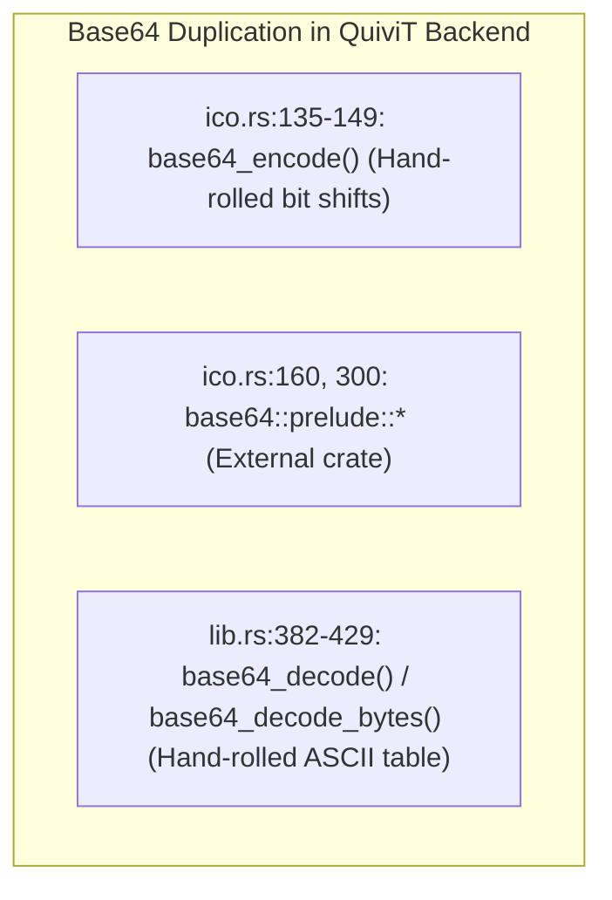
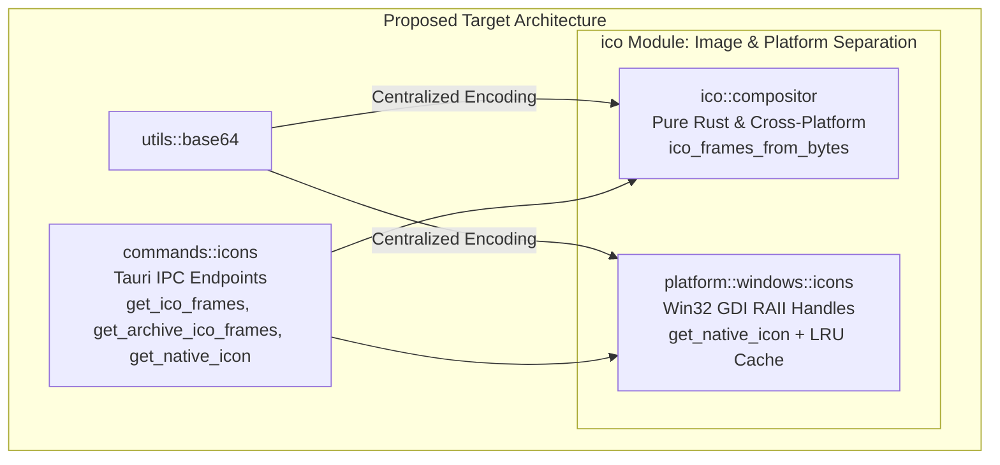

# Decoupling Analysis: `src-tauri/src/ico.rs`

**File Path:** [`src-tauri/src/ico.rs`](file:///E:/Projects/QuiviT/src-tauri/src/ico.rs)  
**Total Lines:** 306 lines  
**File Size:** 11,384 bytes (~11.1 KB)  
**Target Output Artifact:** [`05-ico.rs.md`](file:///E:/Projects/QuiviT/.agents/rust-decoupling-analysis/05-ico.rs.md)  
**Analysis Date:** 2026-08-16  

---

## 1. Executive Summary & File Overview

[`ico.rs`](file:///E:/Projects/QuiviT/src-tauri/src/ico.rs) is a specialized utility and command module in the QuiviT Tauri backend responsible for two distinct imaging features:
1. **ICO Multi-Frame Extraction & Sprite Sheet Compositor:** Parsing binary `.ico` directory headers, extracting embedded sub-images (both modern PNG frames and legacy BMP frames via synthetic ICO byte reconstruction), sorting and deduplicating frames by dimension, and assembling them into a horizontal PNG sprite sheet encoded as a base64 data URI.
2. **Native Windows Shell Icon Extraction:** Querying the Windows Shell (`SHGetFileInfoW`) for file extension and folder icons, rasterizing the native `HICON` onto an off-screen 32-bit GDI Device Independent Bitmap (DIB), converting BGRA pixels to RGBA, and returning a PNG base64 data URI.

While compact (306 lines), `ico.rs` exhibits significant architectural coupling, code duplication, and safety risks:
- **Redundant Base64 Implementations:** Contains a hand-rolled 15-line base64 encoder ([lines 135–149](file:///E:/Projects/QuiviT/src-tauri/src/ico.rs#L135-L149)), while simultaneously importing the external `base64` crate on [line 160](file:///E:/Projects/QuiviT/src-tauri/src/ico.rs#L160) (`BASE64_STANDARD.encode(...)`), and while [`lib.rs`](file:///E:/Projects/QuiviT/src-tauri/src/lib.rs#L382-L429) implements yet another hand-rolled base64 decoder.
- **Mixed Domain Responsibilities:** Blends cross-platform binary format parsing (pure Rust image decoding) with low-level, unsafe Windows-only Win32 GDI/Shell graphics manipulation.
- **Manual GDI Resource Management:** Uses manual cleanup calls for Win32 handles (`HDC`, `HBITMAP`, `HICON`) across multiple early-return error paths without RAII Drop guards, creating potential resource leak hazards.
- **Monochrome Icon Vulnerability:** Assumes all icons have a valid `icon_info.hbmColor`, which fails for 1-bit monochrome icons where `hbmColor` is NULL.
- **Zero Backend Caching for Native Icons:** Every icon request triggers full Win32 shell resolution, GDI DC allocation, rasterization, color space transformation, PNG encoding, and base64 string allocation without caching.
- **Complete Absence of Unit Tests:** Zero unit or integration tests exist for binary ICO header parsing, synthetic BMP frame generation, or icon extraction.

---

## 2. Itemized Inventory of Items in `ico.rs`

### 2.1. Imports & Platform Dependencies

| Line Range | Source / Target | Condition | Purpose |
| :--- | :--- | :--- | :--- |
| [L1](file:///E:/Projects/QuiviT/src-tauri/src/ico.rs#L1) | `std::fs` | Unconditional | File I/O for `get_ico_frames` |
| [L5, L7](file:///E:/Projects/QuiviT/src-tauri/src/ico.rs#L5) | `std::ffi::OsStr`, `std::os::windows::ffi::OsStrExt` | `#[cfg(windows)]` | Wide-string conversion for Win32 API calls |
| [L9](file:///E:/Projects/QuiviT/src-tauri/src/ico.rs#L9) | `windows::Win32::UI::Shell::{SHGetFileInfoW, SHFILEINFOW, SHGFI_ICON, SHGFI_USEFILEATTRIBUTES}` | `#[cfg(windows)]` | Shell file icon lookup API |
| [L11](file:///E:/Projects/QuiviT/src-tauri/src/ico.rs#L11) | `windows::Win32::UI::WindowsAndMessaging::{GetIconInfo, DestroyIcon, DrawIconEx, DI_NORMAL}` | `#[cfg(windows)]` | Win32 icon inspection, rendering, and lifecycle |
| [L13](file:///E:/Projects/QuiviT/src-tauri/src/ico.rs#L13) | `windows::Win32::Graphics::Gdi::{GetDC, ReleaseDC, CreateCompatibleDC, DeleteDC, BITMAPINFO, BITMAPINFOHEADER, BI_RGB, DIB_RGB_COLORS, DeleteObject, CreateDIBSection, SelectObject, GetObjectW, BITMAP}` | `#[cfg(windows)]` | GDI device context, DIB section allocation, and bitmap drawing |
| [L15](file:///E:/Projects/QuiviT/src-tauri/src/ico.rs#L15) | `windows::Win32::Storage::FileSystem::{FILE_ATTRIBUTE_NORMAL, FILE_ATTRIBUTE_DIRECTORY}` | `#[cfg(windows)]` | Shell file attribute flags for dummy icon resolution |
| [L158–L160](file:///E:/Projects/QuiviT/src-tauri/src/ico.rs#L158-L160) | `image::RgbaImage`, `std::io::Cursor`, `base64::prelude::*` | `#[cfg(windows)]` (inside `get_native_icon`) | Image buffer construction, PNG serialization, and standard base64 encoding |

---

### 2.2. Public API & Exported Functions

| Line Range | Signature | Category | Description |
| :--- | :--- | :--- | :--- |
| [L21–L25](file:///E:/Projects/QuiviT/src-tauri/src/ico.rs#L21-L25) | `#[tauri::command]`<br>`pub fn get_ico_frames(path: String) -> Result<String, String>` | Tauri Command | Reads a loose `.ico` file from disk and returns a horizontal PNG sprite sheet as a base64 data URI. |
| [L27–L133](file:///E:/Projects/QuiviT/src-tauri/src/ico.rs#L27-L133) | `pub fn ico_frames_from_bytes(data: &[u8]) -> Result<String, String>` | Core Domain Function | Pure parser and compositor: extracts sub-images from raw ICO bytes, builds a sprite sheet, and encodes to PNG base64. Consumed by `get_ico_frames` and [`commands::get_archive_ico_frames`](file:///E:/Projects/QuiviT/src-tauri/src/commands.rs#L298). |
| [L135–L149](file:///E:/Projects/QuiviT/src-tauri/src/ico.rs#L135-L149) | `pub fn base64_encode(data: &[u8]) -> String` | Utility Helper | Custom handwritten base64 encoder converting byte slice to ASCII Base64 string. |
| [L151–L305](file:///E:/Projects/QuiviT/src-tauri/src/ico.rs#L151-L305) | `#[tauri::command]`<br>`pub fn get_native_icon(ext: &str) -> Result<Option<String>, String>` | Tauri Command | Queries Windows Shell for an extension or folder icon, renders via GDI to a 32bpp DIB, and returns a PNG base64 data URI (returns `Ok(None)` on non-Windows). |

---

## 3. Responsibility Clusters & Line Range Breakdown

```
┌────────────────────────────────────────────────────────────────────────┐
│                        ico.rs (306 total lines)                        │
├───────────────────────────────┬────────────────────────────────────────┤
│ Module Imports & GDI Headers  │ Lines 1 - 16     (16 lines)            │
│ get_ico_frames Command        │ Lines 19 - 25    (7 lines)             │
│ ico_frames_from_bytes Core    │ Lines 27 - 133   (107 lines)           │
│   ├── Binary Header Parsing   │   Lines 27 - 39  (13 lines)            │
│   ├── Frame Extraction & Synth│   Lines 40 - 96  (57 lines)            │
│   ├── Sorting & Deduplication │   Lines 97 - 104 (8 lines)             │
│   └── Blitting & PNG Encoding │   Lines 105 - 133(29 lines)            │
│ Hand-Rolled base64_encode     │ Lines 135 - 149  (15 lines)            │
│ get_native_icon Command (Win32│ Lines 151 - 305  (155 lines, 50.7%)    │
│   ├── Non-Windows Stub        │   Lines 153 - 155(3 lines)             │
│   ├── Shell API & HICON Query │   Lines 156 - 198(43 lines)            │
│   ├── GDI DIB Setup & Render  │   Lines 200 - 270(71 lines)            │
│   ├── GDI Handle Cleanup      │   Lines 272 - 280(9 lines)             │
│   └── RGBA Swap & PNG Encode  │   Lines 282 - 305(24 lines)            │
└───────────────────────────────┴────────────────────────────────────────┘
```

### Cluster 1: ICO Binary Header Parsing & Synthetic Frame Generation ([L27–L96](file:///E:/Projects/QuiviT/src-tauri/src/ico.rs#L27-L96))
- **Responsibilities:**
  - Validates minimum ICO header size (6 bytes: reserved `0x0000`, type `0x0001`, entry count `u16`).
  - Validates directory structure bounds (`data.len() >= 6 + count * 16`).
  - Iterates through 16-byte directory entries to extract byte offset (`data[entry_offset + 12..16]`) and byte size (`data[entry_offset + 8..12]`).
  - **PNG Sub-Image Decoding:** Detects magic bytes `b"\x89PNG"` and decodes directly via `image::load_from_memory_with_format(..., ImageFormat::Png)`.
  - **BMP Sub-Image Decoding via Synthetic ICO:** Legacy BMP entries in `.ico` files lack a standard `BITMAPFILEHEADER`. Instead of writing a manual BMP parser, `ico.rs` synthesizes an in-memory 22-byte single-entry ICO header (`[0, 0, 1, 0, 1, 0]` + 12 directory bytes + offset 22) followed by the raw BMP payload, delegating parsing to `image::load_from_memory_with_format(..., ImageFormat::Ico)`.
  - **Fallback:** If individual frame decoders fail, attempts whole-file decode via `ImageFormat::Ico`.

### Cluster 2: Multi-Frame Sprite Sheet Compositing ([L97–L133](file:///E:/Projects/QuiviT/src-tauri/src/ico.rs#L97-L133))
- **Responsibilities:**
  - Sorts extracted frames in descending order by width (`frames.sort_by(|a, b| b.width().cmp(&a.width()))`).
  - Deduplicates consecutive duplicate resolutions (`frames.dedup_by(...)`).
  - Computes bounding canvas: `total_width = sum(width)`, `max_height = max(height)`.
  - Allocates `image::RgbaImage::new(total_width, max_height)`.
  - Centers each sub-image vertically (`y_offset = (max_height - height) / 2`) and blits pixel-by-pixel (`spritesheet.put_pixel(...)`).
  - Encodes the canvas to PNG format via `image::codecs::png::PngEncoder`.
  - Wraps the resulting bytes in a base64 data URI: `format!("data:image/png;base64,{b64}")`.

### Cluster 3: Hand-Rolled Base64 Encoder ([L135–L149](file:///E:/Projects/QuiviT/src-tauri/src/ico.rs#L135-L149))
- **Responsibilities:**
  - Implements custom 3-byte chunking, 24-bit bitshift operations, and lookup against static table `b"ABCDEFGHIJKLMNOPQRSTUVWXYZabcdefghijklmnopqrstuvwxyz0123456789+/"`.
  - Generates padding characters (`=`).
- **Architectural Smell:** Redundant reinvented utility. Lines 160 & 300 in the very same file use the standard `base64` crate (`BASE64_STANDARD.encode(...)`).

### Cluster 4: Windows Shell & GDI Native Icon Extraction ([L151–L305](file:///E:/Projects/QuiviT/src-tauri/src/ico.rs#L151-L305))
- **Responsibilities:**
  - Normalizes file extension into a dummy filename (e.g. `"dummy.png"`, `"dummy.pdf"`, or `"dummy"` for `"__folder__"`).
  - Invokes `SHGetFileInfoW` with `SHGFI_USEFILEATTRIBUTES` to query the registered Windows shell icon without touching the filesystem.
  - Extracts icon metrics via `GetIconInfo` (`hbmColor`, `hbmMask`) and `GetObjectW`.
  - Creates an off-screen memory device context (`CreateCompatibleDC`) compatible with the screen DC (`GetDC(None)`).
  - Creates a 32-bit top-down DIB Section (`CreateDIBSection` with `biHeight = -height`, `biBitCount = 32`).
  - Renders the icon onto the DIB using `DrawIconEx` with `DI_NORMAL`.
  - Copies raw pixels to a `Vec<u8>` and converts BGRA to RGBA in-place.
  - Encodes the resulting `RgbaImage` to PNG in memory using `image::write_buffer_with_format`.
  - Serializes to base64 using the `base64` crate and returns `data:image/png;base64,<str>`.

---

## 4. Win32 GDI / Windows API Safety & Memory Analysis

```mermaid
graph TD
    subgraph Win32 GDI Pipeline in get_native_icon
        A[SHGetFileInfoW] -->|hIcon| B[GetIconInfo]
        B -->|hbmColor / hbmMask| C[GetObjectW: Query Dimensions]
        C --> D[GetDC: Screen DC]
        D --> E[CreateCompatibleDC: Mem DC]
        E --> F[CreateDIBSection: 32bpp Top-Down DIB]
        F --> G[SelectObject: Select DIB into Mem DC]
        G --> H[DrawIconEx: Rasterize HICON onto DIB]
        H --> I[ptr::copy_nonoverlapping: Copy to Vec]
        I --> J[SelectObject: Restore Old Bitmap]
        J --> K[GDI Cleanup: DeleteObject, DeleteDC, ReleaseDC, DestroyIcon]
        K --> L[In-place BGRA to RGBA Swap]
        L --> M[image::write_buffer_with_format: PNG]
        M --> N[BASE64_STANDARD.encode]
    end
```



### 4.1. Manual Resource Cleanup & Leak Hazards

The Windows GDI subsystem requires strict, paired cleanup of all allocated handles. In [`ico.rs:225–280`](file:///E:/Projects/QuiviT/src-tauri/src/ico.rs#L225-L280), resource management is entirely manual without RAII wrappers:

```rust
// ico.rs:234-241 - Error exit branch during DIB creation
Err(_) => {
    let _ = DeleteDC(hdc_mem);
    let _ = ReleaseDC(None, hdc_screen);
    let _ = DeleteObject(icon_info.hbmColor.into());
    let _ = DeleteObject(icon_info.hbmMask.into());
    let _ = DestroyIcon(hicon);
    return Ok(None);
}
```

#### Fragility Points:
1. **Duplicated Cleanup Blocks:** The 5 cleanup calls are copy-pasted across line 235 and line 245, and then repeated in reverse order on lines 272–279.
2. **Panic Safety:** If `image::RgbaImage::from_raw` or any subsequent operation panics, Rust unwinding skips manual cleanup, leaking GDI handles in the host OS process.
3. **Handle Ordering Rule:** GDI strictly forbids deleting a bitmap while it is selected into a Device Context. While `ico.rs` correctly calls `SelectObject(hdc_mem, old_bmp)` before `DeleteObject(hbm_dib.into())` on line 272, this invariant is vulnerable to future refactoring errors without an RAII guard.

---

### 4.2. Monochrome Icon Edge-Case Bug

In [`ico.rs:201–206`](file:///E:/Projects/QuiviT/src-tauri/src/ico.rs#L201-L206):
```rust
let mut bmp = BITMAP::default();
GetObjectW(
    icon_info.hbmColor.into(),
    std::mem::size_of::<BITMAP>() as i32,
    Some(&mut bmp as *mut _ as *mut std::ffi::c_void),
);
```
**The Bug:**
- In the Win32 API, monochrome (1-bit black & white) icons do **not** have an `hbmColor` bitmap (`icon_info.hbmColor` is `HBITMAP(null)`). The color and transparency masks are packed into `icon_info.hbmMask` with double height.
- Calling `GetObjectW` with a null `hbmColor` returns `0`, leaving `bmp.bmWidth = 0` and `bmp.bmHeight = 0`.
- Subsequent calculations allocate a 0-byte pixel buffer (`vec![0; 0]`), causing `CreateDIBSection` or `RgbaImage::from_raw` to fail or produce an invalid image.
- **Fix Required:** Fall back to inspecting `icon_info.hbmMask` if `icon_info.hbmColor.is_invalid()`, dividing `bmHeight` by 2.

---

### 4.3. Top-Down DIB & Memory Pointer Copy Safety

In [`ico.rs:217, 269`](file:///E:/Projects/QuiviT/src-tauri/src/ico.rs#L217):
```rust
bmi.bmiHeader.biHeight = -(height as i32); // top-down
...
std::ptr::copy_nonoverlapping(bits_ptr as *const u8, pixels.as_mut_ptr(), pixels.len());
```
- Standard Windows DIBs are bottom-up (positive `biHeight`). Setting `biHeight = -height` forces Windows to allocate a top-down bitmap, matching standard image coordinate systems (row 0 at the top).
- Because `biBitCount = 32`, every scanline is `width * 4` bytes, which is naturally 4-byte (DWORD) aligned. No stride padding exists, making the contiguous buffer copy (`copy_nonoverlapping`) mathematically sound.
- However, if `bits_ptr` is null (e.g. if `CreateDIBSection` failed silently without returning an Err), `copy_nonoverlapping` from null causes Undefined Behavior. A null check on `bits_ptr` must precede the copy.

---

## 5. Coupling, Duplication & Architectural Overlaps

### 5.1. Triplicate Base64 Implementation

The codebase contains three separate base64 implementations / approaches across two files:



1. [`ico.rs:135–149`](file:///E:/Projects/QuiviT/src-tauri/src/ico.rs#L135-L149) implements a custom 15-line base64 encoder.
2. [`ico.rs:160, 300`](file:///E:/Projects/QuiviT/src-tauri/src/ico.rs#L160) imports and uses the official `base64` crate (`0.23.1`) already included in `Cargo.toml`.
3. [`lib.rs:382–429`](file:///E:/Projects/QuiviT/src-tauri/src/lib.rs#L382-L429) implements a custom 45-line base64 byte decoder.

**Recommendation:** Delete both handwritten encoders/decoders. Standardize on the `base64` crate across the entire backend, exposing unified helper functions in [`utils.rs`](file:///E:/Projects/QuiviT/src-tauri/src/utils.rs) if needed.

---

### 5.2. Asymmetrical ICO Command Distribution

- Loose ICO file extraction is declared in [`ico.rs:21`](file:///E:/Projects/QuiviT/src-tauri/src/ico.rs#L21) (`get_ico_frames`).
- Archive-embedded ICO file extraction is declared in [`commands.rs:298`](file:///E:/Projects/QuiviT/src-tauri/src/commands.rs#L298) (`get_archive_ico_frames`).
- Both commands depend on [`ico::ico_frames_from_bytes`](file:///E:/Projects/QuiviT/src-tauri/src/ico.rs#L27).

**Issue:** Having IPC command endpoints scattered across both `ico.rs` and `commands.rs` muddles module boundaries. `ico.rs` should be a domain module providing decoding services, while IPC command handlers should reside in `commands.rs` (or a dedicated `commands::icons` module).

---

### 5.3. Performance: Pixel-by-Pixel Blitting vs Memory Blit

In [`ico.rs:110–112`](file:///E:/Projects/QuiviT/src-tauri/src/ico.rs#L110-L112):
```rust
for (px, py, pixel) in rgba.enumerate_pixels() {
    spritesheet.put_pixel(x_offset + px, y_offset + py, *pixel);
}
```
- Each pixel write executes bounds checking, index math, and pixel structure copying.
- For multi-frame icons (e.g. 256x256 + 128x128 + 64x64 + 48x48 + 32x32 + 16x16 = 90,000+ pixels), this inner loop performs ~90,000 individual bounds checks.
- **Optimization:** Use `image::imageops::overlay(&mut spritesheet, &rgba, x_offset as i64, y_offset as i64)` which leverages fast row-wise contiguous buffer copies.

---

### 5.4. Uncached Win32 Shell Icon Resolution

- When opening a directory containing 1,000 files with 10 distinct extensions (e.g. `.png`, `.jpg`, `.pdf`, `.zip`), the frontend invokes `get_native_icon` for each distinct extension.
- While the frontend maintains a client-side icon cache, any cache miss or secondary window instantiation triggers a synchronous Win32 Shell resolution and GDI bitmap rasterization pipeline.
- The backend has **zero caching** for native icons.
- **Optimization:** Introduce a simple thread-safe `Mutex<HashMap<String, String>>` or LRU cache for extension -> data URI strings in the backend.

---

## 6. Code Smells, Concurrency & Performance Summary

| # | Severity | Category | Description | Exact Location |
| :- | :--- | :--- | :--- | :--- |
| 1 | **High** | Code Duplication | Hand-rolled `base64_encode` exists alongside `base64` crate usage in the same file. | [`ico.rs:135–149`](file:///E:/Projects/QuiviT/src-tauri/src/ico.rs#L135-L149) |
| 2 | **Medium** | Safety / Resource Leak | Manual GDI handle cleanup across multiple error returns without RAII guards. | [`ico.rs:234–280`](file:///E:/Projects/QuiviT/src-tauri/src/ico.rs#L234-L280) |
| 3 | **Medium** | Bug / Correctness | Monochrome icons with `hbmColor == NULL` fail dimension queries in `GetObjectW`. | [`ico.rs:201–206`](file:///E:/Projects/QuiviT/src-tauri/src/ico.rs#L201-L206) |
| 4 | **Medium** | Performance | Synchronous `#[tauri::command]` blocks Tauri's IPC thread during file I/O & PNG compression. | [`ico.rs:21, 151`](file:///E:/Projects/QuiviT/src-tauri/src/ico.rs#L21) |
| 5 | **Low** | Performance | Nested pixel-by-pixel loop (`put_pixel`) instead of `imageops::overlay`. | [`ico.rs:110–112`](file:///E:/Projects/QuiviT/src-tauri/src/ico.rs#L110-L112) |
| 6 | **Low** | Modularity | Domain parser (`ico_frames_from_bytes`) mixed with Windows-only Shell API logic in one file. | [`ico.rs:1–306`](file:///E:/Projects/QuiviT/src-tauri/src/ico.rs#L1-L306) |

---

## 7. Test Suite Status & Coverage Gap

### 7.1. Existing Tests in `ico.rs`
- **Total Tests:** 0
- There is no `#[cfg(test)]` module in `ico.rs`.
- Searching the entire workspace confirms no tests in other modules exercise `ico_frames_from_bytes` or `get_native_icon`.

### 7.2. Critical Test Coverage Needed
1. **ICO Header Parser Tests:**
   - Single-frame ICO (16x16 BMP).
   - Multi-frame ICO (256x256 PNG + 48x48 BMP + 32x32 BMP + 16x16 BMP).
   - Corrupted/truncated headers (< 6 bytes, truncated directory entry).
   - Invalid image offset/size exceeding file boundary.
2. **Synthetic Single-Entry ICO Generator Test:**
   - Verify that raw BMP sub-image payloads prefixed with the 22-byte synthetic header decode identically to standalone icons.
3. **Sprite Sheet Dimension & Ordering Test:**
   - Verify output image dimensions equal `sum(width)` x `max(height)`.
   - Verify frames are sorted descending by width.
   - Verify duplicate dimensions are deduplicated.
4. **Base64 Standard Compliance Test:**
   - Verify parity between `base64::prelude::BASE64_STANDARD` and any exported utility.

---

## 8. Decoupling & Refactoring Recommendations



### 8.1. Action Plan 1: Centralize Base64 Utilities

Delete `pub fn base64_encode` from `ico.rs`. In [`utils.rs`](file:///E:/Projects/QuiviT/src-tauri/src/utils.rs), expose standard helpers backed by the `base64` crate:

```rust
// In utils.rs
use base64::prelude::*;

pub fn base64_encode(data: &[u8]) -> String {
    BASE64_STANDARD.encode(data)
}

pub fn base64_decode(input: &str) -> Option<Vec<u8>> {
    BASE64_STANDARD.decode(input).ok()
}
```

---

### 8.2. Action Plan 2: Introduce RAII Guards for Win32 GDI Handles

Wrap raw GDI objects in lightweight RAII structs implementing `Drop` to guarantee leak-free cleanup on all paths (including errors and panics):

```rust
#[cfg(windows)]
struct AutoDestroyIcon(windows::Win32::UI::WindowsAndMessaging::HICON);
#[cfg(windows)]
impl Drop for AutoDestroyIcon {
    fn drop(&mut self) {
        if !self.0.is_invalid() {
            unsafe { let _ = windows::Win32::UI::WindowsAndMessaging::DestroyIcon(self.0); }
        }
    }
}

#[cfg(windows)]
struct AutoDeleteObject(windows::Win32::Graphics::Gdi::HGDIOBJ);
#[cfg(windows)]
impl Drop for AutoDeleteObject {
    fn drop(&mut self) {
        if !self.0.is_invalid() {
            unsafe { let _ = windows::Win32::Graphics::Gdi::DeleteObject(self.0); }
        }
    }
}

#[cfg(windows)]
struct AutoReleaseDC(Option<windows::Win32::Graphics::Gdi::HDC>, windows::Win32::Graphics::Gdi::HDC);
#[cfg(windows)]
impl Drop for AutoReleaseDC {
    fn drop(&mut self) {
        unsafe { let _ = windows::Win32::Graphics::Gdi::ReleaseDC(None, self.1); }
    }
}
```

---

### 8.3. Action Plan 3: Optimize Sprite Sheet Blit using `imageops::overlay`

Replace the nested pixel loop in [`ico.rs:107–114`](file:///E:/Projects/QuiviT/src-tauri/src/ico.rs#L107-L114) with:

```rust
let mut spritesheet = image::RgbaImage::new(total_width, max_height);
let mut x_offset = 0u32;
for frame in &frames {
    let rgba = frame.to_rgba8();
    let y_offset = (max_height - rgba.height()) / 2;
    image::imageops::overlay(&mut spritesheet, &rgba, x_offset as i64, y_offset as i64);
    x_offset += rgba.width();
}
```

---

### 8.4. Action Plan 4: Module Separation Roadmap

1. **`src-tauri/src/ico/compositor.rs` (or `src-tauri/src/ico.rs`):**
   - Retain pure cross-platform functions: `pub fn ico_frames_from_bytes(data: &[u8]) -> Result<String, String>`.
   - Remove Windows-specific imports and GDI code.
   - Add comprehensive unit tests.
2. **`src-tauri/src/platform/windows/icons.rs` (or `src-tauri/src/native_icons.rs`):**
   - Host `get_native_icon(ext: &str)` with RAII guards, monochrome icon fallback, and in-memory LRU caching.
3. **`src-tauri/src/commands.rs`:**
   - Consolidate IPC commands `get_ico_frames`, `get_archive_ico_frames`, and `get_native_icon`.
