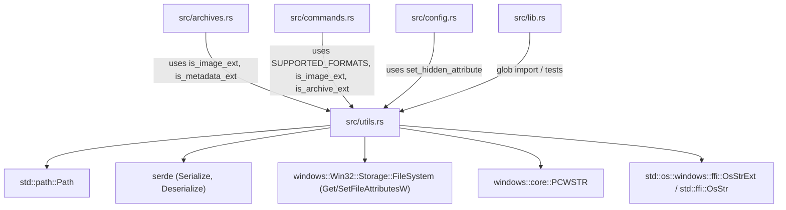

# Rust Backend Decoupling Analysis: `src-tauri/src/utils.rs`

## 1. Executive Summary & File Role

| Property | Value |
| :--- | :--- |
| **Path** | `E:/Projects/QuiviT/src-tauri/src/utils.rs` |
| **Size** | 4,388 bytes |
| **Line Count** | 117 lines |
| **Primary Role** | Static file format registry, extension classification, and platform attribute manipulation |
| **Subsystem Responsibilities** | 2 primary domains (Windows Win32 hidden attribute manipulation; Supported format registry & file extension classification) |
| **Coupling Index** | Low-to-Medium (directly imported by `archives.rs`, `commands.rs`, `config.rs`, and `lib.rs`; coupled to Win32 FileSystem APIs) |
| **Test Coverage** | 0% inline unit tests (indirectly exercised via 1 test in `lib.rs`: `supported_archives_include_new_formats`) |

`utils.rs` is a compact utility module in the QuiviT backend. Despite its small size (117 lines), it plays a foundational role in application-wide file classification and Windows filesystem integration:
1. It maintains the single source of truth for supported image and archive extensions (`SUPPORTED_FORMATS`).
2. It provides format classification predicates (`is_image_ext`, `is_archive_ext`, `is_metadata_ext`) used across archive traversal, directory scanning, and navigation.
3. It encapsulates platform-specific Win32 file attribute mutations (`set_hidden_attribute`) for managing portable configuration visibility.

However, the module exhibits several structural shortcomings: it couples platform-specific Win32 FFI with generic file format definitions, lacks complementary filesystem attribute inspection methods (which were instead orphaned in `commands.rs`), performs redundant heap allocations in hot traversal loops, and leaves other core backend utilities (Base64 encoding/decoding, URL percent-decoding, Shift-JIS/CJK string conversion) fragmented across `ico.rs`, `lib.rs`, and `archives.rs`.

---

## 2. Public API & Item Inventory

### 2.1 Structs & Enums

| Symbol | Visibility | Lines | Description |
| :--- | :--- | :--- | :--- |
| [`FileFormat`](file:///E:/Projects/QuiviT/src-tauri/src/utils.rs#L61-L67) | `pub` | 61–67 | Static descriptor for a supported file format, containing file extension (`ext`), display name (`name`), icon filename (`icon`), and format group (`category`). Derives `Serialize`, `Deserialize`, `Clone`, and `Debug`. |

### 2.2 Declarative Macros (Module-Scoped)

| Symbol | Visibility | Lines | Expansion / Purpose |
| :--- | :--- | :--- | :--- |
| [`image!`](file:///E:/Projects/QuiviT/src-tauri/src/utils.rs#L69-L73) | Private (file-local) | 69–73 | Constructs a `FileFormat` with `category: "Image"`. |
| [`archive!`](file:///E:/Projects/QuiviT/src-tauri/src/utils.rs#L74-L78) | Private (file-local) | 74–78 | Constructs a `FileFormat` with `category: "Archive"`. |

### 2.3 Constants & Registry Tables

| Symbol | Visibility | Lines | Type | Item Count | Content / Formats |
| :--- | :--- | :--- | :--- | :--- | :--- |
| [`SUPPORTED_FORMATS`](file:///E:/Projects/QuiviT/src-tauri/src/utils.rs#L80-L101) | `pub const` | 80–101 | `&[FileFormat]` | 18 formats | **Images (10):** `jpg`, `jpeg`, `png`, `gif`, `webp`, `apng`, `svg`, `bmp`, `ico`, `avif`<br>**Archives (8):** `zip`, `cbz`, `rar`, `cbr`, `7z`, `cb7`, `cbt`, `tar` |

### 2.4 Functions

| Symbol | Target / Attributes | Lines | Signature | Purpose |
| :--- | :--- | :--- | :--- | :--- |
| [`set_hidden_attribute`](file:///E:/Projects/QuiviT/src-tauri/src/utils.rs#L9-L51) | `#[cfg(windows)] pub fn` | 9–51 | `(path: &Path, hidden: bool) -> Result<(), String>` | Queries and sets/clears the Win32 `FILE_ATTRIBUTE_HIDDEN` (0x2) flag via `GetFileAttributesW` / `SetFileAttributesW`. |
| [`set_hidden_attribute`](file:///E:/Projects/QuiviT/src-tauri/src/utils.rs#L53-L57) | `#[cfg(not(windows))] pub fn` | 53–57 | `(_path: &Path, _hidden: bool) -> Result<(), String>` | Non-Windows no-op stub returning `Ok(())`. |
| [`is_image_ext`](file:///E:/Projects/QuiviT/src-tauri/src/utils.rs#L103-L106) | `pub fn` | 103–106 | `(ext: &str) -> bool` | Checks if lowercase extension matches an `"Image"` format in `SUPPORTED_FORMATS`. |
| [`is_metadata_ext`](file:///E:/Projects/QuiviT/src-tauri/src/utils.rs#L108-L111) | `pub fn` | 108–111 | `(ext: &str) -> bool` | Checks if lowercase extension matches `"xml"` or `"opf"`. |
| [`is_archive_ext`](file:///E:/Projects/QuiviT/src-tauri/src/utils.rs#L113-L116) | `pub fn` | 113–116 | `(ext: &str) -> bool` | Checks if lowercase extension matches an `"Archive"` format in `SUPPORTED_FORMATS`. |

---

## 3. Internal / Private Items & Macro Architecture

The file utilizes two lightweight macro rules to reduce boilerplate when initializing the static format slice:

```rust
macro_rules! image {
    ($ext:expr, $name:expr, $icon:expr) => {
        FileFormat { ext: $ext, name: $name, icon: $icon, category: "Image" }
    };
}
macro_rules! archive {
    ($ext:expr, $name:expr, $icon:expr) => {
        FileFormat { ext: $ext, name: $name, icon: $icon, category: "Archive" }
    };
}
```

### Architectural Notes
- Neither macro is exported via `#[macro_export]`, keeping macro hygiene contained entirely inside `utils.rs`.
- While concise, hardcoding `$category` as a string literal (`"Image"` and `"Archive"`) causes stringly-typed category comparisons throughout the engine.

---

## 4. Dependencies & Imports Analysis



### Dependency Audit
1. **Win32 FileSystem Bindings (`windows` crate)**:
   - Reaches into `windows::Win32::Storage::FileSystem::{GetFileAttributesW, SetFileAttributesW, FILE_FLAGS_AND_ATTRIBUTES, INVALID_FILE_ATTRIBUTES}` and `windows::core::PCWSTR`.
   - Requires null-terminated UTF-16 wide string conversion via `encode_wide().chain(std::iter::once(0))`.
2. **Serde Derives**:
   - `FileFormat` derives `Serialize` and `Deserialize`, allowing direct JSON serialization for Tauri IPC if needed.

---

## 5. Responsibility Clusters with Exact Line Ranges

```
utils.rs (117 lines)
│
├── Cluster 1: Win32 File Attributes Manipulation (L5–57)
│   ├── set_hidden_attribute [windows] (L9–51)
│   └── set_hidden_attribute [not(windows)] (L53–57)
│
├── Cluster 2: Format Registry Data Models & Definition Macros (L59–101)
│   ├── FileFormat struct (L61–67)
│   ├── image! macro (L69–73)
│   ├── archive! macro (L74–78)
│   └── SUPPORTED_FORMATS constant slice (L80–101)
│
└── Cluster 3: Extension Classification Engine (L103–117)
    ├── is_image_ext (L103–106)
    ├── is_metadata_ext (L108–111)
    └── is_archive_ext (L113–116)
```

---

## 6. Coupling, Duplication & Code Smells

### 6.1 Split of Platform Attribute Logic (`utils.rs` vs `commands.rs`)
There is an asymmetric split in how file hidden status is managed across the backend:
- [`set_hidden_attribute`](file:///E:/Projects/QuiviT/src-tauri/src/utils.rs#L10-L51) (the attribute **mutator**) lives in `utils.rs` and directly calls Win32 FFI (`GetFileAttributesW` / `SetFileAttributesW`).
- [`is_hidden_path`](file:///E:/Projects/QuiviT/src-tauri/src/commands.rs#L35-L49) (the attribute **inspector**) is defined in `commands.rs` and inspects `fs::Metadata::file_attributes()` and dot prefixes.

*Smell:* Platform-specific filesystem attribute logic is divided across unrelated modules. A single caller should not need to import attribute mutation from `utils` and attribute checking from `commands`.

### 6.2 Hot-Path Heap Allocations in Classification Functions
In `utils.rs`:
```rust
pub fn is_image_ext(ext: &str) -> bool {
    let lower = ext.to_lowercase(); // Allocates a new String on every call!
    SUPPORTED_FORMATS.iter().any(|f| f.category == "Image" && f.ext == lower)
}

pub fn is_archive_ext(ext: &str) -> bool {
    let lower = ext.to_lowercase(); // Allocates a new String on every call!
    SUPPORTED_FORMATS.iter().any(|f| f.category == "Archive" && f.ext == lower)
}
```
*Performance Issue:*
- Every file encountered during directory iteration (`read_directory_impl`) and archive entry listing (`list_zip_entries`, `list_rar_entries`, `list_7z_entries`, `list_tar_entries`) invokes `is_image_ext`, `is_archive_ext`, or `is_metadata_ext`.
- In a folder or comic archive containing 5,000 images, this triggers **10,000+ tiny heap allocations (`to_lowercase()`)** and linear slice scans.
- **Optimization:** All supported extensions are purely ASCII (`jpg`, `png`, `zip`, `cbz`, etc.). Using case-insensitive ASCII comparison (`eq_ignore_ascii_case`) or a compile-time `match` / lookup table eliminates 100% of heap allocations on the critical rendering and directory scanning path.

### 6.3 Missing Utility Consolidation: Duplicated Base64, URL Decoding, and Charset Helpers
QuiviT has several general-purpose utilities scattered across unrelated backend files rather than centralized:

1. **Base64 Encoding**:
   - `ico.rs` ([L135–149](file:///E:/Projects/QuiviT/src-tauri/src/ico.rs#L135-L149)) implements a manual custom byte encoder with bit shifts and ASCII lookup tables (`pub fn base64_encode`).
   - `ico.rs` ([L160](file:///E:/Projects/QuiviT/src-tauri/src/ico.rs#L160), [L300](file:///E:/Projects/QuiviT/src-tauri/src/ico.rs#L300)) separately imports `base64::prelude::*` and calls `BASE64_STANDARD.encode(...)`.
2. **Base64 Decoding**:
   - `lib.rs` ([L382–429](file:///E:/Projects/QuiviT/src-tauri/src/lib.rs#L382-L429)) implements custom manual decoders `base64_decode` and `base64_decode_bytes` with hand-crafted 256-entry lookup tables and padding logic, completely bypassing the `base64` crate listed in `Cargo.toml`.
3. **URL Percent-Decoding**:
   - `lib.rs` ([L431–448](file:///E:/Projects/QuiviT/src-tauri/src/lib.rs#L431-L448)) implements custom manual percent-decoding (`urlencoding_decode`).
4. **Shift-JIS / Multi-byte CJK Charset Decoding**:
   - `archives.rs` ([L187–229](file:///E:/Projects/QuiviT/src-tauri/src/archives.rs#L187-L229)) defines `decode_zip_entry_name` with `encoding_rs::SHIFT_JIS`, `encoding_rs::GB18030`, and `encoding_rs::EUC_KR` fallback decoding.

*Smell:* Hand-rolled encoding/decoding logic with duplicated implementations across `ico.rs`, `lib.rs`, and `archives.rs` creates maintenance overhead and security/correctness risks.

### 6.4 Stringly-Typed Format Categories
`FileFormat` defines `category: &'static str` (`"Image"` or `"Archive"`), leading to string comparisons `f.category == "Image"` inside tight predicates. Replacing this with a strongly-typed enum (`FormatCategory::Image`, `FormatCategory::Archive`) ensures type safety and compiler-enforced exhaustiveness.

### 6.5 Metadata Extension Disconnect
`is_metadata_ext` hardcodes `"xml" | "opf"` directly (line 110) rather than referencing a registered format definition. While `.xml` and `.opf` should not be registered as Windows default application handlers in `SUPPORTED_FORMATS`, the distinction between **Registry Association Formats** and **Internal Archive Content Formats** is undocumented.

---

## 7. Decoupling Recommendations & Target Architecture

To create a clean, maintainable backend utility structure, `utils.rs` should be decoupled and expanded into a cohesive `utils/` or `formats/` subsystem:

```
src-tauri/src/
├── formats/ (or src/formats.rs)
│   ├── mod.rs               # FormatCategory enum, FileFormat struct, SUPPORTED_FORMATS
│   └── classify.rs          # Zero-allocation is_image_ext, is_archive_ext, is_metadata_ext
│
├── platform/ (or src/platform/windows.rs)
│   ├── mod.rs
│   └── attributes.rs        # set_hidden_attribute + is_hidden_path + wide-string helpers
│
└── utils/
    ├── mod.rs               # Re-exports common utilities
    ├── base64.rs            # Consolidated Base64 encode/decode leveraging the `base64` crate
    ├── encoding.rs          # Shift-JIS / GB18030 / EUC-KR CJK fallback string decoders
    └── url.rs               # Percent-decoding utilities
```

### Detailed Item Extraction Plan

| Target Module | Source Items to Move / Refactor | Visibility | Rationale |
| :--- | :--- | :--- | :--- |
| `formats.rs` | `FileFormat`, `FormatCategory`, `SUPPORTED_FORMATS`, `image!`, `archive!` | `pub(crate)` | Keeps all format definitions and registry metadata unified in a dedicated domain module. |
| `formats.rs` | `is_image_ext`, `is_archive_ext`, `is_metadata_ext` | `pub(crate)` | Refactor to zero-allocation ASCII comparison for extreme hot-path throughput. |
| `platform/attributes.rs` | `set_hidden_attribute` (from `utils.rs`), `is_hidden_path` (from `commands.rs`) | `pub(crate)` | Unifies all Win32 / POSIX hidden file attribute checking and modification under a single platform boundary. |
| `utils/encoding.rs` | `decode_zip_entry_name` / CJK decoding (from `archives.rs`), `urlencoding_decode` (from `lib.rs`) | `pub(crate)` | Consolidates string encoding, legacy charset detection, and percent decoding. |
| `utils/base64.rs` | Standardize on `base64` crate; remove manual bit-shift decoders in `lib.rs` and manual encoders in `ico.rs` | `pub(crate)` | Eliminates 100+ lines of redundant, error-prone custom Base64 code. |

---

## 8. Proposed Zero-Allocation Implementation for `formats.rs`

Below is the recommended refactoring pattern eliminating all heap allocations in extension matching:

```rust
#[derive(Debug, Clone, Copy, PartialEq, Eq, Serialize, Deserialize)]
pub enum FormatCategory {
    Image,
    Archive,
}

#[derive(Debug, Clone, Copy, Serialize, Deserialize)]
pub struct FileFormat {
    pub ext: &'static str,
    pub name: &'static str,
    pub icon: &'static str,
    pub category: FormatCategory,
}

pub const SUPPORTED_FORMATS: &[FileFormat] = &[
    // Images
    FileFormat { ext: "jpg",  name: "JPEG Image",     icon: "quivi-t_moe-icon.ico", category: FormatCategory::Image },
    FileFormat { ext: "jpeg", name: "JPEG Image",     icon: "quivi-t_moe-icon.ico", category: FormatCategory::Image },
    FileFormat { ext: "png",  name: "PNG Image",      icon: "quivi-t_moe-icon.ico", category: FormatCategory::Image },
    FileFormat { ext: "gif",  name: "GIF Image",      icon: "gif.ico",              category: FormatCategory::Image },
    FileFormat { ext: "webp", name: "WebP Image",     icon: "webp.ico",             category: FormatCategory::Image },
    FileFormat { ext: "apng", name: "APNG Image",     icon: "apng.ico",             category: FormatCategory::Image },
    FileFormat { ext: "svg",  name: "SVG Image",      icon: "svg.ico",              category: FormatCategory::Image },
    FileFormat { ext: "bmp",  name: "BMP Image",      icon: "quivi-t_moe-icon.ico", category: FormatCategory::Image },
    FileFormat { ext: "ico",  name: "Icon Image",     icon: "quivi-t_moe-icon.ico", category: FormatCategory::Image },
    FileFormat { ext: "avif", name: "AVIF Image",     icon: "quivi-t_moe-icon.ico", category: FormatCategory::Image },
    // Archives
    FileFormat { ext: "zip",  name: "ZIP Archive",    icon: "quivi-t_moe-icon.ico", category: FormatCategory::Archive },
    FileFormat { ext: "cbz",  name: "Comic Book ZIP", icon: "cbz.ico",              category: FormatCategory::Archive },
    FileFormat { ext: "rar",  name: "RAR Archive",    icon: "quivi-t_moe-icon.ico", category: FormatCategory::Archive },
    FileFormat { ext: "cbr",  name: "Comic Book RAR", icon: "cbr.ico",              category: FormatCategory::Archive },
    FileFormat { ext: "7z",   name: "7z Archive",     icon: "quivi-t_moe-icon.ico", category: FormatCategory::Archive },
    FileFormat { ext: "cb7",  name: "Comic Book 7z",  icon: "quivi-t_moe-icon.ico", category: FormatCategory::Archive },
    FileFormat { ext: "cbt",  name: "Comic Book TAR", icon: "quivi-t_moe-icon.ico", category: FormatCategory::Archive },
    FileFormat { ext: "tar",  name: "TAR Archive",    icon: "quivi-t_moe-icon.ico", category: FormatCategory::Archive },
];

#[inline]
pub fn is_image_ext(ext: &str) -> bool {
    SUPPORTED_FORMATS.iter().any(|f| f.category == FormatCategory::Image && f.ext.eq_ignore_ascii_case(ext))
}

#[inline]
pub fn is_archive_ext(ext: &str) -> bool {
    SUPPORTED_FORMATS.iter().any(|f| f.category == FormatCategory::Archive && f.ext.eq_ignore_ascii_case(ext))
}

#[inline]
pub fn is_metadata_ext(ext: &str) -> bool {
    ext.eq_ignore_ascii_case("xml") || ext.eq_ignore_ascii_case("opf")
}
```

---

## 9. Summary of Action Items

1. **Extract `formats.rs`:** Relocate `SUPPORTED_FORMATS`, `FileFormat`, and extension classification predicates to `src/formats.rs` or `src/formats/mod.rs`.
2. **Zero-Allocation Hot Path:** Upgrade `is_image_ext`, `is_archive_ext`, and `is_metadata_ext` to use `eq_ignore_ascii_case` to eliminate all string allocations during directory and archive traversal.
3. **Unify Platform Attributes:** Consolidate `set_hidden_attribute` (from `utils.rs`) and `is_hidden_path` (from `commands.rs`) into `src/platform/windows.rs` or `src/platform/attributes.rs`.
4. **Consolidate Backend Encoding Helpers:**
   - Centralize Base64 encoding and decoding using the `base64` crate, deprecating manual bitwise implementations in `lib.rs` and `ico.rs`.
   - Centralize URL percent-decoding from `lib.rs` into `src/utils/url.rs`.
   - Move CJK/Shift-JIS fallback decoding from `archives.rs` into `src/utils/encoding.rs`.
5. **Add Comprehensive Unit Tests:** Add test suites covering format matching (case insensitivity, edge cases like empty strings or missing extensions) and platform attribute round-tripping.
