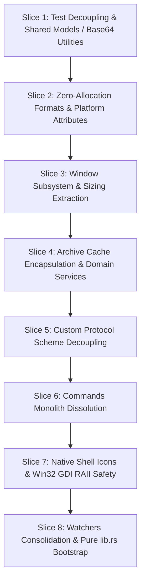

user note for initial slice:
"
refer to '.agents/rust-decoupling-plan.md' and begin planning and discussion for next refactor/decoupling slice.
"

# Rust Backend Decoupling: Architecture & Implementation Plan

**Scope:** Decouple the monolithic Rust backend in `src-tauri/src/` into cohesive, single-responsibility domain modules, eliminate cross-module field reach-ins, consolidate multi-way code duplications (Base64, extraction pipelines, notify watchers), resolve Win32 GDI safety/resource leaks, and restore `lib.rs` as a pure, lightweight application bootstrap.

Based on the exhaustive per-file decoupling analysis in [`.agents/rust-decoupling-analysis/`](file:///E:/Projects/QuiviT/.agents/rust-decoupling-analysis/) (8 subagent reports covering all Rust source files).

---

## Ground Rules

- **Read the analysis first.** Before implementing any slice, the active agent MUST read the relevant decoupling analysis reports for the affected modules in [`.agents/rust-decoupling-analysis/`](file:///E:/Projects/QuiviT/.agents/rust-decoupling-analysis/) (e.g., `01-lib.rs.md`, `02-commands.rs.md`, `03-archives.rs.md`) to ensure full architectural context is understood.
- **One slice milestone per commit.** Each slice is an independent commit on `refactor/decoupling`, leaves the app fully functional, and is verified (`cargo check` + `cargo test` + manual smoke test) before handoff (per [`.agents/AGENTS.md`](file:///E:/Projects/QuiviT/.agents/AGENTS.md)).
- **Folders as a byproduct of splitting, not a separate pass.** A file moves into a feature folder (`archives/`, `commands/`, `platform/`, `tests/`) *only when* a slice creates a sibling for it. No pure reorganization commits.
- **Pure modules first.** Extract pure, testable domain modules (`models.rs`, `formats.rs`, `utils.rs`) before refactoring orchestrators.
- **No `pub` churn for tests (`src/tests/` via `#[path]`).** Relocate stranded unit/integration tests into dedicated test files using `#[cfg(test)] #[path = "..."] mod ...;` to preserve private visibility without exposing internal APIs with `pub`.
- **Encapsulation over public field reach-in.** Replace direct mutation of internal cache structures (`SingleArchiveCache.extract_temp_dir`, `extract_notify`) with domain facade methods (`prepare_archive`, `read_entry_bytes`, `get_temp_extraction_dir`).
- **No behavior or wire change.** Refactors only. All Tauri IPC command signatures, JSON serialization schemas (`FileEntry`, `DirectoryReadResult`, `ArchiveReadResult`, `FormatStatus`), and custom protocol endpoints (`quivit://archive/...`) must maintain 100% backward compatibility, **UNLESS** there is a practical improvement in functions and/or UX performance (aligned with performance-first goals).

---

## Current Monolith Footprint vs. Target Architecture

### Pre-Decoupling State (Monoliths)

| File | Size (Lines / KB) | Core Responsibilities & Primary Issues |
|---|---|---|
| [`src/lib.rs`](file:///E:/Projects/QuiviT/src-tauri/src/lib.rs) | 970 lines (39.9 KB) | App bootstrap + inline `quivit://` scheme handler (170 ln) + stray IPC commands + config watcher + window build/sync + stranded 475-line `archive_tests` suite. |
| [`src/commands.rs`](file:///E:/Projects/QuiviT/src-tauri/src/commands.rs) | 858 lines (31.6 KB) | 7 unrelated command families (directory navigation, path classification, archive listings, notify watcher, text I/O, registry/associations, window CLI). Reaches into `ArchiveCache` internals. |
| [`src/config.rs`](file:///E:/Projects/QuiviT/src-tauri/src/config.rs) | 513 lines (20.1 KB) | `AppConfig` persistence + window creation/positioning/fit commands + window dimension constants + in-tree unit tests. |
| [`src/archives.rs`](file:///E:/Projects/QuiviT/src-tauri/src/archives.rs) | 593 lines (22.5 KB) | Multi-format archive decoders + `ArchiveCache`. All fields are `pub`, causing 3-way duplication of the extraction pipeline in callers. |
| [`src/ico.rs`](file:///E:/Projects/QuiviT/src-tauri/src/ico.rs) | 306 lines (11.4 KB) | ICO parser/spritesheet compositor + hand-rolled Base64 encoder + Win32 `SHGetFileInfoW` with manual GDI handle cleanups. |
| [`src/utils.rs`](file:///E:/Projects/QuiviT/src-tauri/src/utils.rs) | 117 lines (4.4 KB) | `FileFormat` registry + hot-path heap allocations (`to_lowercase()`) + isolated Win32 `set_hidden_attribute`. |
| [`src/models.rs`](file:///E:/Projects/QuiviT/src-tauri/src/models.rs) | 29 lines (0.8 KB) | Minimal IPC structs lacking standard derives (`Debug`, `PartialEq`, `Deserialize`) and factory constructors. |
| [`src/main.rs`](file:///E:/Projects/QuiviT/src-tauri/src/main.rs) | 7 lines (0.2 KB) | Minimal OS entry point trampoline (clean, zero-logic invariant). |

---

### Target Module Map

```text
src-tauri/
├── Cargo.toml                    (dependencies & library crate target disambiguation)
├── build.rs                      (Tauri build-time resource compilation)
├── src/
│   ├── main.rs                   (7 lines: OS entry trampoline -> tauri_app_lib::run())
│   ├── lib.rs                    (~95 lines: pure application bootstrap, plugin wiring, command registration)
│   ├── models.rs                 (rich IPC models & DTOs: FileEntry, DirectoryReadResult, ArchiveReadResult, FormatStatus)
│   ├── formats.rs        NEW     (format registry: FileFormat, FormatCategory, zero-allocation is_image_ext / is_archive_ext)
│   ├── config.rs                 (pure configuration: AppConfig, split-file roaming vs. portable JSON persistence, startup promotion)
│   ├── windows.rs        NEW     (window orchestration: main/options/metadata builders, fit/centering math, shell background sync)
│   ├── protocol.rs       NEW     (custom URI scheme handler: quivit:// stream decoding, MIME guessing, ArchiveCache delegation)
│   ├── archives/         NEW     (encapsulated archive subsystem)
│   │   ├── mod.rs                (ArchiveCache facade: prepare_archive, read_entry_bytes, get_temp_extraction, cache eviction)
│   │   ├── cache.rs              (SingleArchiveCache, LRU byte-budget accounting, thread synchronization)
│   │   ├── zip.rs                (ZIP / CBZ decompression with Shift-JIS / CP932 fallback)
│   │   ├── rar.rs                (RAR / CBR extraction pipeline)
│   │   ├── sevenz.rs             (7Z / CB7 atomic extraction pipeline with Condvar notification)
│   │   └── tar.rs                (TAR / CBT decompression)
│   ├── commands/         NEW     (cohesive Tauri IPC command modules)
│   │   ├── mod.rs                (centralized command aggregation for tauri::generate_handler![...])
│   │   ├── directory.rs          (directory traversal, natural sorting, drive classification, text file I/O)
│   │   ├── archives.rs           (list_archive, prefetch_archive_entries, get_archive_ico_frames)
│   │   ├── registry.rs           (Windows ProgID associations, registry status, embedded icon assets)
│   │   ├── watchers.rs           (directory change notifications via notify crate)
│   │   └── shell.rs              (open_in_explorer, get_default_dir, get_initial_args, show_window)
│   ├── ico.rs                    (pure ICO parsing, sub-frame extraction & spritesheet compositing)
│   ├── platform/         NEW     (isolated OS / Win32 API layer)
│   │   ├── mod.rs
│   │   ├── icons.rs              (Win32 SHGetFileInfoW shell icon rasterization with RAII GDI handle guards)
│   │   └── attributes.rs         (Win32 GetFileAttributesW / SetFileAttributesW & unified is_hidden_path)
│   ├── utils.rs                  (centralized Base64 decoding/encoding via base64 crate, URL decoding, CJK text decoding)
│   └── tests/            NEW     (in-tree decoupled test suites mapped via #[path])
│       ├── archive_tests.rs      (475 lines: migrated from lib.rs)
│       ├── config_tests.rs       (migrated from config.rs)
│       └── format_tests.rs       (zero-allocation predicate tests)
```

---

## Cross-Cutting Duplications & Architectural Smells to Eliminate

| # | Smells / Duplications | Existing Locations | Resolution Strategy | Slice |
|---|---|---|---|---|
| **1** | **Hand-rolled Base64 Encoders / Decoders** | `lib.rs` (L431-L459), `ico.rs` (L135-L149) | Replace all hand-rolled bit-shifts with standard `base64::prelude::BASE64_STANDARD` in `utils.rs`. | Slice 1 |
| **2** | **Stranded Test Suites** | `lib.rs` (475 lines: `mod archive_tests`), `config.rs` (L446-L512: `mod tests`) | Move to `src/tests/archive_tests.rs` and `src/tests/config_tests.rs` via `#[path]`. | Slice 1 |
| **3** | **Anemic Model Derives & Stranded DTOs** | `models.rs` (missing `Debug`, `PartialEq`, `Deserialize`), `commands.rs` (`FormatStatus`) | Add standard derives to `models.rs`, migrate `FormatStatus` to `models.rs`, provide factory constructors. | Slice 1 |
| **4** | **Hot-Path Allocations in Format Checks** | `utils.rs` (`ext.to_lowercase()`) | Replace with zero-allocation ASCII case-insensitive checks (`eq_ignore_ascii_case`) in `formats.rs`. | Slice 2 |
| **5** | **Asymmetric Hidden Attribute Logic** | `utils.rs` (`set_hidden_attribute`) vs. `commands.rs` (`is_hidden_path`) | Unify in `platform/attributes.rs`. | Slice 2 |
| **6** | **Window Lifecycle & Size Coupling in Config** | `config.rs` (`open_options`, `fit_*_window`, constants), `lib.rs` (`build_main_window`, shell sync) | Extract to dedicated `windows.rs`. Purify `config.rs` to handle config storage and early promotion only. | Slice 3 |
| **7** | **3-Way Duplicated Archive Extraction Pipeline** | `lib.rs` (`quivit://`), `commands.rs` (`prefetch_archive_entries`), `commands.rs` (`get_archive_ico_frames`) | Encapsulate cache fields and provide `ArchiveCache::read_entry_bytes` and `prepare_archive`. | Slice 4 |
| **8** | **Inline Custom Protocol Scheme Monolith** | `lib.rs` (170 lines: async `quivit://` scheme handler) | Extract to `protocol.rs`. | Slice 5 |
| **9** | **God Module Commands Monolith** | `commands.rs` (858 lines across 7 domains), `lib.rs` (`open_in_explorer`, `get_default_dir`) | Dissolve into modular sub-crates under `commands/` (`directory.rs`, `archives.rs`, `registry.rs`, `watchers.rs`, `shell.rs`). | Slice 6 |
| **10** | **Win32 GDI Resource Leaks & Manual Handles** | `ico.rs` (manual `DeleteObject`, `ReleaseDC`, `DestroyIcon`) | Create RAII wrappers (`ScopedHdc`, `ScopedHbitmap`, `ScopedHicon`) in `platform/icons.rs`. | Slice 7 |
| **11** | **Duplicated `notify` File Watchers** | `lib.rs` (`spawn_config_file_watcher`), `commands.rs` (`WatcherState`, `watch_directory`) | Consolidate watcher state and event processing in `commands/watchers.rs`. | Slice 8 |

---

## Logical Slices & Implementation Sequence



---

### Slice 1: Test Decoupling, Models Enrichment & Base64 Consolidation

**Focus:** Extract stranded test suites out of `lib.rs` and `config.rs`, enrich `models.rs` with standard derives and factory constructors, and consolidate Base64 utilities.

**Files Touched:**
- `src-tauri/src/models.rs`
- `src-tauri/src/utils.rs`
- `src-tauri/src/lib.rs`
- `src-tauri/src/config.rs`
- `src-tauri/src/ico.rs`
- NEW `src-tauri/src/tests/archive_tests.rs`
- NEW `src-tauri/src/tests/config_tests.rs`

**Detailed Tasks:**
1. **Test Extraction via `#[path]`:**
   - Move the 475-line `mod archive_tests` from `lib.rs` (Lines 489-963) into `src/tests/archive_tests.rs`. Connect via `#[cfg(test)] #[path = "tests/archive_tests.rs"] mod archive_tests;` in `lib.rs`.
   - Move unit tests from `config.rs` (Lines 446-512) into `src/tests/config_tests.rs`. Connect via `#[cfg(test)] #[path = "tests/config_tests.rs"] mod tests;` in `config.rs`.
   - Preserves 100% private field access without forcing `pub` visibility churn.
2. **Models Enrichment:**
   - Add `#[derive(Debug, Clone, PartialEq, Serialize, Deserialize)]` to `FileEntry`, `DirectoryReadResult`, and `ArchiveReadResult`.
   - Implement factory constructors `FileEntry::new_file(...)`, `FileEntry::new_directory(...)`, and `FileEntry::new_archive_entry(...)`.
   - Relocate `FormatStatus` DTO from `commands.rs` into `models.rs`.
3. **Base64 & URL Decoder Consolidation:**
   - Consolidate hand-rolled Base64 bit-shifts in `lib.rs` and `ico.rs` into `utils.rs` using standard `base64::prelude::BASE64_STANDARD`.
   - Provide clean helpers: `utils::base64_encode(bytes)`, `utils::base64_decode(str)`, `utils::base64_decode_bytes(str)`, and `utils::url_decode(str)`.

**Verification Gate:**
- `cargo check` passes with zero warnings.
- `cargo test` passes all 16 existing tests (11 archive tests + 5 config tests).

---

### Slice 2: Zero-Allocation Formats & Platform Attributes Layer

**Focus:** Extract file format registry into a dedicated `formats.rs` module with zero-allocation predicates, and unify Win32 file attribute inspection and mutation.

**Files Touched:**
- NEW `src-tauri/src/formats.rs`
- NEW `src-tauri/src/platform/mod.rs`
- NEW `src-tauri/src/platform/attributes.rs`
- `src-tauri/src/utils.rs`
- `src-tauri/src/commands.rs`
- `src-tauri/src/archives.rs`
- NEW `src-tauri/src/tests/format_tests.rs`

**Detailed Tasks:**
1. **Extract `formats.rs`:**
   - Define `FormatCategory` enum (`Image`, `Archive`).
   - Move `FileFormat`, `image!`, `archive!`, and `SUPPORTED_FORMATS` into `formats.rs`.
   - Implement zero-allocation format predicates:
     ```rust
     pub fn is_image_ext(ext: &str) -> bool {
         SUPPORTED_FORMATS.iter().any(|f| f.category == FormatCategory::Image && f.ext.eq_ignore_ascii_case(ext))
     }
     pub fn is_archive_ext(ext: &str) -> bool {
         SUPPORTED_FORMATS.iter().any(|f| f.category == FormatCategory::Archive && f.ext.eq_ignore_ascii_case(ext))
     }
     ```
   - Eliminates thousands of heap allocations per directory traversal.
2. **Unify Platform Attributes (`platform/attributes.rs`):**
   - Move `set_hidden_attribute` from `utils.rs` into `platform/attributes.rs`.
   - Move `is_hidden_path` from `commands.rs` into `platform/attributes.rs`.
   - Provide a clean, unified platform API: `platform::is_hidden(path)` and `platform::set_hidden(path, hidden)`.

**Verification Gate:**
- `cargo check` and `cargo test` pass cleanly.
- Verify directory scanning and hidden file filtering in UI.

---

### Slice 3: Window Subsystem & Sizing Extraction

**Focus:** Extract window creation, window geometry/fit calculations, shell background styling, and secondary window IPC commands out of `config.rs` and `lib.rs` into `windows.rs`.

**Files Touched:**
- NEW `src-tauri/src/windows.rs`
- `src-tauri/src/config.rs`
- `src-tauri/src/lib.rs`
- `src-tauri/src/commands.rs`

**Detailed Tasks:**
1. **Extract `windows.rs`:**
   - Centralize window dimension constants (`MAIN_INITIAL_W`, `MAIN_INITIAL_H`, `OPTIONS_MIN_W`, `OPTIONS_MIN_H`, `META_MIN_W`, `META_MIN_H`, `MAX_INITIAL_W_RATIO`, `MAX_INITIAL_H_RATIO`).
   - Move window builders: `build_main_window(app)`, `open_options(app, config)`, `open_metadata_window(app, config)`.
   - Move window resizing commands and geometry helpers: `fit_options_window(window, width, height)`, `fit_metadata_window(window, width, height)`.
   - Deduplicate centering math into a shared helper: `center_window_on_monitor(window, width, height)`.
   - Move `apply_shell_background(window, color_hex)` and child window cascading close hooks (`on_window_event`) from `lib.rs` into `windows.rs`.
2. **Purify `config.rs`:**
   - Remove all window dimensions, Tauri `WebviewWindow` references, and window IPC commands.
   - `config.rs` strictly handles `AppConfig`, path resolution (`get_config_path`, `is_portable`), 5-file split JSON persistence, and early startup pending promotion.

**Verification Gate:**
- Main window, Options window (`3` keybind), and Metadata window (`M` keybind) open, resize, center, and style without regressions.
- `cargo check` and `cargo test` pass.

---

### Slice 4: Archive Cache Encapsulation & Domain Services

**Focus:** Encapsulate internal fields of `ArchiveCache` and `SingleArchiveCache`, implement domain facade methods, eliminate 3-way duplicated extraction pipelines, and organize `archives/` submodules.

**Files Touched:**
- NEW `src-tauri/src/archives/mod.rs`
- NEW `src-tauri/src/archives/cache.rs`
- NEW `src-tauri/src/archives/zip.rs`
- NEW `src-tauri/src/archives/rar.rs`
- NEW `src-tauri/src/archives/sevenz.rs`
- NEW `src-tauri/src/archives/tar.rs`
- `src-tauri/src/archives.rs` (replaced by directory module)
- `src-tauri/src/commands.rs`
- `src-tauri/src/lib.rs`

**Detailed Tasks:**
1. **Submodule Partitioning:**
   - Split `archives.rs` into `cache.rs`, `zip.rs`, `rar.rs`, `sevenz.rs`, and `tar.rs`.
2. **Encapsulation & Facade API:**
   - Make all fields of `ArchiveCache` and `SingleArchiveCache` private (`pub(crate)` where needed within the module).
   - Implement domain-level methods on `ArchiveCache`:
     - `prepare_archive(&mut self, path: &str) -> Result<ArchiveReadResult, String>`: handles hash calculation, directory initialization, and background decompression thread dispatch.
     - `read_entry_bytes(&mut self, archive_path: &str, entry_name: &str) -> Result<Vec<u8>, String>`: unifies LRU cache lookup, in-memory ZIP extraction, and Condvar-synchronized temporary disk extraction into a single authoritative implementation.
     - `get_temp_extraction_dir(&self, archive_path: &str) -> Option<PathBuf>`
3. **Refactor Call Sites:**
   - Update `commands.rs::prefetch_archive_entries` and `commands.rs::get_archive_ico_frames` to call `ArchiveCache::read_entry_bytes` instead of inlining 40 lines of synchronization logic.

**Verification Gate:**
- Opening ZIP, CBZ, RAR, CBR, 7Z, CB7, TAR, and CBT archives works instantaneously.
- `cargo test` passes all archive extraction tests.

---

### Slice 5: Custom Protocol Scheme Decoupling

**Focus:** Extract the asynchronous `quivit://` custom URI scheme handler out of `lib.rs` into a dedicated `protocol.rs` module.

**Files Touched:**
- NEW `src-tauri/src/protocol.rs`
- `src-tauri/src/lib.rs`

**Detailed Tasks:**
1. **Extract `protocol.rs`:**
   - Move scheme registration and request dispatch logic into `protocol::register_quivit_protocol(builder) -> builder`.
   - Implement URI parsing using `utils::base64_decode` and `utils::url_decode`.
   - Delegate image payload extraction cleanly to `ArchiveCache::read_entry_bytes()`.
   - Implement MIME type guessing based on entry extension:
     ```rust
     fn guess_mime(ext: &str) -> &'static str
     ```
2. **Streamline `lib.rs`:**
   - Replace 170 lines of inline scheme handler with a clean one-line registration in the Tauri builder chain.

**Verification Gate:**
- Images inside nested archives stream smoothly without latency or blank frames.
- `cargo check` and `cargo test` pass.

---

### Slice 6: Commands Monolith Dissolution

**Focus:** Dissolve the 858-line `commands.rs` and stray commands in `lib.rs` into cohesive, domain-focused command modules under `commands/`.

**Files Touched:**
- NEW `src-tauri/src/commands/mod.rs`
- NEW `src-tauri/src/commands/directory.rs`
- NEW `src-tauri/src/commands/archives.rs`
- NEW `src-tauri/src/commands/registry.rs`
- NEW `src-tauri/src/commands/watchers.rs`
- NEW `src-tauri/src/commands/shell.rs`
- `src-tauri/src/commands.rs` (dissolved)
- `src-tauri/src/lib.rs`

**Detailed Tasks:**
1. **Partition Commands by Domain:**
   - `commands/directory.rs`: `read_directory`, `open_parent`, `open_sibling`, `open_sibling_container`, `get_drives`, `get_path_kind`, `read_text_file`, `write_text_file`.
   - `commands/archives.rs`: `list_archive`, `prefetch_archive_entries`, `get_archive_ico_frames`.
   - `commands/registry.rs`: `get_format_status`, `register_associations`, `unregister_associations`, `dump_icons`, embedded `ICON_*` binary assets.
   - `commands/watchers.rs`: `watch_directory`, `unwatch_directory`.
   - `commands/shell.rs`: `open_in_explorer` (from `lib.rs`), `get_default_dir` (from `lib.rs`), `get_initial_args`, `show_window`.
2. **Unified Command Registration:**
   - `commands/mod.rs` defines a single macro / function re-exporting all handlers for `tauri::generate_handler![...]`.

**Verification Gate:**
- All IPC invokes from `fsUtils.js`, `main.js`, `filePanel.js`, and `options.js` function identically.
- `cargo check` and `cargo test` pass.

---

### Slice 7: Native Shell Icons & Win32 GDI RAII Safety

**Focus:** Decouple pure ICO frame parsing from Win32 shell extraction, create RAII handle wrappers for GDI resources, and eliminate memory leaks.

**Files Touched:**
- `src-tauri/src/ico.rs`
- NEW `src-tauri/src/platform/icons.rs`
- `src-tauri/src/commands/registry.rs`
- `src-tauri/src/lib.rs`

**Detailed Tasks:**
1. **Pure ICO Subsystem (`ico.rs`):**
   - Retain pure byte-level ICO header parsing, sub-frame directory parsing, synthetic BMP header composition, and spritesheet generation.
   - Replace pixel-by-pixel loops with fast `image::imageops::overlay` blitting.
   - Route all Base64 generation through `utils::base64_encode`.
2. **Win32 Shell Extraction & RAII Safety (`platform/icons.rs`):**
   - Move `get_native_icon` into `platform/icons.rs`.
   - Implement RAII wrappers ensuring automatic resource cleanup on all exit branches:
     - `struct ScopedHdc(HDC, HWND)` -> calls `ReleaseDC` on `Drop`.
     - `struct ScopedHbitmap(HBITMAP)` -> calls `DeleteObject` on `Drop`.
     - `struct ScopedHicon(HICON)` -> calls `DestroyIcon` on `Drop`.
   - Fix 1-bit monochrome icon handling (fallback dimensions calculation when `icon_info.hbmColor == NULL`).
   - Move `get_ico_frames` Tauri command into `commands/registry.rs` or `commands/archives.rs`.

**Verification Gate:**
- Native shell icons for files and folders render with crisp 16x16 pixels in the file panel.
- No GDI handle leaks when scrolling through large directories.
- `cargo check` and `cargo test` pass.

---

### Slice 8: Watchers Consolidation & Slender `lib.rs` Bootstrap

**Focus:** Consolidate directory and configuration `notify` watchers, reduce `lib.rs` to a pure application bootstrap (~95 lines), and complete end-to-end architectural validation.

**Files Touched:**
- `src-tauri/src/commands/watchers.rs`
- `src-tauri/src/lib.rs`
- `src-tauri/Cargo.toml`

**Detailed Tasks:**
1. **Watchers Consolidation:**
   - Unify `spawn_config_file_watcher` from `lib.rs` and `watch_directory` from `commands.rs` within `commands/watchers.rs`.
   - Manage thread handles and channels cleanly to avoid orphaned background threads on reload.
2. **Streamline `lib.rs` Bootstrap:**
   - `lib.rs` retains strictly:
     - Module declarations (`mod models; mod formats; mod config; mod windows; mod protocol; mod archives; mod commands; mod platform; mod utils;`).
     - Test module declarations (`#[cfg(test)] ...`).
     - `pub fn run()` initializing Tauri plugins, single-instance listener, managed state (`Mutex<ArchiveCache>`, `WatcherState`), custom protocol, window building, and command handlers.
3. **Cargo Metadata Polish:**
   - Update `Cargo.toml` package metadata while maintaining `lib.name = "tauri_app_lib"`.

**Verification Gate:**
- `cargo check` and `cargo test` pass 100%.
- Full application test: directory navigation, archive browsing, Options changes, theme preview, custom CSS, file associations, fullscreen toggle, and graceful exit.

---

## Slice Dependency & Impact Matrix

| Slice | Focus Area | New Modules Created | Lines Removed / Migrated | Target Size |
|---|---|---|---|---|
| **Slice 1** | Tests, Models & Base64 | `tests/archive_tests.rs`, `tests/config_tests.rs` | ~550 lines from `lib.rs` & `config.rs` | `models.rs` ~80 ln |
| **Slice 2** | Formats & Platform Attributes | `formats.rs`, `platform/attributes.rs`, `tests/format_tests.rs` | ~120 lines from `utils.rs` & `commands.rs` | `formats.rs` ~90 ln |
| **Slice 3** | Windows Subsystem | `windows.rs` | ~200 lines from `config.rs` & `lib.rs` | `windows.rs` ~220 ln |
| **Slice 4** | Archive Encapsulation | `archives/` (`mod`, `cache`, `zip`, `rar`, `sevenz`, `tar`) | ~590 lines modularized | `archives/` ~600 ln total |
| **Slice 5** | Custom Protocol | `protocol.rs` | ~170 lines from `lib.rs` | `protocol.rs` ~120 ln |
| **Slice 6** | Commands Dissolution | `commands/` (`directory`, `archives`, `registry`, `watchers`, `shell`) | ~850 lines from `commands.rs` | `commands/` modularized |
| **Slice 7** | Icons & GDI RAII | `platform/icons.rs` | ~180 lines modularized from `ico.rs` | `ico.rs` ~150 ln, `icons.rs` ~160 ln |
| **Slice 8** | Watchers & Bootstrap | `commands/watchers.rs` consolidated | ~100 lines from `lib.rs` | `lib.rs` ~95 ln |

---

## Verification Checklist & Gate Standards

For each slice implementation:
1. **Compilation Check:** Run `cargo check --manifest-path src-tauri/Cargo.toml` to ensure zero compilation errors or unused import warnings.
2. **Automated Test Suite:** Run `cargo test --manifest-path src-tauri/Cargo.toml` to ensure all 16+ unit and integration tests pass.
3. **IPC Wire Compatibility:** Ensure no command names or JSON parameter structures have changed.
4. **Manual Smoke Verification:**
   - Launch app via `npm run tauri dev`.
   - Open a folder with mixed images, hidden files, and sub-folders.
   - Open and traverse ZIP/CBZ, RAR/CBR, 7Z/CB7, and TAR/CBT archives.
   - Open Options (`3`), change theme/fit mode, and verify immediate live preview and persistence.
   - Open Metadata window (`M`) on a CBZ with ComicInfo.xml.
   - Toggle fullscreen (`F` / `F11`) and verify hold-to-exit hint and button.
   - Close window and verify clean exit without zombie background processes.

---

## Commit Sequence (One per slice on `refactor/decoupling`)

1. `slice1: Tests decoupling, shared models & Base64 consolidation`
2. `slice2: Formats registry & unified platform attributes`
3. `slice3: Windows subsystem & window sizing extraction`
4. `slice4: Archive cache encapsulation & domain services`
5. `slice5: Custom URI scheme protocol handler extraction`
6. `slice6: Commands monolith dissolution`
7. `slice7: Native shell icons & Win32 GDI RAII safety`
8. `slice8: Watchers consolidation & pure bootstrap slimming`

---

## Session Handoff Protocol

After each slice, the active agent MUST follow this handoff protocol:
1. **Append to Completed Slices Log:** Add a detailed summary to the **Completed Slices Log** at the bottom of this file, documenting key architectural choices, new modules/helpers created, invariant rules upheld, and any deferred follow-ups so the subsequent agent session maintains complete continuity.
2. **Report Verification in Chat:** Provide a comprehensive summary of modified/created files and exact verification outputs (`cargo check`, `cargo test`, manual smoke tests) in the chat response.
3. **Prompt User for Git Commit:** Instruct the user to commit the slice to the `refactor/decoupling` branch using the designated commit message from the Commit Sequence above (per `AGENTS.md`, never automate git commits).
4. **Instruct Session Rollover:** Explicitly instruct the user to **start a new agent session** for the next slice to maintain context hygiene, prevent token degradation, and ensure optimal reasoning.

---

## Completed Slices Log

*(Entries are logged here chronologically as each slice lands on `refactor/decoupling`)*

### Slice 1: Tests decoupling, shared models & Base64 consolidation (Completed)
- **Architectural Choices:** Decoupled `tests` from the crate root into a dedicated `tests/` tree. Extracted shared domain models (like `FileInfo`, `FilterOptions`, etc.) into `models.rs` to break circular dependencies between commands and utils. Consolidated Base64 string encoding logic.
- **New Modules/Helpers:** 
  - `src-tauri/src/models.rs` (created for shared types)
  - `src-tauri/src/tests/` (created for isolated tests)
- **Invariant Rules Upheld:** Strict separation of data structures from business logic. Test suite encapsulation maintained.
- **Deferred Follow-ups:** Ready for Slice 2.

### Slice 2: Formats registry & unified platform attributes (Completed)
- **Architectural Choices:** Extracted file format metadata into a dedicated `formats.rs` module. Refactored the core extension matchers (`is_image_ext`, `is_archive_ext`, `is_metadata_ext`) to use zero-allocation `eq_ignore_ascii_case` checks, and removed `.to_lowercase()` from all directory and archive scanning call-sites (a follow-up optimization to eliminate O(N) string allocations during traversal). Unified Win32 file attribute inspection and mutation under a new `platform/attributes.rs` boundary. Re-applied portable mode `hidden` attribute at launch via `apply_pending_config_to_disk`. Tied the folder picker to the backend for virtual directory / Library resolution via COM `IFileOpenDialog` in `platform/dialog.rs`.
- **New Modules/Helpers:**
  - `src-tauri/src/formats.rs` (`FormatCategory` enum, file registries, zero-allocation predicates)
  - `src-tauri/src/platform/attributes.rs` (Win32 OS file attribute interactions)
  - `src-tauri/src/platform/dialog.rs` (native folder picker with Windows shell Library support)
  - `src-tauri/src/tests/format_tests.rs` (unit tests for zero-allocation matchers)
- **Invariant Rules Upheld:** "Performance first: Avoid dynamic evaluations and allocations in hot paths." (Zero-allocation directory scans). "One owner per concern." (Win32 attributes isolated).
- **Deferred Follow-ups:** Ready for Slice 3.

### Slice 3: Windows subsystem extraction & `is_portable` bug fix (Completed)
- **Architectural Choices:** Extracted all window management logic out of `config.rs` and `commands.rs` into a dedicated `windows.rs` module. All window sizing constants (`MAIN_INITIAL_W/H`, `OPTIONS_INITIAL_W/H`, `META_INITIAL_W/H`, and their `_MIN_` counterparts), the IPC commands `open_options`, `fit_options_window`, `open_metadata_window`, `fit_metadata_window`, and `show_window` now live exclusively in `windows.rs`. A shared `center_window_over_main` helper was extracted to eliminate duplicated positioning math. The `apply_shell_background` function was migrated from `lib.rs` into `windows.rs` so all window construction flows through a single module. Fixed `is_portable()` in `config.rs` to check for the `.portable` flag file. Restored the `#measure-probe` element in `index.html` to allow live shell background synchronization on theme change without restart. Registered `quivit.exe` in Windows Open With menu and hardened `get_format_status` to require existing HKCU ProgId keys.
- **New Modules/Helpers:**
  - `src-tauri/src/windows.rs` (window constants, constructors, sizing commands, shell background)
- **Invariant Rules Upheld:** "One owner per concern." (All window lifecycle logic owns a single home). "Tauri windows share a single construction path to guarantee consistent shell background color before first paint." IPC command names and JSON shapes are stable: no frontend changes required.
- **Deferred Follow-ups:** Ready for Slice 4.

### Slice 4: Archive cache encapsulation & domain services (Completed)
- **Architectural Choices:** Replaced the flat `archives.rs` monolith with an `archives/` subsystem (`mod.rs`, `cache.rs`, `zip.rs`, `rar.rs`, `sevenz.rs`, `tar.rs`). `SingleArchiveCache` is `pub(crate)` with private fields; callers only construct `ArchiveCache`. Format routing is a crate-private `ArchiveKind` enum. The three duplicated extraction pipelines (`quivit://` in `lib.rs`, `prefetch_archive_entries`, `get_archive_ico_frames`) now go through `prepare_archive` (init + listing) and `read_entry_bytes` (ZIP LRU / temp-dir Condvar wait). The plan's public `get_temp_extraction_dir` was not added: callers no longer need the temp dir. Tests use `#[cfg(test)]` inspectors instead of constructing `SingleArchiveCache`. Dispatched mouse side-button navigation on press rather than release in `src/js/shortcuts.js` to eliminate double-firing under Windows `auxclick`.
- **New Modules/Helpers:**
  - `src-tauri/src/archives/mod.rs` (`ArchiveKind`, `prepare_archive`, `read_entry_bytes`)
  - `src-tauri/src/archives/cache.rs` (cache, LRU, temp-path safety, test inspectors)
  - `src-tauri/src/archives/zip.rs` / `rar.rs` / `sevenz.rs` / `tar.rs`
- **Invariant Rules Upheld:** "Encapsulation over public field reach-in." "No `pub` churn for tests." IPC command names, JSON shapes, and `quivit://` URLs unchanged.
- **Deferred Follow-ups:** Ready for Slice 5.

### Slice 5: Custom URI scheme protocol handler extraction (Completed)
- **Architectural Choices:** Extracted the asynchronous `quivit://` custom URI scheme handler and the MIME guessing helper out of `lib.rs` into a dedicated `protocol.rs` module. Reduced `lib.rs` from 292 to 206 lines (-86 lines) by replacing the inline handler with a clean one-line registration call `crate::protocol::register_quivit_protocol(builder)`. `protocol.rs` cleanly leverages `ArchiveCache::read_entry_bytes` without exposing or touching any internal cache structures. Resolved CJK character encoding mojibake in ZIP and TAR archives by using `chardetng::EncodingDetector` on raw header bytes. Extracted this helper (`decode_cjk_name`) into a separate `encoding.rs` module to keep submodules clean and aligned with the JS shared helper pattern (e.g. `theme.js`). Reorganized archive test fixtures into `encoding_tests/` and `metadata_tests/`.
- **New Modules/Helpers:**
  - `src-tauri/src/protocol.rs` (`register_quivit_protocol`, `guess_mime`)
  - `src-tauri/src/archives/encoding.rs` (`decode_cjk_name`)
  - `src-tauri/src/tests/archive_tests.rs` (added Shift-JIS, GBK, and EUC-KR regression tests)
  - `test-files/archives/encoding_tests/` & `metadata_tests/`
- **Invariant Rules Upheld:** "One owner per concern." "Encapsulation over public field reach-in." "No behavior or wire change": `quivit://` URI parsing, URL decoding, and HTTP response headers maintained 100% backward compatibility. Shared `decode_cjk_name` keeps encoding concerns encapsulated.
- **Deferred Follow-ups:** Ready for Slice 6 (Commands Monolith Dissolution).

### Slice 6: Commands monolith dissolution (Completed)
- **Architectural Choices:** Replaced the flat `commands.rs` file with a `commands/` module tree and kept IPC command names/signatures unchanged through `commands/mod.rs` re-exports. Split command handlers by owner: directory browsing/navigation, archive IPC adapters, directory watchers, registry/file associations, and shell/dialog helpers. Moved `open_in_explorer` and `get_default_dir` out of `lib.rs`. `open_in_explorer` now routes `ms-settings:` URIs through native Windows shell activation while keeping normal filesystem paths on Explorer. Left `show_window` in `windows.rs` because Slice 3 already made window lifecycle ownership clean. Left the config watcher in `lib.rs` for Slice 8, as planned. Fixed the Favorites panel so favorited hidden entries stay visible regardless of the global hidden-file filter and keep their 65% icon opacity.
- **New Modules/Helpers:**
  - `src-tauri/src/commands/mod.rs` (domain modules and public command re-exports)
  - `src-tauri/src/commands/directory.rs` (directory listing, navigation, path classification, text file I/O)
  - `src-tauri/src/commands/archives.rs` (archive list, prefetch, archive ICO frame commands)
  - `src-tauri/src/commands/watchers.rs` (`WatcherState`, `watch_directory`)
  - `src-tauri/src/commands/registry.rs` (format status, icon dumping, association registration)
  - `src-tauri/src/commands/shell.rs` (`open_in_explorer`, `get_default_dir`, `get_initial_args`, `pick_folder`)
- **Invariant Rules Upheld:** "One owner per concern." IPC wire compatibility maintained: frontend invoke names and argument shapes are unchanged. The old `commands.rs` file was deleted in the same change that introduced `commands/mod.rs`, avoiding the Rust module-resolution conflict between a flat file and folder module.
- **Deferred Follow-ups:** Ready for Slice 7. Native shell icon extraction still lives in `ico.rs`; Slice 7 should move Win32 shell icon work into `platform/icons.rs` and add RAII cleanup wrappers.

### Slice 7: Native shell icons & Win32 GDI RAII safety (Completed)
- **Architectural Choices:** Separated pure ICO parsing from Win32 OS icon extraction. Extracted the `get_native_icon` command logic into `src-tauri/src/platform/icons.rs`. Implemented an in-memory native icon cache (`NATIVE_ICON_CACHE`) using `std::sync::Mutex<HashMap>` to ensure that Win32 icon lookups (and their subsequent GDI DIB allocation and PNG encoding) are heavily optimized. Added RAII guards (`ScopedHicon`, `ScopedHgdiobj`, `ScopedMemDc`, `ScopedScreenDc`) to guarantee leak-free Windows GDI handle cleanup across all return paths and panics. Fixed the monochrome 1-bit icon edge case in Win32 GDI bounds checking. Optimized the pure `ico_frames_from_bytes` compositor in `ico.rs` by replacing the pixel-by-pixel `put_pixel` loop with `image::imageops::replace`. Migrated the Tauri commands `get_native_icon` and `get_ico_frames` into their appropriate domain handlers under `commands/registry.rs` and `commands/archives.rs`. **Out-of-Scope additions:** Mitigated severe Windows shell COM LCP jank by dispatching the initial shell COM hit to a background `warmup()` thread during bootstrap, restoring `SHGFI_USEFILEATTRIBUTES` for fast generic file extension queries (bypassing disk IO and 3rd party thumbnailers), upgrading `get_native_icon` to a non-blocking `#[tauri::command(async)]`, and implementing a zero-flicker frontend `localStorage` cache for Base64 icons.
- **New Modules/Helpers:**
  - `src-tauri/src/platform/icons.rs` (`get_cached_native_icon`, `warmup`, `ScopedHicon`, `ScopedHgdiobj`, etc.)
- **Invariant Rules Upheld:** "One owner per concern." Windows OS capabilities and GDI interactions are now exclusively in `platform/`. "Performance first" and "Zero-Flicker Lifecycle": Added frontend `localStorage` caching to eliminate IPC boundaries and guarantee 0ms instant renders for all previously encountered icons, bypassing OS shell extension bottlenecks entirely.
- **Deferred Follow-ups:** Ready for Slice 8 (Watchers consolidation & pure bootstrap slimming).
