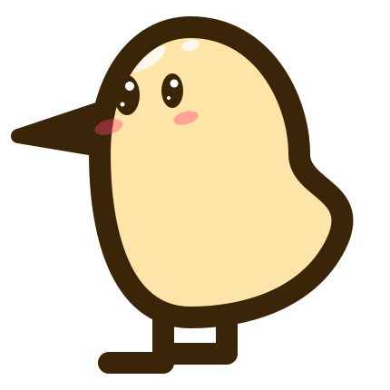

# QuiviT

> *Pronounced similarly to the word 'pivot' lol*

<p align="center">
  
</p>

A modern standalone (performance-first) port of Quivi, built with Tauri and vanilla HTML/CSS/JS. View static images and animated formats like WebP, APNG, and GIF, including direct support for archive files (ZIP/CBZ, RAR/CBR, etc.).

## Quivi

Quivi is an image viewer specialized for comic and manga reading, with fast file browsing and compressed archive support.

- Original project: [Quivi](http://quivi.sourceforge.net/)
- Later continuation/fork: [qazmlpok/quivi](https://github.com/qazmlpok/quivi) (used as reference)

## Stack

- **Runtime:** Tauri 2
- **Backend:** Rust
- **Frontend:** Vanilla HTML, CSS, and ES modules
- **Desktop webview:** WebView2 on Windows
- **Archives:** ZIP/CBZ through `zip`, RAR/CBR through `unrar`
- **Sorting:** natural sorting through `natord`
- **Config:** JSON through `serde` / `serde_json`
- **File watching:** `notify` (directory watcher / auto-refresh)
- **ICO extraction:** `image` (ico feature)
- **Archive hashing:** `md5` (deterministic temp directory naming)
- **Plugins:** `tauri-plugin-opener` (open config folders in Explorer), `tauri-plugin-dialog` (native pickers), `tauri-plugin-single-instance` (single-instance handoff)

## Project Structure

```text
QuiviT/
├─ src/
│  ├─ index.html              # Main viewer window
│  ├─ options.html            # Options window
│  ├─ css/
│  │  ├─ main.css             # Viewer layout and shared theme tokens
│  │  └─ options.css          # Options window layout
│  └─ js/
│     ├─ core.js              # Central app state and config management
│     ├─ directoryPrefs.js    # Persistent per-directory grouping and sorting
│     ├─ filePanel.js         # File list rendering, sorting UI, resizing, favorites
│     ├─ fsUtils.js           # Filesystem and Rust backend interaction
│     ├─ keyboardNav.js       # Accessible keyboard navigation (Tab/Home/End)
│     ├─ keybinds.js          # Default shortcuts and config merge helpers
│     ├─ keybindUi.js         # Keybind configuration grid and conflicts
│     ├─ main.js              # DOM wiring for the main window
│     ├─ menubar.js           # Main window menu bar DOM wiring
│     ├─ options.js           # Options window DOM wiring
│     ├─ shortcuts.js         # Shortcut matching and keyboard dispatch
│     └─ viewer.js            # Image viewport, zoom, fit, pan, rotation, flips
├─ src-tauri/
│  ├─ capabilities/
│  │  └─ default.json         # Tauri permissions for main/options windows
│  ├─ icons/                  # Application icons
│  ├─ src/
│  │  ├─ main.rs              # Native executable entry point
│  │  └─ lib.rs               # Tauri commands, config, archive protocol
│  ├─ Cargo.toml
│  └─ tauri.conf.json
├─ package.json
└─ README.md
```

## Features

- Opens image files, archive files, and directories.
- Browses image siblings with keyboard or mouse.
- Seamlessly jumps to previous/next directories, archives, and root drives, following the active sort order.
- Lists folders, images, and supported archives in the file panel.
- Supports parent-directory navigation through '`..`'.
- Reads ZIP/CBZ and RAR/CBR archives directly, treating them as folders.
- **Instant archive listing** — reads only headers (central directory) for immediate file lists without full extraction.
- **Hybrid archive caching** — ZIP/CBZ uses on-demand in-memory LRU cache (20 images) with background prefetch (7 ahead / 3 behind); RAR/CBR uses background sequential extraction to temp disk.
- **Seamless image navigation** — retains previous image on screen until new image fully loads, eliminating flicker between archive images.
- Supports configurable keybindings, multi-key combos, and mouse shortcuts.
- Supports global or portable configuration storage.
- Provides fit, zoom, pan, rotation, flip, and scaling controls.
- Scroll-wheel panning with Ctrl+wheel zoom (both remappable, manga-friendly), plus an optional sticky-Ctrl "toggle" mode so you press Ctrl once to enter zoom mode instead of holding it.
- Provides a display-only breadcrumb for the current directory or archive.
- Displays multi-frame ICO files as a horizontal spritesheet.
- Toggleable opaque backdrop for transparent images.
- Favorites system for quick access to frequently visited folders and files, persisted through the config (not browser storage).
- Single-instance handoff for routing external file opens into an active session.
- Optionally auto-opens the first image when entering a directory, or restores the last active image at startup.

## Supported Formats

Images:

```text
jpg, jpeg, png, gif, webp, apng, svg, bmp, ico, avif
```

Archives:

```text
zip, cbz, rar, cbr
```

## Development

Install dependencies:

```bash
npm install
```

Run the Tauri development build:

```bash
npm run tauri dev
```

Run backend checks:

```bash
cd src-tauri
cargo check
```

Run frontend syntax checks:

```bash
node --check src/js/main.js
node --check src/js/options.js
node --check src/js/keybinds.js
node --check src/js/viewer.js
node --check src/js/core.js
node --check src/js/fsUtils.js
node --check src/js/directoryPrefs.js
node --check src/js/shortcuts.js
node --check src/js/filePanel.js
```

## Architecture

The frontend is intentionally split into small ES modules.

- `core.js` is the single source of truth for application state and configuration.
- `fsUtils.js` handles all file system interactions, Tauri backend commands, and dialogs.
- `directoryPrefs.js` owns the grouping and persistent sorting logic for directory entries.
- `viewer.js` owns the image viewport only: image source, fit modes, zoom, pan, rotation, flips, and scaling.
- `keybinds.js` is the single source of truth for default shortcuts.
- `shortcuts.js` owns keyboard combo normalization and action lookup.
- `filePanel.js` owns the file list UI component, including column sizing and sorting.
- `menubar.js` owns the main window's top menu bar DOM wiring and state logic.
- `keyboardNav.js` manages accessible keyboard navigation (Tab, Home, End) across UI elements.
- `options.js` wires the options window UI to persisted config.
- `keybindUi.js` renders the keybind configuration grid and handles conflict highlighting.
- `main.js` should stay focused on DOM wiring and state callbacks for the main window.

When behavior starts to grow inside `main.js`, prefer moving the domain logic into a focused module and leaving `main.js` as the bridge between DOM events and state/actions.

## Configuration

Normal configuration is saved through Tauri's app config directory.

On this Windows app identifier, the global config directory is normally:

```text
C:\Users\<user>\AppData\Roaming\com.x4163.quivit
```

In normal (roaming) mode QuiviT splits its data across four files in that directory:

```text
quivit_config.json          # user preferences (keybinds, fit/scaling, options)
quivit_state.json           # runtime state (last opened location, remembered image)
quivit_directory_sort.json  # per-directory sort column/direction
quivit_favorites.json       # favorited folders and files
```

Portable mode is enabled when the app finds either of these files next to the executable:

```text
.portable
quivit_config.json
```

When **Save config data locally** is enabled in Options, QuiviT writes a single self-contained file:

```text
<executable-directory>\.portable
<executable-directory>\quivit_config.json
```

Enabling portable mode moves your settings out of the roaming directory (the roaming files are removed once the portable copy is written), so only one active location exists at a time. When the option is disabled, QuiviT writes the split files back to the roaming directory and removes the portable files instead.

### Custom CSS & Emergency Reset

QuiviT supports injecting custom CSS rules to fully theme the application (available in the Options menu under Customization). You can instantly save and apply these rules using `Ctrl+S` while editing.

If a broken CSS rule makes the user interface unusable, press `Ctrl+Shift+Alt+C` globally in any window. This performs an emergency reset, instantly stripping the custom CSS and reloading the interface safely.

## Shortcuts

Default shortcuts live in:

```text
src/js/keybinds.js
```

The backend does not define shortcut defaults. It only loads and saves the config object.
Keyboard pan distance is tuned by `VIEWER_KEYBOARD_PAN_STEP` in the same file.
The startup fit mode defaults to `DEFAULT_FIT_MODE` (`height-if-larger`) and changes made from the View menu are saved in config.
The scaling method defaults to `DEFAULT_SCALING_MODE` (`bicubic`) and changes made from the View menu are saved in config.
The scroll-wheel modifier defaults to `hold` (hold `Ctrl` while scrolling to zoom) and can be switched to `toggle` (sticky `Ctrl`, press once to enter zoom mode) in Options → Keys → Scroll Wheel, saved as `scroll_zoom_modifier`.

### Scroll Wheel Behavior

- Plain wheel pans the image up/down (bound to `cmd-pan-up` / `cmd-pan-down` as `ScrollUp` / `ScrollDown`).
- `Ctrl` + wheel zooms in/out (bound to `cmd-zoom-in` / `cmd-zoom-out` as `Ctrl+ScrollUp` / `Ctrl+ScrollDown`).
- All four are ordinary keybinds in the Options Keys tab, so they are fully remappable; zooming zooms toward the cursor position.
- Wheel scrolling over the file list or menu chrome is never hijacked — it keeps scrolling that UI.
- In **Hold** mode, keep `Ctrl` held while scrolling to zoom. In **Toggle** mode, press `Ctrl` once to latch zoom mode (a status-bar badge appears); the wheel keeps zooming without `Ctrl` until you press `Ctrl` again.

### Advanced Shortcut Capabilities

QuiviT's shortcut engine fully supports:
- **Simultaneous Multi-Key Combinations:** You can bind arbitrary keys without standard modifiers (e.g., `A + B`). The capture engine tracks all keys held and finalizes the binding on release.
- **Native Mouse Input:** Mouse buttons (`MouseLeft`, `MouseMiddle`, `MouseRight`, `MouseBack`, `MouseForward`) are bindable individually or combined with modifiers (e.g., `Shift + MouseBack`).
- **Canonical Named Keys:** Captured combos use canonical casing (`Backspace`, `ArrowLeft`, `F5`, ...) matching the defaults, and stored bindings are normalized on load.
- **Conflict Highlighting:** The options menu visually highlights keybind conflicts by matching them with dynamically generated hues.

Current defaults include:

```text
1                                           Toggle file list
2                                           Toggle menu bar
3                                           Toggle status bar
4 / Alt+Enter                               Full screen
5                                           Options
6 / Ctrl+R                                  Refresh
Backspace                                   Parent directory
Ctrl+O                                      Open directory...
Ctrl+Shift+O                                Open file/archive...
Toggle favorite                             (unbound by default)
Ctrl+X                                      Open next directory/archive
Ctrl+Z                                      Open previous directory/archive
Shift+D / Shift+Right / MouseForward        Next item
Shift+S / Shift+Down                        Next item
Shift+A / Shift+Left / MouseBack            Previous item
Shift+W / Shift+Up                          Previous item
ScrollUp / ScrollDown                       Pan up / pan down
Ctrl+ScrollUp / Ctrl+ScrollDown             Zoom in / zoom out
C                                           Zoom in
Z                                           Zoom out
X                                           Zoom 100%
Q                                           Fit width
E                                           Fit height
W / Up                                      Pan up
A / Left                                    Pan left
S / Down                                    Pan down
D / Right                                   Pan right
G                                           Rotate counter-clockwise
H                                           Rotate clockwise
V                                           Flip horizontal
B                                           Flip vertical
R                                           Fit width if larger
T                                           Fit height if larger
F                                           Auto fit
```

## Backend Commands

The Rust backend provides Tauri commands for:

- Reading directories.
- Listing archive headers instantly (`list_archive`).
- Prefetching archive entries (`prefetch_archive_entries`).
- Opening parent and sibling directories.
- Opening sibling folders/archives.
- Loading and saving config.
- Resolving and opening the global and local config directories.
- Opening the Options window.
- ICO frame extraction (`get_ico_frames`).

The Options window command is async because creating a Tauri webview window from a synchronous command can deadlock on Windows.

## Icon Attributions

- APNG icon: [Cosplayer icons created by Magnific - Flaticon](https://www.flaticon.com/free-icon/cosplayer_949561?term=anime&page=1&position=28&origin=search&related_id=949561)
- WebP icon: [Webp icons created by JessHG - Flaticon](https://www.flaticon.com/free-icon/webp_13434961?term=webp&page=1&position=3&origin=search&related_id=13434961)
- GIF icon: [Gif icons created by Dimitry Miroliubov - Flaticon](https://www.flaticon.com/free-icon/gif_337936?term=gif&page=1&position=2&origin=search&related_id=337936)
- CBZ icon: [Cbz icons created by Good Ware - Flaticon](https://www.flaticon.com/free-icon/cbz_4208350?term=cbz&page=1&position=7&origin=search&related_id=4208350)
- SVG icon: [Svg icons created by The Chohans - Flaticon](https://www.flaticon.com/free-icon/svg-file_9704766?term=svg&page=1&position=4&origin=search&related_id=9704766)
- Language Flags: [jdecked/Twemoji](https://github.com/jdecked/twemoji)
